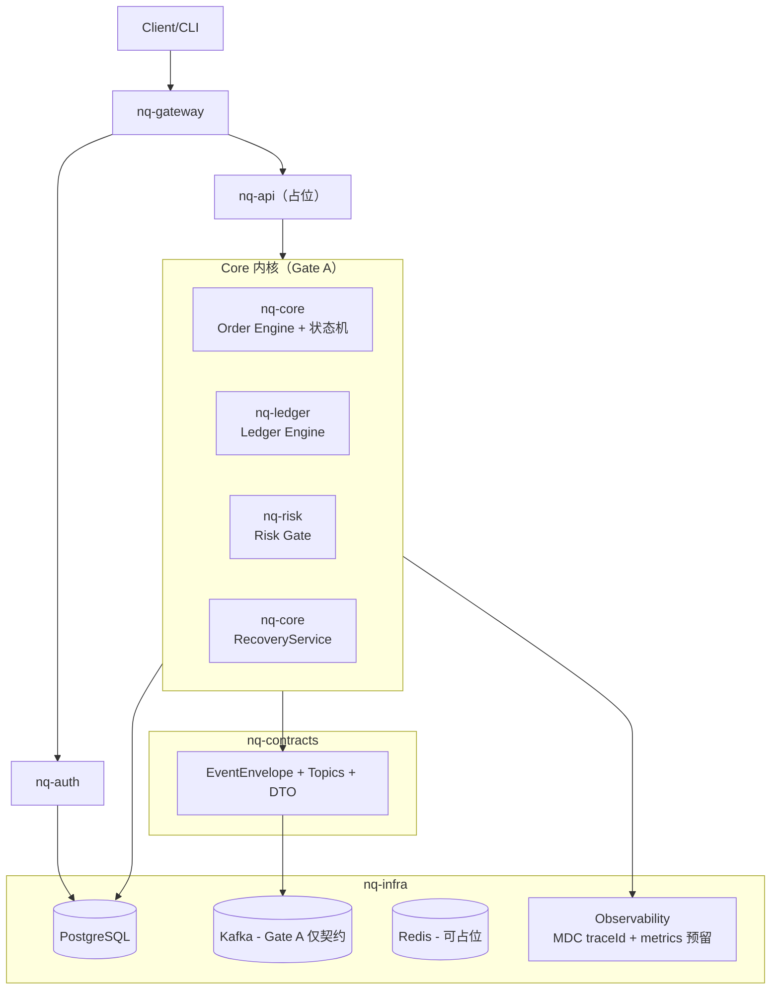
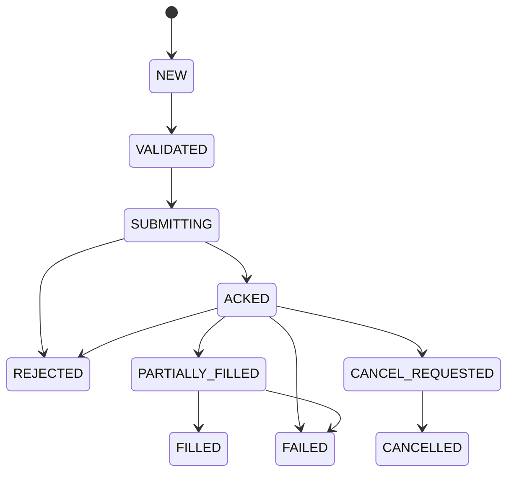

# nexus-quant V1 架构基线（ARCHITECTURE）

> 项目：nexus-quant  
> 包名基线：`com.guidinglight.nexusquant`  
> 模块命名：`nq-*`  
> 版本：v1.0（Gate A 基线）  
> 范围：V1 数字货币量化系统 Gate A（核心内核 + auth/gateway 骨架）  
> 强约束：事件驱动、统一域模型、严格状态机、幂等、账本可重算、可恢复、可审计  
> 禁止：接交易所（Gate B）、实现策略逻辑、实现业务 Controller（除 auth 最小登录）、实现前端页面

---

## 1. 目标与非目标

### 1.1 目标（V1 最终必须闭环）
系统最终闭环（后续 Gate B/C 完成）：
行情 → 信号 → 风控 → 下单 → 成交 → 仓位 → 资金账本 → 对账 → 回放 → 可观测 → 审计 → 可恢复

Gate A 的目标是把“闭环正确性底座”钉死：
- 统一域模型（Order/Trade/Position/Account/LedgerEntry/RiskEvent/AuditLog）
- 订单状态机（严格流转，不允许随意 setStatus）
- 幂等（clientOrderId）
- 资金账本（流水可重算余额，支持平衡校验）
- PG DDL（Flyway）支撑恢复
- 事件契约（Kafka Topic/Envelope/去重/版本演进）先冻结
- 最小恢复流程（RecoveryService.rebuild）
- 最小 auth/gateway 骨架（可登录拿 JWT + 网关鉴权与 traceId 透传骨架）
- 单元测试覆盖关键链路

### 1.2 非目标（Gate A 明确不做）
- 不接入 OKX/Binance（Gate B 才实现 Adapter）
- 不实现策略逻辑（仅 Strategy 接口占位）
- 不实现交易业务 API（nq-api 仅建壳；不做下单/持仓查询接口）
- 不实现管理台页面（frontend 仅建骨架）
- 不做分布式/多节点/高频优化（先正确后快）

---

## 2. 技术栈冻结（基线）

- JDK 21
- Spring Boot 3.5.10
- Spring Cloud 2024.3.x（网关）
- PostgreSQL 17.7 + Flyway 10.x
- Kafka 3.7.x（Gate A 只输出契约/常量，不要求连 broker）
- Redis 7.2.x（可占位）
- Spring Security 6.x
- JWT：jjwt 0.12.x（或 Nimbus JOSE JWT，二选一；默认 jjwt）
- Observability：traceId 贯穿（MDC + EventEnvelope trace_id）；Prometheus/Grafana compose 预留

强制规范：
- 金额/数量/价格：BigDecimal（统一 scale/rounding；在代码与文档中明确）
- 时间：Instant（UTC）
- 事件：Envelope 必带 trace_id

---

## 3. 仓库结构与模块职责（mono-repo）

### 3.1 目录结构
```
nexus-quant/
  README.md
  docker-compose.yml
  docs/
  infra/
  backend/
    pom.xml
    nq-common/
    nq-contracts/
    nq-security/
    nq-auth/
    nq-gateway/
    nq-core/
    nq-ledger/
    nq-risk/
    nq-infra/
    nq-adapter/   (Gate A 只建接口壳)
    nq-api/       (Gate A 只建启动壳)
  research/
    pyproject.toml (仅骨架)
  frontend/
    package.json   (仅骨架)
```

### 3.2 模块职责边界（强约束）
- **nq-common**：公共工具/异常体系/Result/ErrorCode/traceId(MDC) 工具/BigDecimal 序列化与精度策略
- **nq-contracts**：事件契约归口（topic 常量、EventEnvelope、payload DTO、版本演进规则）；禁止散落在其它模块
- **nq-security**：JWT 组件、安全配置抽象（资源服务器/鉴权入口/角色解析）
- **nq-auth**：最小登录发 JWT（用户名+密码），最小 RBAC 表；记录 audit_logs
- **nq-gateway**：Spring Cloud Gateway，JWT 校验、路由、traceId 生成/透传、统一错误返回
- **nq-core**：统一域模型、订单状态机、订单聚合根/应用服务（不对外暴露 Controller）
- **nq-ledger**：账本引擎、借贷平衡校验、余额重算
- **nq-risk**：RiskGate 框架与最小规则（限额/黑白名单等占位）
- **nq-infra**：DB/Flyway/Kafka/Redis 配置、Repository、基础装配
- **nq-adapter（占位）**：交易所适配层接口（Gate B 实现 OKX/Binance）
- **nq-api（占位）**：对外业务 API（Gate A 不实现交易 API）

---

## 4. 总体架构概览

### 4.1 分层架构（Mermaid）


### 4.2 关键数据流（Gate A 视角）
- 登录：Client → Gateway → Auth（校验用户）→ 签发 JWT
- 请求链路：Gateway 生成/透传 traceId（`X-Trace-Id` 或 W3C traceparent）
- 内核：OrderCommand（占位）→ RiskGate（占位）→ OrderStateMachine → Trade（占位）→ Ledger → Position → AuditLog
- 事件：所有事件先冻结契约（nq-contracts），实现阶段可先在内存发布（后续接 Kafka）

---

## 5. 统一域模型（Domain Model）

### 5.1 实体清单
- Account：账户与 venue（交易场所）信息
- Instrument（可选）：统一标的定义（symbol、tickSize、lotSize、quote/base）
- Order：订单（含 clientOrderId 幂等键）
- Trade：成交/Fill（含 fee）
- Position：持仓（qty/availableQty/frozenQty）
- LedgerEntry：账本流水（可重算余额）
- RiskEvent：风控事件
- AuditLog：审计日志
- User/Role/UserRole（auth）

### 5.2 字段规范（示例表格）
| Entity | Key Fields | Notes |
|---|---|---|
| Order | orderId, accountId, symbol, clientOrderId, side, type, price, qty, status | UNIQUE(accountId, clientOrderId) |
| Trade | tradeId, orderId, price, qty, feeAmount, feeCurrency, ts | 必须可去重；允许乱序 |
| Position | accountId+symbol, qty, availableQty, frozenQty | 预留 T+1：available/frozen |
| LedgerEntry | entryId, accountId, currency, amount, direction, refType, refId, ts | 余额由流水聚合；支持平衡校验 |
| AuditLog | id, domain, action, actorId, traceId, ts, detail | 关键操作不可缺 |

---

## 6. 订单状态机（Order State Machine）

### 6.1 状态定义
- NEW / VALIDATED / SUBMITTING / ACKED
- PARTIALLY_FILLED / FILLED
- CANCEL_REQUESTED / CANCELLED
- REJECTED / FAILED

### 6.2 状态流转图（Mermaid）


### 6.3 竞态与最终事实规则（必须）
- **Trade 为最终事实**：即使出现“撤单后迟到成交”，也以成交事件为准纠偏订单状态与账本/仓位。
- **乱序与重复回报**：Trade、LedgerEntry 必须可去重；消费者必须幂等。
- **幂等键**：clientOrderId 是命令幂等的硬约束（DB + 代码）。

---

## 7. 风控体系（Risk）

### 7.1 风控分层（Gate A 只实现框架）
- 事前：下单前校验（仓位限额、单笔限额、黑白名单、价格偏离、频率限制占位）
- 事中：执行链路异常（延迟、断线）触发熔断占位
- 事后：对账差异与审计（占位）

### 7.2 RiskGate 接口
输入：OrderCommand / AccountSnapshot / PositionSnapshot / RiskConfig  
输出：ALLOW / REJECT（reason、severity、traceId）

---

## 8. 资金账本（Ledger）

### 8.1 设计原则
- 余额 = ledger_entries 聚合（快照仅缓存/展示）
- 成交必记账（含手续费）
- 借贷平衡校验（double-entry 或等价校验，需在 DECISIONS/ADR 记录）

### 8.2 refType 预留
- TRADE, FEE, TRANSFER, FREEZE, UNFREEZE（Gate A 可占位接口）

---

## 9. 对账与恢复（Recon & Recovery）

### 9.1 对账（Gate A 仅定义接口/占位）
- 对账对象：订单/成交/余额/手续费
- 最小频率：每日一次（未来 Gate C 强制执行）
- 差异处理：告警 + 重拉快照 + 修正策略（占位）

### 9.2 恢复（Gate A 必须最小实现）
系统重启后最小恢复能力：
1) 从 DB 恢复 orders 基本状态
2) 从 trades + ledger_entries 重建 positions 与余额（或给出明确策略）
3) 输出恢复报告（重建数量、差异、traceId）

---

## 10. 事件驱动与 Kafka 契约（Gate A 冻结）

事件契约统一归口 `nq-contracts`，详见 `docs/CONTRACTS.md`：
- Topic 列表、Key 规则、Envelope 字段、payload 字段
- 幂等/去重规则
- 版本演进规则

---

## 11. PostgreSQL 数据模型（Gate A 落地）

Flyway：`V1__init.sql` 至少包含：
- auth：users / roles / user_roles
- core：accounts / orders / trades / positions / ledger_entries / risk_events / audit_logs

关键约束：
- orders：UNIQUE(account_id, clientOrderId)
- trades：trade_id 唯一；后续 ext_trade_id 预留

---

## 12. 可观测性（Observability）

### 12.1 traceId 规范（强制）
- Gateway 生成或透传 traceId（`X-Trace-Id`）
- 后端写入 MDC（日志自动带 traceId）
- EventEnvelope 必带 trace_id

### 12.2 指标（后续逐步落地）
- 下单延迟 p95/p99
- 拒单率/失败率
- Kafka lag（Gate B+）
- DB 连接池耗尽
- 对账差异数（Gate C）

---

## 13. Gate A 交付物与验收标准

### 13.1 交付物
- backend 多模块可编译可测试
- 域模型 + 状态机实现
- Ledger 实现
- Flyway DDL
- 事件契约文档 + 常量
- RecoveryService 最小实现
- 单元测试：状态机/幂等/账本/恢复
- auth/gateway 最小骨架（登录发 JWT + 网关鉴权/traceId 透传）

### 13.2 Gate A 通过条件（必须全部满足）
1) 状态机合法路径完整，非法路径拒绝（单测）
2) clientOrderId 幂等生效（DB 唯一约束 + 单测）
3) 账本平衡校验恒成立，余额可重算（单测）
4) 最小恢复可运行且可验证（代码+说明）
5) docs 四件套完整且与代码一致（ARCHITECTURE/CONTRACTS/CHECKLIST/DECISIONS）
