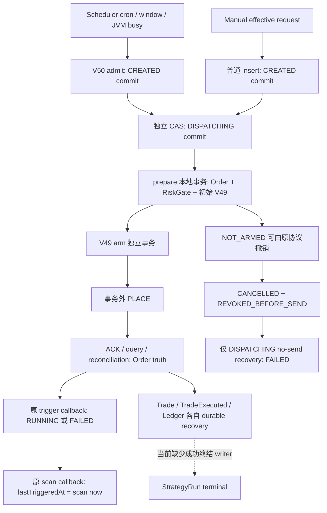

# B5 StrategyRun durable execution contract review

任务：`NQ-GATEAUDIT-PHASE6-L4-B5-STRATEGY-RUN-DURABLE-EXECUTION-CONTRACT-REVIEW`。日期：2026-09-10。范围：HIGH_RISK / ARCHITECTURE_AND_SCHEMA_REVIEW / REVIEW_ONLY / NQ-only。

**设计结论：PASS / READY_FOR_IMPLEMENTATION。运行时结论：P1_OPEN_PENDING_IMPLEMENTATION / B5 NOT_QUALIFIED。** 本文定义待实施、待 PostgreSQL/真实进程证明的契约；不把静态论证当成 migration、实现或独立验收通过。本文由此前整改会话继续完成，不声称是与此前设计作者独立的 implementation acceptance。

## 1. 候选身份和证据边界

- worktree：`E:/Project/nexus-quant-gateaudit`；branch：`audit/post-gatey-agent-baseline`；HEAD：`86c8ad84542636364f6c21e78bc292a323cbdff7`。
- 本轮起点为 3570 个非忽略 tracked/untracked 文件；按排序的 `path + NUL + fileSHA256 + LF` 聚合指纹：`a2a84b965a4a3a0e7ec3a39e03f66dab301affafdd3c9feb0cc6b26228127cda`。index SHA256：`67d0e2a40f423491211b9b48b17ac7a43ceebb67c38f62929eacc759d31db106`。工作区已有 301 个 status 项，均属本轮起点，不以 HEAD diff 冒充本轮变更。
- 当前代码和 V1–V50 是本轮静态分析对象；STATUS 的旧 schema/stage 描述不覆盖实际候选 inventory，也不授予发布权限。
- 复用[前轮生命周期证据](GATEAUDIT_PHASE6_L4_B5_STRATEGY_RUN_DURABLE_LIFECYCLE_CRASH_RECOVERY_REMEDIATION_ATTEMPT01.md)、[proof-index](l4-b5-lifecycle-remediation-attempt01/proof-index.json)及[checks](l4-b5-lifecycle-remediation-attempt01/checks.json)，不改其字节、不重记为本轮复现。
- 已有真实结果：CREATED owner death 后 Order=0、恢复=0、未来 BUSY；RUNNING owner death 后 Order=FILLED、Trade=1、TradeExecuted=1、Ledger=4，run 仍 RUNNING、未来 BUSY。永久红测为 2 tests / 2 failures / 0 errors / 0 skips。
- 同 run 两 Order/两 V49 是独立 PostgreSQL/Spring repository 诊断，未发 PLACE；它证明 schema 缺口，不证明生产已发两次 PLACE。

## 2. 当前实际生命周期及所有者

下图的缺口均来自当前代码；虚线不是已存在的恢复能力。



| 当前步骤 | durable owner / 事务 | 稳定身份 | 下一 writer / death 后行为 |
| --- | --- | --- | --- |
| due/window 检测 | Scheduler；无业务写事务。cron.next(lastTriggeredAt 或 createdAt−1s)，timezone 转 UTC；窗口按 scan now 判断 | schedule + strategy/account + whole-second dueAt | JVM busy 只防本地重入；未 admission 可重新检测 |
| scheduler admission | `JdbcStrategyRunRepository.admit`，Spring REQUIRES_NEW、5s，V50 INSERT ON CONFLICT | `(strategy,account,schedule,dueAt)`，winner 的原 run ID | loser 用 READ COMMITTED 下一条语句读 winner；commit 后 CREATED 没有当前恢复 writer |
| manual admission | `StrategyManualTriggerService` → repository 普通 insert；无覆盖后续步骤的事务 | 随机 run ID、首次 requestId | 当前重复 request 可再建 run；实际 manual economic request 尚未保存 |
| CREATED→DISPATCHING | 独立 status CAS | run ID + expected CREATED | Order 前死亡形成 DISPATCHING 无 Order；现有 JOIN 型恢复不匹配 |
| command/Order prepare | command event 在 prepare 前；`preparePlaceOrder` 的本地 @Transactional 包含 NEW Order、RiskGate、风险/Order事件、初始 V49，允许路径到 SENT | Order PK；当前仅 `(account,clientOrderId)` 唯一 | prepare 死亡整体回滚；command event 单独存在不表示有 Order/发送权；同 run 尚无 UNIQUE |
| 初始 authority | V49 restricted function 内先 INSERT Order，再 INSERT NOT_ARMED，同一个调用方事务 | authority.order_id PK/FK | 两条 INSERT 之间进程死亡会回滚；新 canonical OKX 路径无已提交的 Order/初始 authority 裂缝 |
| arm | REQUIRES_NEW；V49 锁 Kill→Order→authority；核对 SENT/version、Risk ALLOW | 同一 Order 的一次决定 | 成功确认的 caller 才可发送；MAY 或 commit unknown 不能由 successor 读回获得发送权 |
| PLACE | prepare/arm commit 后，HTTP 在事务外 | 原 account/venue/client/Order | pause、超时、丢 ACK 由既有 query-first/V49 协议处理，不能重造 Order |
| ACK/对账 | Order 的独立 finalize/OCC、Trade/Event/Ledger 的现有事务/恢复 owner | Order version、venue fill identity、Trade/event/ledger 幂等键 | Order 可已 FILLED 而 run callback 尚未执行；FILLED 后仍会补扫 fills/账务 |
| trigger callback | 独立 CAS DISPATCHING→RUNNING/FAILED | run ID + expected status | 当前 SENT/ACCEPTED/PARTIALLY_FILLED/**FILLED** 均到 RUNNING；没有成功终态 writer |
| no-send run recovery | REQUIRES_NEW、5s；最多50，FOR UPDATE SKIP LOCKED | DISPATCHING + 唯一匹配 Order + V49 | 仅 CANCELLED、特定 no-order reason、REVOKED、无 Trade 时 FAILED；不覆盖 CREATED/RUNNING |
| schedule callback | `updateLastTriggeredAt` 单独盲写 scan now，无单调 CAS | schedule ID | admission 后死亡丢游标；callback 迟到可覆盖较新值；run 终态与 cursor 无原子关系 |

源码定位（行号为本轮候选，历史领域文档仅辅助解释）：

- [StrategyManualTriggerService](../../../backend/nq-core/src/main/java/com/guidinglight/nexusquant/strategy/application/StrategyManualTriggerService.java)：48–123、150–162。
- [StrategyScheduleScanService](../../../backend/nq-core/src/main/java/com/guidinglight/nexusquant/strategy/application/StrategyScheduleScanService.java)：99–169、190–225、288–319。
- [JdbcStrategyRunRepository](../../../backend/nq-infra/src/main/java/com/guidinglight/nexusquant/strategy/infra/jdbc/JdbcStrategyRunRepository.java)：36–96、133–162；[当前 no-send recovery](../../../backend/nq-infra/src/main/java/com/guidinglight/nexusquant/strategy/infra/jdbc/JdbcStrategyRunRecoveryRepository.java)；[schedule repository](../../../backend/nq-infra/src/main/java/com/guidinglight/nexusquant/strategy/infra/jdbc/JdbcStrategyScheduleRepository.java)。
- [OrderCommandService](../../../backend/nq-core/src/main/java/com/guidinglight/nexusquant/trading/application/OrderCommandService.java)：87–142；[OrderCommandWriteService](../../../backend/nq-core/src/main/java/com/guidinglight/nexusquant/trading/application/OrderCommandWriteService.java)：prepare、455–495、598–665。
- [V49](../../../backend/nq-infra/src/main/resources/db/migration/V49__ordinary_place_authorities.sql)：41–53、70–118；[V50](../../../backend/nq-infra/src/main/resources/db/migration/V50__strategy_window_admission.sql)：5–35。两者的历史文件都保持 immutable。

## 3. 执行输入审计：已有 snapshot 不等于 effective work

A=已有 durable 值；B=可从已冻结字段按明确版本规则重建；C=当前仅请求/JVM 或可变定义，不能用于自动恢复。A 仅说明已保存；V51 仍须封住目前允许改写的 run 字段。现有 Order 一旦存在，是恢复该 Order 的事实源，但不能倒推尚不存在的 Order。

| 实际消费项 | 当前类别/来源 | 新 contract 的唯一来源 |
| --- | --- | --- |
| strategy/run/account、canonical venue、tradeEnv、triggerType | A：run；实际 gateway **没有**显式传 env | run 字段冻结；work.accountId 为唯一键所需的受约束副本；run→request→Order→Trade 环境/作用域一致 |
| definition version | C：trigger 本次读取 definition.version，run 未显式保存 | work.definition_version；与本次保存的 definition configSnapshot 同次读取；只是 provenance，不据此重读最新版 |
| definition.configSnapshot | A，但 manual request 可覆盖，scheduler 先取配置后 trigger 又重读，存在 snapshot drift | 原 run snapshot 保留定义审计语义；work 才是经济指令 owner |
| symbol、side、OrderType、quantity、price（可空） | C：manual request；scheduler 从之前读到的 config 生成 request；未完整绑定到持久 run | typed work 保存最终验证/规范化值；恢复绝不重新求值配置 |
| timeInForce | 当前 intent=null；PlaceOrderRequest 按 type 默认 MARKET→IOC、其它→GTC；type 缺失时不能算 B | work 保存显式最终 TIF；不依赖将来构造器默认值 |
| requestId | A：trim 或首次生成后保存；API 允许省略 | 原 run.request_id 冻结；同一次有副作用调用的重试必须复用已确定 requestId |
| clientOrderId | B：当前 `coid-` + run.requestId；Order 前无独立持久 owner | work 显式保存 canonical client；v1 保持此编码，验证现有 VARCHAR(128)及适用 adapter 限制，超长/非法拒绝，不截断、不重哈希旧身份 |
| idempotencyKey | B：accountId + `:` + clientOrderId；当前策略没有 override | work v1 reader 用不可变字段确定性生成；将来支持 override 必须升级 work contract |
| source | B：当前 scheduler/manual 均明确传 `strategy_manual` | work v1 固定该值；recovery 不改成 `recovery` 以改变原 command；恢复 actor 另记审计 |
| traceId | A：run.traceId | 使用首次 trace；worker 本次 trace 只能做附加关联，不替换原 work |
| schedule/dueAt | A：V50结构化列；old legacy 不一定有 | 使用原 V50列；不从 request 字符串猜原 dueAt 来造 work |
| cron、timezone、windowConfig | 当前可变 schedule；决定 admission，不是已 admitted PLACE 的输入 | 新 admission 在同一快照验证；存最终 dueAt 后 recovery 不重算 cron/window；下一窗口重新评估当前配置 |
| executionScopeId | 当前策略 intent 无此字段，14参 PlaceOrderRequest 默认 null；Javadoc禁止持久化一次性 scope | v1 固定 null；不存 scope token、不据 run 生成 LIVE 权限 |
| amount、策略算法中间输出、随机状态 | 当前路径没有独立 amount/算法执行输入，只有 request.quantity | 不增设未来框架字段；以后真实入口新增执行输入时须同步版本化 work |
| 当前 RiskGate/Kill/账户权限/运行授权 | 动态控制；不应冻结为“永远允许” | 每次尚未 prepare/arm 的真实边界仍执行原安全控制；work 恢复只固定意图，不复活历史授权 |

[StrategyExecutionIntent](../../../backend/nq-core/src/main/java/com/guidinglight/nexusquant/strategy/domain/port/StrategyExecutionIntent.java)、[gateway](../../../backend/nq-core/src/main/java/com/guidinglight/nexusquant/trading/application/port/OrderCommandStrategyExecutionGateway.java)、[PlaceOrderRequest](../../../backend/nq-core/src/main/java/com/guidinglight/nexusquant/trading/application/command/PlaceOrderRequest.java)：当前 gateway 使用默认 SIM 的构造器。未来实现必须显式传递并验证 canonical env；历史 run=LIVE / Order=SIM 必须保持可见的 scope mismatch，不能改历史行或把 SIM 当 LIVE。本文未授权 LIVE/真实 provider。

### 3.1 Work 方案选择

| 方案 | 完整性与成本 | 决定 |
| --- | --- | --- |
| typed immutable snapshot | 当前固定的一笔订单输入可穷尽；类型/精度/约束可在 PG/JDBC 校验；按 run PK 直接读取 | **选择**独立 `strategy_run_dispatch_work`，run 拥有生命周期，work 拥有 immutable 指令 |
| versioned structured payload | 需要稳定 serializer、typed schema、版本分发、未知字段/未知版本拒绝及数值精度契约 | 当前 config JSON、Jackson 和事件 envelope 不等于已存在的 strategy dispatch serialization contract；不选，不存无版本 dump |

work identity 就是原 run PK。新 admission 的 run+work 必须同时提交；禁止先写 CREATED 再异步补 payload。admission 的 scheduler request 由同一个 definition 快照提取，manual economic request 直接规范化保存，不能在 trigger 第二次读取后拼出不一致 provenance。读取最新定义只用于**新 admission**及安全控制，不用于猜原执行参数。

work_schema_version=1 是解释默认 source/idempotency/scope 等规则的协议版本，不是 lease/generation。reader 遇未知版本、缺字段、作用域不符或数值无法无损表示，fail closed 并报告明确 unresolved；不得用默认空 JSON 或最新配置补齐。quantity/price 使用与 Order 一致的 NUMERIC(38,8)，在 admission 前验证无损表示，禁止数据库静默舍入后与原意图不同；价格 nullability 与现有类型契约一致。

首次 manual 请求若未带 requestId，可在本次调用 admission 前生成一次；连接重试必须沿用它。客户端在丢响应后既无 requestId 也无 runId 时，服务无法识别其“新请求”是否为重试，不得宣称跨该边界 exactly-once。恢复 worker 通过持久 run 遍历接手，并不要求该客户端重发。显式相同 requestId 的重试以 work 的 `(account_id,client_order_id)` 唯一键定位原 run，核对 strategy/env/经济字段；一致返回原 run，不一致为 idempotency conflict，整个新 admission 回滚。

work 不保存 credential、secret、API key、runtime对象或 JVM身份。账户仅 canonical reference；不向 Research 的 V19 strategy_versions 强行添加原路径不存在的关系。

## 4. 同 run 的唯一 Order：选择既有 FK 上的 partial UNIQUE

| 方案 | 强项 | 约束/成本 | 决定 |
| --- | --- | --- | --- |
| `UNIQUE orders(strategy_run_id) WHERE strategy_run_id IS NOT NULL` | 所有 INSERT/UPDATE 都受 PG唯一索引约束；既有 FK 就是 binding；不增加第二份 order_id owner | 必须另封堵解绑、改绑、删除后重建；已有同 run 多 Order 会阻止建索引 | **选择**。当前实际策略路径是一 run 一请求一 Order；这是最少的关系和最直接的全 writer 约束 |
| `strategy_run_order_bindings(run PK,order UNIQUE)`，含 work.order_id 变体 | 可显式存引用，易于分隔旧数据 | 仅有映射表无法阻止另一个 Order 同样写 strategy_run_id；仍需全路径 guard、反向一致性/延迟FK、解绑保护及旧行隔离 | 不选；没有足以抵消双重关系成本的当前需要；不能用 grandfather 绕开 one-run-one-Order 结论 |

这里的 invariant 是**跨生命周期**最多一个 Order，而不仅是同一时刻最多一个。V51 须同时保证：

1. 保留已有 Order FK及 `(account_id,client_order_id)` UNIQUE；新增上述 run UNIQUE。并发两个事务即使都认为 absent，PG也不允许两个已提交 Orders；deterministic client 只是定位手段。
2. 新 `orders.strategy_run_id IS NOT NULL` INSERT 必须找到已存在或同事务创建的 run+完整 work，且 account/venue/env/client/symbol/side/type/price/qty 与冻结 work/run 一致。不存在 work 的 legacy run 禁止新增 Order。不能写一个“可选 contract 标记”再通过 NULL 跳过检查。
3. 非空 run linkage 一经 INSERT 即不可改；NULL→非空的事后认领也不允许，绑定必须在 Order creation 时完成。绑定 Order 的 PK、经济字段及作用域不可改；禁止删除绑定 Order、run、work 或 TRUNCATE 释放身份。合法 Order status/version/external-id 的既有推进不被禁止。V49已有 guard **没有**覆盖 strategy_run_id，此保护是 additive V51 的必要职责。
4. 新 run INSERT 在 commit 时必须有恰好一份 work（PK+延迟完整性检查），不能先提交半个 admission；不自动为 legacy UPDATE 构造 work。work 和 run 的 request/config/scope/admission/startedAt 等输入字段不可改，只有许可的 lifecycle 字段能更新。
5. 同 client 的已存在 Order 只有与原 run/work 完整匹配时才是 idempotent hit；不允许当前 `find(account,client)` 命中其它 run 后直接返回成功。普通无 run 的 Order 也不能被认领为本 run 的 Order；身份冲突需整体失败，不能新建替代 client。随机更换 client 且主动抹掉 run 的独立命令不属于合法 strategy writer；application策略入口必须只接收 runId 并重建 work，不能降级为无 run 请求。
6. TIF/source/idempotency 在 orders 中没有完整对应列，DB guard 不谎称检查了不存在的列；canonical strategy prepare/dispatch 入口只能从 typed work构造这些值，拒绝调用方 override。DB 负责关系唯一性及已存经济字段一致性，application 负责完整请求映射，两者共同构成 same intended execution。

外部订单号允许沿原query/ACK路径从NULL绑定一次；已有非空externalOrderId不得替换或清空。这使cancel-finality和durable fills引用的外部identity稳定。work不冻结未来venue规则或RiskGate结果：同一个冻结请求可能在恢复时被当前安全规则拒绝，但不得重写价格/数量来绕过拒绝。

**迁移兼容选择是 fail closed，不是清洗历史。** V51应用前须只读检查所有非空 run 的多 Order、同 client 的不相容身份和孤立 FK。发现真实旧库多 Order时，建全局唯一索引应失败、整次 V51回滚，另交用户处理历史事实；不得删单、合并、改 strategy_run_id、只建新数据 partial index 后声称全局 invariant。前轮诊断的两 Order在已销毁隔离库，不证明任何待升级库没有/存在此数据。本轮设计 PASS 不等于未知目标库已满足 migration preflight；此预检不改变 schema设计的可证明性。

### 4.1 同 run prepare 与暂停旧 owner

canonical application 先用 runId读取工作，进入短事务 B，**锁原 run**，在等待结束后的新语句中读取唯一 Order。若已绑定，验证一致性、返回原 binding/no-op；若无绑定，重新验证 work和允许的 run状态，再执行一次 canonical Order prepare。状态 CREATED→DISPATCHING、Order/FK binding、初始 V49、RiskGate结果及其已有事件一起 commit。不先单独提交 DISPATCHING claim。

- B/C 两 successor：B持 run锁；C等待后读到 B的 Order，不再 create。非协议 writer仍受唯一索引兜底拒绝。
- A暂停在锁前/锁后：锁前无特权；锁后由 transaction/lock timeout及连接关闭释放，B重试同 run。A恢复必须重新读 binding/CAS，不能依据先前 CREATED 或本地布尔值建单。
- 异常导致 B整体回滚：下一次仍从原 run/work开始。unique violation、deadlock、serialization failure都退出失败事务；不能 catch 23505 后在同一 PostgreSQL事务查询（既有诊断会得到25P02）。正常竞争在持锁读后变成 no-op；需要异常重试时使用新事务，先读 durable truth，最多3次有界退避后交下一轮恢复。
- OrderCommandService前置 command event不授予任何发送许可。未来同 run恢复不能把“读到 command event”当作绑定；重复 attempt审计允许存在，业务 Order/authority/fill不可重复。

## 5. V49 interaction：保留既有 one-shot protocol

新 canonical OKX Order 的初始 authority 已由原 V49创建函数与 Order原子建立；没有理由改 V49三态，也没有理由把缺行补成 NOT_ARMED。事务 B只将 StrategyRun binding/state推进纳入同一外层本地事务。新 Order 的延迟完整性 guard 还需拒绝绕开函数而在 commit 时缺初始 authority 的策略 Order。

| durable authority / Order | successor 允许的行为 | 禁止行为 |
| --- | --- | --- |
| 无 Order，完整 work | 事务 B恢复原 run并创建唯一 Order/NOT_ARMED | replacement run/client 或按最新配置造单 |
| SENT + NOT_ARMED | 仅通过现有 V49 arm竞争获得一次资格，或由既有 query/no-order流程竞争 REVOKED | 把已有 Order当作已发送而无条件终结；绕 RiskGate/arm |
| RISK_REJECTED + NOT_ARMED | 以风险终态终结 run；arm因不为 SENT不能授予发送权 | 为了统一状态强行修改 V49为 REVOKED |
| REVOKED_BEFORE_SEND | 验证原 CANCELLED、`ORDER_NOT_FOUND/OKX_51603`、scope和无 Trade；安全 FAILED | 重新 arm或创建第二 Order |
| MAY_HAVE_ESCAPED | 原来**确认 arm成功**且尚未消费的唯一 caller仍可能继续一次调用；其它 actor只能 query/reconcile | 从读回 MAY、年龄、PID死亡或 NOT_FOUND恢复发送权 |
| authority 缺行的 legacy Order | unknown；只读恢复、对账或明确人工处理，真实终结证据可被 §6消费 | 依据 absent推断 never-sent、补 NOT_ARMED |

事务 B返回“已有 binding”本身不是 arm grant；新协议须提供 resume-bound-order 的 canonical编排，避免当前 `placeOrder` 的 existingOrder早返回造成永远不推进 NOT_ARMED。对于 MAY，即使发送尚未开始而原 A随后永久死亡，B也不能偷取许可；这是保留 V49的 correctness-required uncertainty，需查询或人工结案，不是新的 lease问题。

arm仍在独立短事务，保持 Kill→Order→authority锁序。`COMMIT outcome unknown`时原 caller也不得发 PLACE；successor不靠重新 arm试探结果。所有 PLACE、CANCEL、getOrder、fills HTTP均在本地事务外；不得把带网络编排的 `OrderCommandService.placeOrder` 整体套入事务 B。

## 6. StrategyRun terminalization contract

### 6.1 业务语义和最小 enum扩展

当前一 run只执行一条明确订单请求。accepted后仍为 RUNNING、结果查询聚合 Orders/Trades，故它表达**该次订单执行生命周期**，不是只等 dispatch ACK，也不是策略算法 evaluation，更不是全账户账务结算生命周期。

[当前 enum](../../../backend/nq-core/src/main/java/com/guidinglight/nexusquant/strategy/domain/StrategyRunStatus.java)实际仅 `CREATED / DISPATCHING / RUNNING / FAILED`。新 contract保留三种非终态，仅提出一个必要的成功终态 **SUCCEEDED**：表示原唯一 Order已完整执行。该业务含义也见既有 [GateE状态契约](../../gates/gate-e/STATE_MACHINE.md)与[V5注释](../../../backend/nq-infra/src/main/resources/db/migration/V5__gate_e_schema_contract_alignment.sql)，但不据历史文档声称 enum已支持它。不新增 READY、PARTIAL_SUCCESS、CANCELLED、SKIPPED等运行状态。

FAILED表示该次 intended order execution已确定不能完整完成，**不表示零成交、零账务副作用**。取消后的部分成交数量必须留在 Order/Trade及结果详情中，并明确失败原因。SUCCEEDED的 reader/API/UI enum兼容修改是下一实施任务的必要范围；旧二进制 `valueOf` 不能与新成功状态混跑。

### 6.2 canonical predicate

通用前提：锁原 run→唯一 Order；核对 run/account/venue/env及work（legacy按§9分类）；Order是 trading state SoR。非终态到终态使用 expected status CAS，finishedAt只写一次；迟到 callback只调用同一事实驱动 finalizer，不能携带旧 success布尔值覆盖终态。

| 当前 Order / durable proof | run目标 | 是否足以释放 active gate |
| --- | --- | --- |
| FILLED + 有效的唯一 durable fills累计 **等于原 qty**，身份/环境全匹配 | **SUCCEEDED** | 是。完整执行有正向证明，不要求再等全部 Ledger |
| FILLED，但缺 fills、重复fill身份、overfill、环境不符 | 保持原非终态，query/reconcile或人工诊断 | 否；不把“FILLED字面值”冒充完整订单执行结果 |
| CANCELLED +完整 durable fills=原qty | 先由既有 B2 Order writer按 Order version纠正为 FILLED，再按上一行 SUCCEEDED | 不越过 Order SoR直接成功；B2原协议保留 |
| CANCELLED + REVOKED_BEFORE_SEND +原 no-order reason + Trade=0 | **FAILED**，原因明确 no-send | 是；保留已接受的 DISPATCHING分支，并让同事实可收敛 RUNNING |
| CANCELLED +经下述 query-finality证据证明取消已终结 + durable executedQty=q，0≤q<原qty | **FAILED**，原因区分未成交取消/部分成交取消；保留q | 是；失败不宣称零副作用 |
| CANCELLED只有 cancel ACK、`sCode=0`、一般reason或一次 fills backfill日志 | 保持非终态；继续订单最终状态查询/成交对账 | 否。B2证明该状态可能再纠正为 FILLED |
| RISK_REJECTED +该 Order持久 Risk REJECT + Trade=0 +无矛盾发送事实 | **FAILED**，保留原ruleCode | 是；canonical新 OKX pair应为 NOT_ARMED |
| REJECTED + canonical明确 PLACE rejection/OCC持久结果 + Trade=0、无矛盾成交事实 | **FAILED**，保留拒绝原因 | 是；不能把 DEFERRED/REMOTE_UNAVAILABLE/超时当成此证明 |
| SENT/ACCEPTED/PARTIALLY_FILLED/CANCEL_REQUESTED/CANCEL_REJECTED，无最终证据 | DISPATCHING可事实推进到 RUNNING；RUNNING保持 | 否；CANCEL_REJECTED是取消失败，不是原订单失败 |
| MAY + unresolved，包括请求结果不确定/无订单查询结果 | 保持原非终态，query-first / manual | 否；禁止为清 BUSY伪造 FAILED |
| CREATED +完整 work +无 Order | 事务 B，不在这里猜失败 | 不是 terminalization入口 |

完整成交证明复用 [JdbcOrderRepository](../../../backend/nq-infra/src/main/java/com/guidinglight/nexusquant/trading/infra/jdbc/JdbcOrderRepository.java)的 durableExecutedQuantity/VALID_EXECUTION_PROOF：按唯一 `(exchange,exchange_trade_id)`累积，不能对 qty做 DISTINCT；校验 account、symbol、venue、env、externalOrderId及正数量。该查询与 canonical Trade插入共享 Order行锁，等锁后用新语句取事实，避免等待前快照。不能只数 Trade=1。

Strategy终结还要核对Trade上冗余保存的strategy_run_id与原Order/run血缘相符；当前VALID_EXECUTION_PROOF并未检查该字段，故不能声称原helper已经证明这一项。旧血缘冲突需显式未决，不能仅为了run详情可读自动改历史Trade。

### 6.3 取消终结不能从现有 CANCELLED推导：最小 typed finality fact

[OkxRestReconcileService](../../../backend/nq-scheduler/src/main/java/com/guidinglight/nexusquant/scheduler/service/OkxRestReconcileService.java)：164–178按终态分支扫描；216–235的 CANCELLED分支只补 fills/纠正完整执行；238–282才是 getOrder路径。`finalizeAcceptedCancelOrder`直接将取消请求接受写为 CANCELLED。因此现有字段/日志不足以证明未满量的 CANCELLED已达到venue终态，不能用一个新的 run writer猜测。

必要补足为 Order拥有的 **`ordinary_order_cancel_finality`**，只记录这个缺失的 typed事实，不创造另一套订单状态机。key=order_id，三个字段见§10。writer是 canonical Order reconciliation application service，infra负责受限写入；Strategy finalizer只消费它。

1. 在事务外针对**绑定原 Order**进行 authenticated getOrder，查询前保留 Order identity/version。使用既有 [AdapterOrderSnapshot](../../../backend/nq-adapter-api/src/main/java/com/guidinglight/nexusquant/adapter/api/model/AdapterOrderSnapshot.java)的 SUCCESS、externalStatus、origQuantity、executedQuantity及完整scope。必须得到明确最终 CANCELLED，0≤q<原qty，原始数量相等、client/external ID和账户/venue/env一致。cancel ACK、NOT_FOUND、缺quantity/identity的snapshot均不满足。
2. 补齐/重放原 canonical fills；HTTP仍在事务外。有限页结果不等于已收齐；只有经验证的 durable fills累计**等于终态snapshot的累计 q**才可建立证据。q=0仍须明确的venue最终取消与零durable Trade；q>0须通过同一fill identity验证。不因某页为空猜零成交。
3. 在事务 C锁 run→Order，核对当前 status/version/identity与查询前预期完全一致，再读最新durable fills。期间任何 Order版本推进使旧snapshot失效；旧响应不得刷新 expectedVersion再提交。已转FILLED则走正向完整成交证明。若fills尚不齐，整组不写终态，下轮再查。
4. 插入 write-once typed finality，连同run的 FAILED/finishedAt及终结审计原子提交。表的存在只表示经过上述验证的cancel终结；不同q/version的冲突不得覆盖。可验证的相同事实重放no-op。
5. 原始venue响应不作为无版本JSON correctness owner，不存凭证。provider终态语义仍是受信任只读边界的合同：明确cancel终态和最终累计成交量；若某adapter不能给出这些事实，该分支明确 unresolved/manual，不能虚构适配能力。

这项补足属于最小 V51的**必要项**，不是实施阶段可省略的“以后再做”。若将其删去却仍以所有 CANCELLED终结run，本设计结论应降为 `STRATEGY_RUN_TERMINAL_CURSOR_CONTRACT_UNPROVEN`。若后续provider给出与已验终态相矛盾的成交，继续保留/处理真实Trade、B2纠正及显式correctness告警，不能重开run/重发；本文不声称能由本地协议证明一个违反终态契约的venue永不撒谎。

### 6.4 Event/Ledger与run的关系

[StrategyRunExecutionResult](../../../backend/nq-core/src/main/java/com/guidinglight/nexusquant/strategy/domain/StrategyRunExecutionResult.java)直接聚合 Orders/Trades；Ledger/risk/event当前是受限摘要。[GateE契约](../../gates/gate-e/CONTRACTS.md)同样没有“全部Ledger完成才终结run”的合同。这里要求完整Trade是证明原qty执行或最终取消累计量，不任意增加四条Ledger计数门槛。

TradeExecuted继续受B4的原子/可幂等补齐契约保护，Ledger继续由既有幂等owner恢复；run SUCCEEDED不宣称Event/Ledger全部完成，不取消对终态Order的fills/账务扫描。若这些下游有缺失/异常，必须保留其自身未决状态和告警，不能因run终结隐藏或重写。前轮 1/1/4的RUNNING样本满足本设计成功条件，但当前代码尚没有该 writer。

## 7. Schedule cursor：选择 admission-time consumption

| 方案 | owner death、重复与代价 | 决定 |
| --- | --- | --- |
| A：admission时推进 | run/work/V50/cursor同提交；无callback裂缝；失败run也已消费原窗口，恢复仍沿同run | **选择** |
| B：terminal时推进 | 每次旧due都需绕过dedup找到原run，terminal/cursor还需多表一致；真实unresolved合理阻塞，但更容易把terminal callback当进展owner | 不选；把窗口消费与订单业务终结耦合无当前必要 |
| C：从admitted runs派生 | 可减少一个写事实，但每次due要结合V50最大值、无结构化字段的legacy基线和现有lastTriggeredAt；同时存在两个推导体系 | 不选；保留现有schedule列及明确原子写入更小 |

**新canonical meaning：`last_triggered_at`是本schedule已原子admit的逻辑dueAt消费水位，既不是HTTP发送时刻，也不是run结束时刻。** 新写入取canonical dueAt，不能用scan now/finishedAt覆盖。必要行为兼容改变须同步API说明和schedule测试，不能伪装成仅schema优化。

- 新schedule：reference=createdAt−1s；新窗口为 `CronExpression.next(reference in timezone)`，转换为whole-second UTC。timezone/DST沿现有CRON实现，不能把本地重复时间字符串当identity。
- admission事务 A锁strategy definition/serialization row，再锁schedule；读当前配置并验证enabled、当前window、scope、预期cursor。对调用已选定的dueAt，只允许它仍为该cursor的next due且≤本次now；stale调用返回原admission或stale/no-op，不能在同一次重试中自动改成N+1。
- winner插入V50 run+typed work，并把cursor严格单调推进到该dueAt；loser先读原V50身份，返回原run且不改work、不再推进cursor。同request但不同payload不得覆盖winner。
- missed-window policy明确改为**按dueAt顺序、每个schedule每次scan最多admit一个积压窗口**，仍受strategy active gate、当前window/风险/授权约束；不会在一次scan中无界追赶。当前`lastTriggeredAt=scan now`会跳过中间积压CRON，本设计不沿用该隐式丢窗口行为。这是下一实施验收必须验证的行为差异，不是本轮执行积压交易的授权。
- disabled策略/计划不admit未来工作；恢复已admitted run的独立扫描不依赖它们是否enabled。禁用不等于撤销已给出的V49许可；新风险/Kill/运行权限仍按既有边界检查。
- 原callback式blind update须退出canonical写路径；仅支持与V50证据匹配的单调admission事务写cursor。DB guard拒绝回退、无对应admission的推进、跨schedule推进；不得让暂停旧代码写scan now。

legacy水位不重写：保留已存lastTriggeredAt作为**旧消费下界**，即使它不是cron点。首次新admission在锁内使用 `max(legacy lastTriggeredAt, max(已结构化V50 admission_due_at))` 作为reference；NULL按createdAt−1s。旧V50在cursor前死亡也不会被重复认领；已有更大cursor不回退。老request格式的确切匹配继续保守拒绝已消费窗口；能够确定匹配的dueAt，可在专用同一admission事务中单调确认消费并记录所引用的legacy run，不能造新的run/work。无法可靠识别schedule/due的旧事实按§9人工处理。

最大V50 due查询有索引支持；老基线在后续新due正常提交后自然被新水位覆盖。消费修复不得将finishedAt/当前时间写成跳跃cursor；不修改旧run的admission列。schedule的cron/timezone/window以后变动只影响尚未admit窗口；已冻结due/work不变。

due detection与事务A必须使用同一个effective-reference规则（含legacy基线和结构化V50最大due），不能scanner永远选旧cursor的N、A却只返回stale而不让下一次fresh scan看见N+1。当前`isDedupHit`也不能在需要验证/确认消费之前提前截断A；duplicate响应本身不拥有cursor写权限。

### 7.1 future-window与active gate

窗口N在事务A提交即消费；owner death后恢复原run，终结提交释放strategy active。后续fresh scan从已消费水位算N+1，并在同一strategy序列化锁内重查active，所以两个schedule或manual/scheduler并发也不能通过各自的JVM busy检查一起越过strategy串行门。锁只覆盖本地admission，不持有到venue调用结束。

run已经终结而cursor回调尚未执行不再是可达裂缝，因为C不拥有cursor；A已经提交它。N的FAILED不重开N，也不必另造replacement run。若N属于真实MAY未知、终态证据缺失或不可重建legacy work，则继续由明确query/人工owner持有未决，未来窗口合理阻塞；“eventually eligible”以事实可收敛、授权允许、worker获得公平执行机会为前提，不能保证永久失联venue下仍自动交易。

## 8. 原子事务、commit unknown和恢复调度

| 组 | 同一短事务内的facts/锁顺序 | crash-before commit | crash-after commit | COMMIT响应未知 |
| --- | --- | --- | --- | --- |
| **A admission** | strategy serialization row→schedule（manual无schedule）；重查active/config/cursor；V50 admission +原run CREATED + typed work +选择的cursor水位；manual也原子写run/work并校验client身份 | 整组不成立，无窗口消费；只能用同请求身份重试 | 原run/work/cursor都可见，直接进入恢复B | 先独立连接读原V50 tuple或manual的account/client work；存在即引用原run，不重造run、不再推进；不存在时在新事务锁同identity重查，重试同逻辑请求。in-flight旧事务须由锁/唯一键先分出结果，单次absent读不是rollback证明 |
| **B prepare** | run→新/原Order；完整work校验；CREATED→DISPATCHING +唯一Order FK binding +初始NOT_ARMED +原RiskGate/事件/审计 | run/work仍在；新Order/state/authority全部回滚 | 原binding与初始authority同时可见；后续只能沿该Order的原V49编排 | 独立读取同run的唯一binding和authority；若已提交，引用原Order，不生成新pair；若不在，进入同run锁事务再判定并重试原work；缺authority的已提交新Order是完整性错误，不现场补NOT_ARMED |
| **V49 arm（既有）** | Kill→Order→authority；原风险/SENT/version条件 | 不授予HTTP调用权 | 仅确认成功的caller有原一次许可 | 不调用PLACE，不重新arm探测，query-first；与可重试的纯本地A/B严格区分 |
| **C terminal** | run→Order；等锁后新语句验证Order/Trade/authority事实；需要时插入typed cancel-finality；CAS原run到SUCCEEDED/FAILED +finishedAt +原终结审计；**不写cursor** | run继续非终态，完整事实可由下一actor重读；HTTP查询结果丢失可重新查询 | 原run终态、证据同时可见；replay no-op；fresh scan可做下一窗口 | 独立读原run及依据；已终结即返回；未终结在新事务重验证原fact/CAS；不重复finishedAt、不推进cursor、不新建run/Order |
| **R candidate reservation** | 只锁恢复扫描cursor，预留一批有界run IDs，提交下一扫描位置 | 后继仍能选本批 | 即使actor死于处理前，循环扫描仍会再次遇到本批 | 不表示已执行任何work；后续循环可重选，B/C幂等兜底 |

这些事务应由独立Spring bean/public事务入口落实，避免self-invocation或把REQUIRES_NEW误认为整个链条原子。A/B/C采用READ COMMITTED，普通本地事务timeout 5s、lock_timeout≤5s；每次失败释放连接/锁。query/network用原有显式timeout及有界分页；重试纯本地幂等步骤有上限，HTTP mutation仍严格遵守V49，不因“可重试数据库”自动重试PLACE。

Order状态/Trade写入不反向调用run锁：旧Order finalizer先独立提交，Strategy finalizer在下一短事务取run→Order；terminal C不取Kill或schedule锁。run-linkage guard对合法Order status UPDATE只检验immutable列是否未变，不能顺手在Order锁后再锁run。RiskGate中既有安全锁次序不得被prepare封装颠倒；不能将arm放入B。这些锁序/事务代理是下一实施必须实证的合同项。

### 8.1 recovery owner与公平性

Strategy领域拥有 work/lifecycle predicate；Application拥有同run dispatch/recovery编排；infra/PostgreSQL拥有admission、unique、锁及CAS；Order保持trading state SoR；V49保持PLACE一次性权；Scheduler只检测due和调用这些入口。Controller、adapter、JVM busy-set不能承担durable正确性。

扩展现有StrategyRun recovery application入口，使其从canonical调度启动时及每次恢复tick独立扫描所有三种非终态，**先于且独立于enabled/window/due过滤**；不依赖原owner回调、前端请求或另一个相同计划窗口才可唤醒。它既可恢复manual run，也可恢复已禁用schedule留下的run；恢复不会自动解除Kill或获取LIVE授权。

每批最多50个，使用持久的 `(started_at,strategy_run_id)` 循环游标，在短预留事务先推进扫描位置，释放游标锁后才逐run执行B/C/query。每批只预留有界身份和必要事实，避免每个schedule再扫描整张run表。单个长期unresolved不得永久占据固定最老50行前缀；重启也不能总从同一前缀开始。游标仅表示检查进度，**不是claim/lease、没有发送权、不增加generation/heartbeat**。它是本设计最小的liveness支持，不能依赖内存翻页保证反复重启后的公平性。

预留查询用索引有序的“cursor后区间 + 剩余预算下的wrap前区间”，总数≤50且不重复；不以无界CASE排序替代分页边界。多个worker锁同cursor只分配检查区间，实际B/C仍必须重新验证状态/版本；运行中新增run及状态变化由下一循环纳入，不把预留名单当执行资格。

查询完但暂不具备终态证明的run仍是 `CORRECTNESS_REQUIRED_UNRESOLVED`，记录具体缺失事实/原run/order身份和下一负责入口：Order query/reconcile或明确人工处理。正常长时间挂单不自动发CANCEL，不按年龄改FAILED。重复观测日志可聚合限流，不能为每次扫描产生无界诊断积压。

## 9. reachable-state crash completeness与legacy

当前实际enum的非终态只有CREATED、DISPATCHING、RUNNING；FAILED已是终态。以下分支覆盖当前代码可留下的durable组合。表中“现有恢复”描述当前缺口；“要求”描述V51实现后的契约，不把静态矩阵记成测试PASS。

| State / durable facts available | Next required action | owner dies here / 当前 recovery | Required contract / 分类 |
| --- | --- | --- | --- |
| CREATED；run/V50有，Order无，effective work当前可能缺失 | 冻结work后才允许同run prepare | 当前恢复0、全strategy BUSY；已实测 | 新admission必须原子存work；完整work的原run由B恢复：**RESTART_SAFE_RECOVERY**。当前旧行缺work按下方legacy明确处理，不能猜 |
| DISPATCHING；无Order | 建立同一run唯一Order | 当前JOIN不匹配，缺owner | 新路径B不再单独提交此组合：**ATOMIC_NEXT_STEP**；旧行只有完整可证work才走B，否则 **CORRECTNESS_REQUIRED_UNRESOLVED** |
| DISPATCHING；Order/SENT+NOT_ARMED | 原V49竞争发送或query/no-send撤销 | 当前Order恢复有；run仅特殊no-send可终结 | **RESTART_SAFE_RECOVERY**，resume原Order；B/C/A不能获得第二Order或第二grant |
| DISPATCHING；RISK_REJECTED/明确REJECTED或REVOKED终局 | C终结同run | 当前只有特定REVOKED分支有writer | **RESTART_SAFE_RECOVERY**，完整§6谓词覆盖全部确定分支 |
| DISPATCHING；MAY，HTTP前/中/ACK丢失 | query/reconcile原Order，确定后C | 当前V49保持不确定是正确边界 | 未决时 **CORRECTNESS_REQUIRED_UNRESOLVED**；真实终态出现后转 **RESTART_SAFE_RECOVERY**，不能因为death越权 |
| DISPATCHING；Order已ACCEPTED/PARTIALLY_FILLED/FILLED，callback丢失 | 从durable Order归一化RUNNING或直接C | 当前callback依赖；完整FILLED也被映为RUNNING | 活动单 **RESTART_SAFE_RECOVERY**（状态投影）并继续真实未决；完整成交 **RESTART_SAFE_RECOVERY**（C→SUCCEEDED） |
| RUNNING；活动Order或不明确CANCELLED/MAY | Order query/fills/取消finality；有证明再C | Order有恢复，run无通用writer | 暂态事实不足 **CORRECTNESS_REQUIRED_UNRESOLVED**，明确owner；事实齐备后 **RESTART_SAFE_RECOVERY** |
| RUNNING；FILLED+完整Trade，Event/Ledger可已收敛 | C→SUCCEEDED | 已实测永久busy | **RESTART_SAFE_RECOVERY**；不能继续借“还在RUNNING”忽略已存在终局 |
| CREATED/RUNNING；无work但恰好一个legacy绑定Order | 只恢复/查询该Order，从其明确结果C，不再create | 当前覆盖不完整 | 一致的Order事实可恢复终结：**RESTART_SAFE_RECOVERY**；不完整scope/authority只允许只读查询，必要时 **CORRECTNESS_REQUIRED_UNRESOLVED** |
| 任一非终态；无可重建输入、多Order、scope矛盾、缺发送协议或证据冲突 | 隔离该run、报告精确矛盾、人工确定事实 | 当前无完整分类owner | **CORRECTNESS_REQUIRED_UNRESOLVED**，有扫描/报告/人工owner；不隐藏、不按年龄释放、不冒充自动恢复 |

### 9.1 每个状态的六项边界证明

| 状态 | state commit立刻death / 下一fact前death | A暂停后恢复 | B/C同时接手 | restart replay | future work |
| --- | --- | --- | --- | --- | --- |
| CREATED | A保证work已在；B前死亡仍有完整原意图；B中死亡全回滚 | 锁后重读原binding；旧无binding结果无权创建第二单 | 同run锁串行化+全局UNIQUE；一个新Order、一个no-op | 原run/work反复可读；不重新产生admission | C终结后原窗口已消费，fresh N+1可admit；不可重建legacy明确人工未决 |
| DISPATCHING | 新B提交同时有Order/V49；旧无Order按work分类；arm前后严格区分 | NOT_ARMED竞争原一次grant，REVOKED/MAY不可重授；旧callback被CAS拦住 | 同binding，一次V49决定；query可重复、C最多一个状态变化 | 无Order补B必须原work；有Order不再create；MAY永不rearm | 确定终局由C释放；真实未知不冒险释放 |
| RUNNING | Order/Trade终结后死亡由独立C补run；C前death可重读、C后已终态 | 旧ACK/status callback只依据新事实CAS；不能终态→RUNNING | run锁/CAS最多一个terminal transition/finishedAt；其它读原结果 | terminal事实无须原JVM；未决继续query | 成功/确定失败均释放active；N不会replacement、N+1单独走A |

### 9.2 legacy具体政策

- **无Order、无完整immutable effective request的旧manual CREATED/DISPATCHING：不可自动重建。** definition snapshot不是manual request；日志中猜数量、读取最新配置、拿其它run复制work均禁止。它保留原状态和P1关联，进入可见人工处理，不能迁移为FAILED或“补齐成功”。该类历史丢失信息无法由任何V51事后恢复，§21允许的legacy fail-closed并非P1关闭证明。
- 旧scheduler snapshot同样可能是trigger重新读取的配置；除非有完整、版本可解释、身份匹配的immutable原始命令证据，否则不自动假定可恢复。仅有V50字段/definition version不足。
- 如果确有完整immutable原请求证据，可在**另行明确的数据修复范围**内，持run锁、核对全部字段和无冲突绑定后一次性建立work，保存证据关联；迁移不做这种猜测式backfill。本轮不执行任何历史行更新。
- 旧run有一个scope一致Order：沿原Order/client/V49 lineage读取、query、补Trade并终结即可；不需要为“只读恢复到终态”伪造原TIF/price override。缺初始authority仍是unknown，只有独立确定的终态事实才足以结束run，缺行不产生发送权。
- 旧run多Order：保留所有订单/成交，自动终结不选“第一个”；部署preflight阻止全局UNIQUE上线。需要明确的历史处置才能恢复自动发布，不能在contract中静默排除这组数据。
- 旧FAILED及未来SUCCEEDED不重开为RUNNING；不能把旧错误FAILED的含义自动改写成成功。发现历史终态与真实成交不符应单独报告处理，不藉本设计重新发送。
- 本次V49发送证明覆盖 **ordinary OKX**。全局run→Order UNIQUE适用于所有非空run链接；其它venue或dedicated execution scope不能据这份V49契约获得重发权，缺少已接受一次性mutation协议时归入明确unresolved/原领域处理。v1自动resume-dispatch只接现有ordinary OKX入口；不新增LIVE/non-OKX执行能力，也不伪称旧其它入口已经通过B5。将来扩大自动恢复范围必须先有相应发送契约。

## 10. 最小 additive V51 schema proposal（仅设计，未编写DDL）

下列是足以承载上述契约的**完整最小集合**，不是只列work/UNIQUE而把cancel finality或恢复公平性留空。字段名为拟定契约名；implementation可按既有命名规范细调，但不得删除其事实或弱化约束。保留V1–V50全部历史字节、V49函数协议与V50唯一键。

### 10.1 `strategy_run_dispatch_work`

表owner：Strategy；writer：admission application的infra原子事务A；reader：同run prepare/recovery。全部输入write-once，拒绝UPDATE/DELETE/TRUNCATE。普通runtime角色无DDL/禁trigger权限，受限函数固定schema/search_path，不接受调用方temp表替身；不能把保护仅建立在“大家遵守repository”上。

| column | reason / writer-reader | constraint / index | legacy treatment / crash invariant |
| --- | --- | --- | --- |
| strategy_run_id VARCHAR(64) | work identity；A写、B读 | PK及run FK RESTRICT；run INSERT commit时延迟校验work必存在 | 旧run可无work；新run不可能commit半份 |
| work_schema_version SMALLINT | 冻结解释规则；A填1、reader精确分发 | NOT NULL、当前CHECK=1；无静默默认版本 | 未知版本不执行；升级不得重解释旧v1 |
| definition_version INTEGER | 本次定义快照的版本provenance；A写、审计/recovery校验 | NOT NULL、>0；不另建V19 FK | 旧值不猜；不据版本重读经济字段 |
| account_id BIGINT | work唯一client键需要；A写、B校验 | NOT NULL、account FK；受限guard强制等于run.account_id | 禁止冗余副本漂移 |
| client_order_id VARCHAR(128) | 冻结canonical client、manual admission重试定位 | NOT NULL非空；**UNIQUE(account_id,client_order_id)**；v1与run.requestId编码一致 | 旧已绑定client不改；A争用失败整组回滚后新事务读赢家 |
| symbol VARCHAR(64) | effective symbol | NOT NULL非空，与Order匹配 | 旧无work不推断 |
| side VARCHAR(16) | effective BUY/SELL | NOT NULL、按当前OrderSide CHECK | 同上 |
| order_type VARCHAR(16) | effective MARKET/LIMIT | NOT NULL、按当前OrderType CHECK | 同上 |
| quantity NUMERIC(38,8) | 原目标数量 | NOT NULL、>0；application admission无损精度校验 | crash不能改变数量或单位 |
| price NUMERIC(38,8) NULL | 原价格，包括有意义的NULL | 现有订单类型/价格合法性；NULL与0不互换 | crash不能重新从行情/配置取价 |
| time_in_force VARCHAR(16) | 冻结IOC/GTC等实际支持的TIF | NOT NULL；v1限定当前type默认映射；未来新增显式选项须同步contract | 不在Order前death后重选默认值 |

不重复存已冻结run的strategy/venue/env/request/trace/schedule/due/config，不存idempotency/source常量副本，不加work.order_id。account副本仅为PG唯一键所需；绑定以orders.strategy_run_id为唯一关系。除PK和account/client UNIQUE外不加work扫描索引，扫描从run开始。

### 10.2 已有表的必要约束和访问入口

| table / change | reason / writer-reader | constraint / index | legacy treatment / crash invariant |
| --- | --- | --- | --- |
| orders：run partial UNIQUE | 同run至多一个Order；B写、全部查询读 | 唯一索引覆盖所有非NULL strategy_run_id；保留原FK/client唯一键 | 多Order preflight失败而不改历史；并发≤1 |
| orders：binding/work及initial-authority guards | 防direct INSERT绕过、解绑/删除再建、Order/V49裂缝 | INSERT核work，immutable linkage/economic/scope guard；new strategy OKX Order commit须有原初始V49；删除/截断禁止释放绑定 | 旧Order允许原状态/成交恢复，不允许新绑定/重授authority |
| strategy_runs：work-completeness/input/lifecycle guards | 新admission不能缺work，旧owner不能覆写终态 | 新INSERT延迟校验work；不可变输入、V50原identity保护叠加；允许单调CREATED→DISPATCHING→RUNNING及事实驱动终态；terminal不可逆 | 只对新INSERT强制work；旧无work仍可按证据终结。SQL status为VARCHAR，无需为了SUCCEEDED另建状态表 |
| strategy_runs：recovery扫描索引 | 全状态有界公平取候选 | partial index `(started_at,strategy_run_id)` WHERE status IN三种非终态 | 不改变旧状态/时间；扫描不受缺work或未知前缀阻断 |
| strategy_schedules.last_triggered_at：限制writer/单调guard | 与A相同commit消费due，防旧callback覆盖 | 无新cursor业务列；前进值须可对应本schedule已消费身份；拒绝回退和独立盲写；已有scope索引保留 | 旧scan-now值留作baseline；不伪造旧admission |
| strategy_runs：schedule/due读取索引 | 锁内读取本schedule结构化最大已消费due，兼容旧cursor裂缝 | `(admission_schedule_id,admission_due_at DESC)` WHERE admission_schedule_id IS NOT NULL；V50原唯一索引不删除/弱化 | 只读旧V50事实；不扫/解析全部历史request来造新身份 |

新增受限admission/prepare/terminal入口与guard属于V51的schema支持；不修改历史V49函数正文。普通合法Order状态更新不追加run反向锁，保护函数搜索路径/权限检查与现有V49纪律一致。若实施发现现有服务必须破坏这些边界才能接入，应回到contract review，不以弱化guard通过测试。

### 10.3 `ordinary_order_cancel_finality`

owner：Order；只服务 §6.3 缺失的最终取消证据。writer在application验证真实getOrder结果后，由infra受限事务C重新核对Order/Trade；adapter不写库，Strategy不自行捏造provider事实。

| column | reason | writer / reader | constraint / index | legacy / crash invariant |
| --- | --- | --- | --- | --- |
| order_id VARCHAR(64) | 绑定原Order，无新logical identity | Order finality writer / Strategy terminalizer | PK/FK RESTRICT；禁止改/删/截断 | 不批量backfill，旧单经实际query可建证据；每单最多一份 |
| observed_order_version BIGINT | 拒绝跨Order版本的迟到snapshot，记录C1校验身份 | C使用查询前version / replay审计 | NOT NULL、≥0；插入时等于锁定Order.version | 不能刷新旧query的expectedVersion；commit未知读原记录 |
| executed_quantity NUMERIC(38,8) | 区分取消接受与具有最终累计量的终态；证明缺fill与部分成交 | canonical snapshot→C验证 / finalizer | NOT NULL；0≤q<Order.qty、orig qty和scope在guard/受限入口校验，durable fills=q | C与run终态同commit；不猜0、不因分页完成日志伪证 |

表名及受限写契约已经限定 `SUCCESS + final CANCELLED`，不重复保存可从不可变Order获取的account/symbol/venue/env，也不加自由JSON/source/status列。终结观测时间、响应分类及执行actor记录到既有审计；它们不替代该typed事实。若真实snapshot无法绑定明确环境/账户，拒绝建立证据。

### 10.4 `strategy_run_recovery_scan_cursor`

| column | reason / writer-reader | constraint / index | legacy / crash invariant |
| --- | --- | --- | --- |
| cursor_id SMALLINT | 唯一扫描流，不是owner | PK、CHECK=1；R行锁 | 初始一行；不按JVM新增行 |
| last_started_at TIMESTAMPTZ NULL | 下一轮循环排序位置 | 与last_run_id同时NULL或同时非NULL | 初始NULL；不修改run.startedAt |
| last_run_id VARCHAR(64) NULL | 同时间戳的稳定tie-breaker | 与时间成对；不加FK（历史位置不是业务绑定） | R commit后死亡也只跳过一轮，wrap会重选；重启不会永久重扫最老前缀 |

除此之外不增加lease、heartbeat、leader election、generation、owner PID、outbox执行框架或未来strategy参数。三个本地事务之外的事件/账务恢复仍用现有owner。

### 10.5 migration与二进制兼容边界

未来实施应先在隔离PG验证V50→V51的升级、Flyway validate、类型/JDBC精度、约束正负例及未知版本拒绝；本轮没执行这些DDL。唯一索引与guard启用时需验证实际表规模和锁预算；用明确lock/statement timeout，超限安全失败，不能关闭validator/约束。静态设计不证明大库锁耗时。

旧writer既不能原子存work/cursor，也不能读取SUCCEEDED，故**不支持无约束的旧新二进制混跑**。升级须先停止并确认旧strategy admission/dispatch进程不再写，完成schema+兼容reader/writer部署后恢复；不能把旧owner停顿视为死亡后任其恢复发送。新版本内部的A暂停/B接手/A恢复仍须按本文实证。普通旧Order对账可保留的兼容范围须在实施验证，不自动允许带旧strategy callback的整体进程继续跑。

本轮没有授权部署、停生产或DDL执行。设计READY_FOR_IMPLEMENTATION表示可以开始实现并在隔离环境证明；不是READY_TO_MIGRATE_EXISTING_DATABASE，也不是B5资格/发布许可。

## 11. 不采用的替代路径

- 单独增加CREATED CAS或给RUNNING加年龄回收：把死亡窗口移动到下一fact之前，或把真实未知成交伪终结，不能闭合整个lifecycle。
- SELECT absent→INSERT、只靠deterministic client、JVM busy-set：前者不防并发，client唯一键不是run唯一键，busy不能跨JVM/重启。
- 新replacement run、随机client、释放V50身份、删除旧Order/authority：破坏窗口、run、发送权及成交血缘的不可变性。
- work表中再存order_id或另加optional binding表：现有FK+全局UNIQUE已足够，另一份映射仍需防绕过；这里没有必要支付双重一致性成本。
- 最新definition、旧config_snapshot或无版本JSON当原manual工作：不能证明与实际request一致，价格/数量/方向漂移会执行不同订单。
- 把SUCCEEDED塞给任何ACK，或把所有CANCELLED统一当零副作用FAILED：均与真实业务/取消成交竞态相矛盾。
- 为成功等待固定数量Ledger、在run终结后停止Order/Trade恢复：当前run语义没有该账务门槛，终态Order仍有独立下游义务。
- 只重跑fixed-prefix LIMIT50、仅在due/enabled路径调用恢复：长期未知/禁用计划可让其它run永久失去执行机会。
- 用run锁代替V49，或将PLACE包在数据库长事务：本地互斥不能撤销已经交给暂停caller的外部许可。
- 扩展allowlist、同步144项hash、关闭stage-assets validator：与本设计无关，且没有授权。

## 12. 下一实施的必要证明（本轮均未运行）

静态契约可以证明所需事实与约束充分，但真正的Spring事务代理、PG可见性、SQL guard、角色权限及多JVM行为必须在实现候选上证明。以下是验收义务，不是已观察PASS：

| proof family | 必须观察的结果 |
| --- | --- |
| schema/role反例 | 两run/client冲突、同run两Order、direct INSERT缺work/初始authority、NULL→run、unlink/relink、删除后重建、truncate、未知work版本、temp/search_path替身均fail closed；原普通合法订单状态更新仍可执行 |
| typed intent | manual overrides与definition不同；admit后改definition；scheduler两次读取竞态；quantity/price边界、TIF、tradeEnv及request/client重放，最终同一work→相同请求；legacy无法证明的值仍未决 |
| A事务切点 | run/work/cursor三者全有或全无；同窗口双JVM一个winner；commit成功丢响应、commit前断连、旧事务仍in-flight均只返回同run；相同manual request不产第二run |
| B事务切点 | CREATE前/Order INSERT后/authority INSERT后/prepare commit后杀JVM，原run下Order≤1且authority lineage≤1；B/C并发及A暂停恢复只一个新binding，正常loser无25P02 |
| V49兼容 | 原NOT_ARMED→REVOKED no-send恢复仍成立；MAY/arm commit unknown不可重授；resume已有NOT_ARMED Order有明确原协议进展；PLACEs没有移入DB事务 |
| C成功/拒绝 | 真实FILLED+durable fills的RUNNING、callback丢失的DISPATCHING、risk reject/明确reject/no-send都可独立终结；Event/Ledger延迟不虚报完成；late callback不能恢复RUNNING |
| C取消 | cancel ACK但未最终取消必须未决；部分取消q与fills页不齐不得终结；最终cancel q齐备可FAILED并保留成交；full execution按B2先纠正Order再SUCCEEDED；stale version/query不得重贴expectedVersion |
| restart/fairness/future | 原永久红测在真实Spring/PG/独立NQ与Venue JVM下修复；超过50个未知前缀、manual/disabled schedule的run也有恢复机会；重启/重复C不变finishedAt；N收敛后N+1可admit而N不重开 |
| scheduling兼容 | dueAt水位、顺序积压、每scan有界、timezone/DST、window边界、stale scan、legacy scan-now基线和V50领先旧cursor、manual与两schedule跨JVM active串行化 |
| migration与regression | V50→V51/Flyway validate；历史多Order拒绝而不篡改；兼容reader/旧writer拒绝；相关B1–B4及受影响回归按候选风险执行；任何Full Maven结果原样保存，不能用targeted PASS覆盖Full失败 |

成功证明需要有公平运行机会的successor、可用数据库以及可证明的venue结果。明确挂单、失联venue、legacy不可恢复输入的安全未决必须单列，不能将其当实现漏writer，也不能把所有没实现的恢复都塞进此例外。

## 13. 本轮验证、结论和副作用

本轮仅执行真实代码/schema阅读、设计一致性检查及文档/工作区完整性验证；没有新建容器、启动交易JVM、运行Flyway、修改business tests或执行Full Maven。历史2项红测和144项stage-assets失败原样保留；目标测试PASS不替代它们。本轮校验的最终观测在文末记录。

本设计的逻辑闭合关系：A使每个新admitted run拥有完整不可变work和已消费due；B的run锁与PG全局唯一/不可变链接使同run至多一个Order，且原子拥有原V49；外部调用仍受原one-shot协议；独立有界公平恢复根据原Order/Trade及必要cancel-finality做C；C不依赖cursor回调。因此当前三种非终态分别有原子下一步、重启安全恢复或具有明确责任人的correctness未决，已知确定终局不会因原JVM死亡永久BUSY。

这不恢复已丢失的legacy manual intent，不证明未来实现无bug，也不关闭任何P1。若实施省略immutable work、全局run唯一性、取消证据、原子cursor或公平恢复中任一必要项，则本文PASS不适用于该实现。

```text
PASS /
B5_STRATEGY_RUN_DURABLE_EXECUTION_CONTRACT_ACCEPTED /
IMMUTABLE_DISPATCH_WORK_CONTRACT_READY /
SAME_RUN_ORDER_IDEMPOTENCY_CONTRACT_READY /
TERMINAL_RECOVERY_CONTRACT_READY /
SCHEDULE_CURSOR_CONTRACT_READY /
V51_SCHEMA_CONTRACT_READY /
P1_OPEN_PENDING_IMPLEMENTATION /
READY_FOR_IMPLEMENTATION

STRATEGY_CREATED_OWNER_DEATH_PERMANENT_ORPHAN = OPEN
STRATEGY_RUNNING_OWNER_DEATH_PERMANENT_BUSY = OPEN
B5 = NOT_QUALIFIED
stage-assets 144 = DELIVERY_COMPATIBILITY_BLOCKER
```

下一任务：`NQ-GATEAUDIT-PHASE6-L4-B5-STRATEGY-RUN-DURABLE-EXECUTION-V51-IMPLEMENTATION`。该名称只是handoff，不在本轮自动创建新任务或开始实施；实现后的高风险候选仍需真正独立审查，release acceptance仍需其自身exact-head证据。

```text
production changed = 0
migration changed = 0
business tests changed = 0
engineering lesson changed = 0
prior evidence changed = 0
stage = 0
commit = NONE
push = NONE
```

最终观测：

- `python scripts/docs/check-stage-assets.py --root .`：exit=1，scanned=1856、reviewed_exceptions=138、errors=144，与前轮记录的统计相同；仍为DELIVERY_COMPATIBILITY_BLOCKER。源文件、policy/例外和validator字节均未改，不进行例外/hash整改。
- `git diff --check`：exit=0；仅有工作区既存LF/CRLF提示。新增文档单独检查UTF-8解码、行尾空白与23处本地链接：缺失链接=0、行尾空白=0。
- 逐文件SHA256对比本轮起点：原3570个文件changed/deleted=0；仅新增本文，非忽略文件数3571。排除本文后的候选聚合指纹仍为起点值；HEAD与index SHA256均不变，staged paths为空。
- Full Maven / targeted business tests / Flyway /真实进程proof：本轮NOT_RUN（design-only）；未把前轮红测改绿，未声明新的runtime/CI acceptance。
