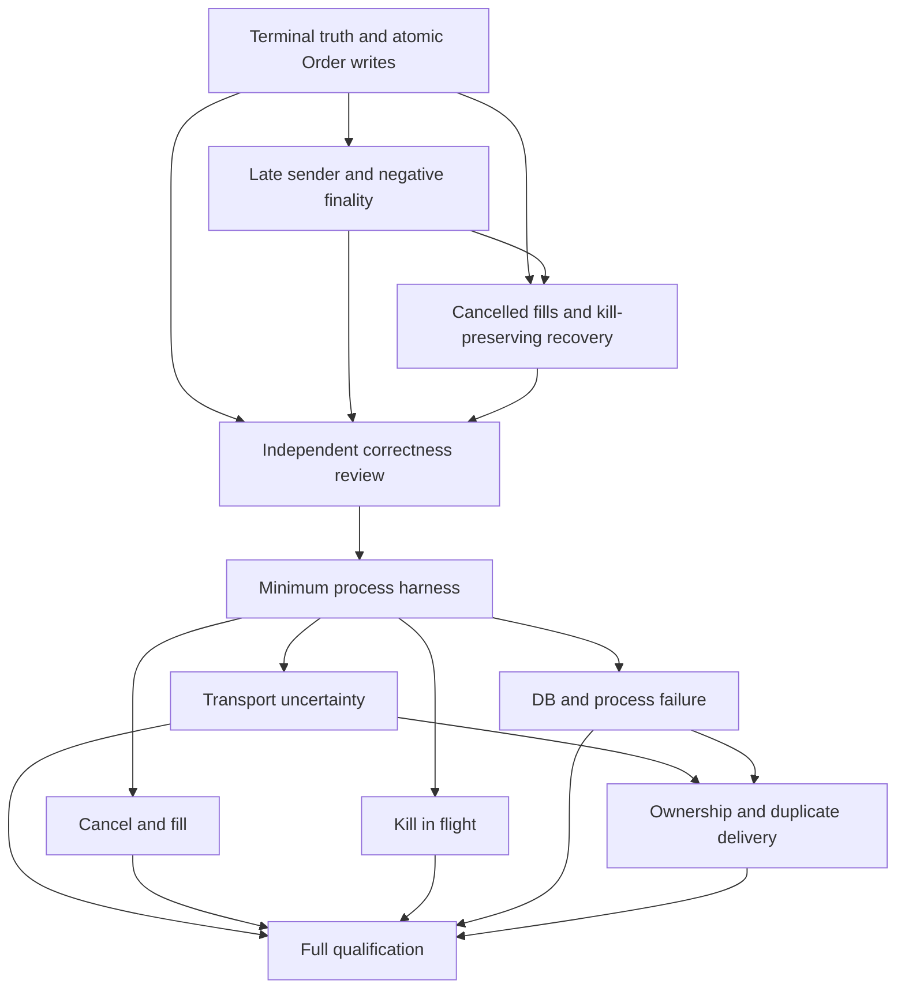

# GateAUDIT Phase6 L4 Failure Matrix Plan

> 文档类型：PROOF_PLAN / NON_RUNTIME_AUTHORITY（证明计划，非运行时或阶段authority）。
> 基线：`8abe969af8bada6a6a9434ca30b990c5ebec7bd5`；日期：2026-09-06。Primary Skill：java-backend-regression-tests（本次 blocker closure）。
> 本文保留 blocker closure 事实；本次 delivery 的测试语义、临时生命周期及重新运行证据见第16节。提交时 CI 尚未运行；后续 exact-head CI 结果绑定本提交，不回写本提交。所有27个L4 qualification scenario仍NOT_RUN。
> 人类摘要与[机器矩阵](GATEAUDIT_PHASE6_L4_FAILURE_MATRIX_PLAN.json)构成同一份计划，不是平行authority。

## 1. 结论、范围与基线

**5 项未知性已关闭，计划可执行；5 项 runtime correctness correction 尚未修复。**

`PLANNED / PHASE6_L4_FAILURE_MATRIX_BLOCKERS_DISPOSITIONED / P0_0 / P1_5 / PLAN_EXECUTABLE`

这是 `EXECUTABLE_PLAN_COMPLETE`，不是 L4 ACCEPTED，也不是 P1=0。3 个 provisional P1 经复现维持 P1；PB1/PB2 分别确认 typed 恢复编排不保持 kill 与负查询终态后的 late dispatch，均按 P1 runtime correction 处理。无 confirmed proof-seam gap，无 false positive，remaining unknowns=0。独立 review 未执行，后续修复必须独立 review。

- 预检 fetch 成功；branch=`audit/post-gatey-agent-baseline`；HEAD=origin=`8abe969af8bada6a6a9434ca30b990c5ebec7bd5`；初始仅两份 untracked plan，staged=0。
- [STATUS](../../current/STATUS.md)及[ROADMAP](../../current/ROADMAP.md)不变：Phase5 ACCEPTED/CLOSED，Phase6 READY/NOT_STARTED，work_batch=GateAUDIT-PHASE6-L4-FAILURE-MATRIX，正式 next_action=NQ-GATEAUDIT-PHASE6-L4-FAILURE-MATRIX-PLAN。
- 本轮仅修改 test/evidence candidate；生产 Java、SQL、RiskGate、kill/lease algorithm、adapter、migration、workflow 和 authority 均未修改。前次closure阶段NO git add/commit/push；本次delivery按第16节授权精确六路径提交和推送。
- 实际验证：8 个新增复现 + 60 个受影响既有用例，共 68 PASS / 0 failure / 0 error / 0 skip。复现断言刻画未修复缺陷，测试绿不等于产品正确。
- 风险：终态覆盖、漏记账、typed recovery 解除 kill、QUERY_NOT_FOUND 后旧 sender 晚发。第一 batch 必须是 correctness remediation 的 C1，B0 不再是复现或修复的前提。
- 回滚：恢复 `artifacts/20260906-l4-blocker-closure/plan-before.md/.json` 到本两份文件；仅反向撤销本轮两个既有测试文件的新增片段、移除两个新测试文件。不要删除用户原计划或覆盖其他改动。
- 全局 LIVE DISABLED、kill ENGAGED 不变；PG/loopback 是 disposable test-only synthetic facts，未访问真实 provider/credential/生产数据。

## 2. Current-code inventory

以下S/T/G编号对应第14节精确文件和行段；源码类名只用于定位，场景按故障边界组织。

| Owner / 能力 | 代码证据 | 事务与真实行为 | 已有hook / foundation | 最小缺口 |
| --- | --- | --- | --- | --- |
| Order / Risk | S01 S02 S03 S04 S05 S06 | OrderCommandService编排、WriteService唯一状态写入口；prepare短@Transactional包括订单/风控/审计/事件，gateway外调在返回后；finalize另一个短事务 | 已有公开服务边界；无统一named hook | 短事务前后用test proxy；事务内部用DataSource statement/commit checkpoint；P1-L4-02另修 |
| Intent / Receipt | S07 S08 S09 | create/claim/SEND_STARTED/receipt各TransactionTemplate；receipt INSERT与Intent UPDATE原子；普通adapter路径不自动创建Intent | ExecutionAttemptLifecycle.beforeClaim/afterClaim/afterSendStarted/beforeFakeMutation/afterFakeMutation仅fake orchestration | typed gateway无该lifecycle；test transport可停在return前，receipt内部需JDBC checkpoint |
| External dispatch | S10 S12 S13 S14 S15 S29 | 普通gateway->OkxExchangeAdapter->OkxHttpClient；typed gateway->OkxSpotProviderAdapter->transport；fake ExecutionIntentService->LoopbackFakeExchangeHttpClient；三者不能互相代替全链证明 | 旧force timeout在成功HTTP之后抛HttpTimeoutException；fake HTTP限loopback、禁redirect、timeout<=30s | 真实独立venue ACK生成/丢失、接收次数；typed transport仅替换最低I/O实现，保留provider解析 |
| Uncertainty / query | S07 S10 S11 S13 | typed UNKNOWN同步query，重启SEND_STARTED->UNKNOWN->RECONCILED；SEND_SUCCEEDED不强改RECONCILED。普通DEFERRED/REMOTE_UNAVAILABLE保留SENT；查order/fills恢复 | query接口可复用；transport IOException在fake路径抛出并留下SEND_STARTED，未必落TIMEOUT receipt | 不能把有body的TRANSPORT_ERROR当lost ACK；负查询与活跃sender冲突属PB2 |
| Reconcile / recovery | S16 S17 S30 | REST getOrder->link ID->align Order短事务->Trade insert->Ledger事务。FILLED可补扫，CANCELLED未列入；typed runner额外负责align/persistFills | 单轮reconcileOnce、typed reconcile可调用；runner内恢复会resume/disengage，open路径sleep后CANCEL | PB1需正常query-only恢复owner；不可由controller直接调repository拼终态 |
| Trade / Ledger | S17 S18 S19 S20 S21 | Trade insert独立durable；Ledger @Transactional包分录/ledger_events/position/account_snapshots/event_store/audit；2基础分录+fee>0时2手续费分录 | F002故障gateway是service throw，只能复用基础断言 | 真实rollback、connection loss和before-commit死亡；逐trade identity/keys及投影断言 |
| Kill | S22 S23 S24 S08 | KillSwitchService每次durable snapshot，读取异常fail-closed；RiskGate下单早期检查；markSendStarted再检查；WorkerOperationSafetyGate只提供authorize，不自动包围网络发送 | 可正常engage；future gate支持claim/send阶段；不是已装配network fence | PB2需dispatch合同；PB1需ENGAGED下只读恢复，禁止复用resumeConsumed解除kill |
| Intent lease / pilot lease | S08 S25 S26 | claim带workerId/UUID token/version/DB time expiry；仅CREATED或expired CLAIMED且send_started NULL可claim；pilot lease另有status/version/validity及one-place/cancel绑定 | CAS/row locks已有；无renew接口，无provider侧monotonic fencing token | 区分intent和pilot lease；expiry用PG实际时钟观察，不能改lease表 |
| Scheduler / worker | S27 S07 T08 | transaction advisory lock只发现ValidationEvidenceScheduler消费；read-only REQUIRES_NEW中callback，事务结束释放；不是Order/Intent外发的锁 | same-JVM双instance/latch PostgreSQL测试；fake service有worker调用接口 | >=2 JVM；不可把validation lock宣称交易worker受保护；新process driver仅委托正常服务 |
| Observability | S16 S17 T03 | F007操作计数及最近时间，进程内重启归零；durable audit、receipt、event_store拥有业务细节 | MicrometerOperationalObservation及现有测试helpers | 故障到达事件、SQLSTATE、wire序列及crash后观测需独立controller日志；不加高基数标签 |

### 2.1 三条路径必须分别登记

1. **ORDINARY**：OrderCommandService -> WriteService.prepare -> AdapterBackedTradingVenueGateway -> OkxExchangeAdapter/OkxHttpClient -> WriteService.finalize；OkxRestReconcileService负责Order/Trade/Ledger。这条路径没有ExecutionIntent，因此对应Intent/lease oracle必须明确NOT_APPLICABLE，不能fixture补造Intent。
2. **TYPED**：普通Order先存在 -> MinimalPilotTradingVenueGateway创建Intent/绑定pilot lease -> claim/SEND_STARTED -> OkxSpotProviderAdapter ->最低transport -> receipt ->普通Order finalize。provider恢复与普通Order/Trade/Ledger恢复分离，必须通过后续收口的正常恢复服务衔接（PB1），不能拿fake路径替代。
3. **INTENT_WORKER**：ExecutionIntentService使用真实JdbcExecutionIntentRepository+loopback fake mutation port。worker进程通过正常服务处理既有durable work；fake service有lifecycle但没有生产worker自动装配证明。该profile最终Order/Trade/Ledger收敛仍依赖PB1明确的正常恢复owner；禁止test driver自己决定终态后调用repository写入。

普通路径的adapter force-timeout hook在HTTP已返回后抛异常，是分支foundation；AT要求在ACK收到前真实timeout，LA要求已生成ACK但caller没有收到，不能复用这个hook冒充两者。


补充已核查的正常startup/recovery路径（S33）：OkxRecoveryService在ContextRefreshed/定时任务中受recoveryEnabled控制，rebuild先扫描NEW/RISK_PASSED/SENT/ACCEPTED/PARTIALLY_FILLED/CANCEL_REQUESTED/CANCEL_REJECTED，hydrate外部ID，再query-confirm，最后委托REST reconcile。普通NOT_FOUND会通过正常OrderLifecycleService推进CANCEL_REQUESTED -> CANCELLED，reason=ORDER_NOT_FOUND/OKX_51603，并写RECOVERY_QUERY_ORDER_NOT_FOUND审计。这不是external CANCEL动作，也不等于typed Intent已恢复。新matrix保留此真实no-send语义，不发明REJECTED合同；PB1/PB2仍须证明typed identity桥接及旧sender不会在负查询之后再发送。

Paper实际资产（S34/T13）：PaperTradingAdapter直接返回ACCEPTED和SIM，getOrder亦固定ACCEPTED，无独立外部store；PaperMatchingServiceTest用InMemoryTradeRepository、AlwaysPostedLedgerGateway验证tick幂等/限价分支，分类仅FOUNDATION_ONLY。F007 OperationalReconciliationMetricsTest（T14）使用真实SimpleMeterRegistry和mock业务依赖，覆盖posted/rejected/thrown/telemetry failure；证明观测分支，不能升格为真实process/ledger故障。

### 2.2 事务地图

| Tx | 开始/结束 | 外部I/O | durable事实与风险 |
| --- | --- | --- | --- |
| T-CMD | S01独立append command event，非包住全链的@Transactional | 无 | command event存在不代表订单或dispatch已提交 |
| T-ORDER-PREP | S02 public preparePlaceOrder的Spring事务入口/返回commit | 无 | NEW/risk/events/audit/SENT原子；先提交再gateway |
| T-INTENT-CREATE / CLAIM / SEND | S08/S09每个TransactionTemplate | 无 | session/order锁、token/version/CAS；SEND_STARTED是一次发送的durable marker |
| T-RECEIPT | S08 appendReceiptAndTransition | 无 | receipt INSERT + Intent UPDATE同事务；中途SQL成功不等于receipt durable |
| T-ORDER-ACK / CANCEL | S03/S04各public方法 | 无 | ACK/状态/audit/events短事务；与receipt不同事务，旧快照是已定位风险 |
| T-TRADE | S17/S20实际JdbcTemplate INSERT，reconciler无外层@Transactional | query在前 | Trade可先于Ledger持久化；trade event append另调用，不虚构共同事务 |
| T-LEDGER | S18 @Transactional | 无 | entries/events/projection/snapshots及相应audit/event在同一Spring事务；需真实PG断言rollback原子性 |
| T-LOCK | S27 REQUIRES_NEW/readOnly/pg_try_advisory_xact_lock | callback可能运行，但唯一消费者是validation refresh | callback不等于交易dispatch fencing；不能把它外包住业务写事务以改变原合同 |

真实Spring composition验收须记录TransactionSynchronizationManager状态、实际transaction manager类型、proxy/target class与pg_backend_pid；不得用上述注释代替将来的runtime验证。

### 2.3 Lease与fencing判断

- Intent acquire：FOR UPDATE + state/version/claim_token条件；CREATED可claim，CLAIMED必须已过DB时间expiry且send_started_at=NULL。TTL>0且<=5分钟。owner=`claimed_by + claim_token`，version单调递增。
- send：再次锁session/intent、检查token/version/未过期和kill/session安全条件后CAS提交SEND_STARTED。没有续租API；不能宣称renew已实现。失去claim后旧token无法markSendStarted。
- post-send：SEND_STARTED/UNKNOWN不能再次claim，是at-most-once dispatch基础；receipt持久化校验version/token但不以TTL作为网络动作撤销器。恢复可在旧进程仍存活时markUnknown/query，旧sender仍可能继续执行，PB2必须解决。
- pilot lease：独立的CREATED/ACTIVE/CONSUMED/CLOSED等控制事实；valid_from/expires_at、version CAS、绑定place/cancel和数据库约束不等于worker fencing。无renew，不可自动生成第二个pilot。
- scheduler advisory lock：PG事务锁；没有租约expiry token或网络fencing，owner连接结束自动释放。应用回调在连接损失后继续运行的风险不能由pg_locks缺失自动排除。
- **没有provider侧monotonic fencing token的证据**。现有claim CAS足以拒绝pre-send stale owner，但不足以直接宣称kill/late dispatch严格边界已保证；是否采用最小dispatch gate或确认sender停止由C3合同决定。不为测试方便新增通用分布式锁系统。

## 3. Existing proof inventory

ALREADY_PROVEN只针对其已接受invariant；PARTIALLY_PROVEN/FOUNDATION_ONLY不满足L4 final qualification。下表accepted pairs来自当前STATUS/ROADMAP与现有evidence，未联网重查历史CI、未重新跑测试。

| 资产 | 分类 | 代码/证据 | 既有technical pair或检查状态 | 复用范围与限制 |
| --- | --- | --- | --- | --- |
| Phase4 F-001 | ALREADY_PROVEN | T01 / G02 | 95b859ee61a8e7f0a725e29877e7303ea4453b1a / 33347091147 | L3正常order->venue fill->Trade->Ledger因果；同JVM fake venue，非L4网络/崩溃 |
| Phase4 F-002 | FOUNDATION_ONLY | T02 T03 / G02 | 0651a7365d1a6afe453d75c8abd3975d458e0b7a / 33387882472 | 两个JVM先后运行、真实PG、R1 service ledger failure、R2 partial continuation；受控GRACEFUL_EXIT，不是lost ACK/DB commit failure |
| Phase4 F-003 | ALREADY_PROVEN | T04 S09 / G02 | 327c2229e89c076eace60046b79ec02c622a7fe4 / 33399190770 | ordinary Order身份与Intent N:1、真实PG并发create；无真实external mutation |
| Phase4 F-004 | ALREADY_PROVEN | T01 S17 / G02 | 18efc06c380d2b411ba7d5f651e7e441247a1b96 / 33358364678 | 多fill、多Trade、旧非latest Trade恢复及identity拒绝；不覆盖CANCELLED中断 |
| Phase5B canonical deploy/restore | ALREADY_PROVEN | Phase5B acceptance evidence | a12ec821fee9dcadaa11428f1db0a065614fb58b / 33615809848 | PG16.15/V46恢复、完整性/Flyway/smoke/wrong-major；不重做deploy，不等于业务故障matrix |
| Phase5 F007 observability | ALREADY_PROVEN | F007 acceptance/implementation evidence | 0e2efdeb236c185dbace67bb22f94c6af64a563a / 34009290836 | 固定5类operation、重启归零、health不等于业务成功；复用原指标 |
| Intent timeout/crash/retry | PARTIALLY_PROVEN | T05 | 初始计划只读；本次相应用例执行见第15节 | InMemoryRepository分支矩阵和lifecycle顺序；不能证明PG/多进程 |
| Gateway/provider | PARTIALLY_PROVEN | T06 T11 S14 | 初始计划只读；本次相应用例执行见第15节 | canonical provider identity、no blind retry、typed query mapping；无终端L4证据 |
| Kill durability / gating | FOUNDATION_ONLY | T07 S22 S23 S24 | 初始计划只读；本次相应用例执行见第15节 | 真实PG但two Spring contexts是同JVM；尚无in-flight fencing证明 |
| Idempotency / reconciliation | PARTIALLY_PROVEN | T09 T10 T01 | 初始计划只读；本次相应用例执行见第15节 | local command short circuit、SENT保留、FILLED补账；既有测试不覆盖本次三项P1 |
| Scheduler lock | FOUNDATION_ONLY | T08 S27 | 初始计划只读；本次相应用例执行见第15节 | 双对象+threads真实PG，并非2 JVM；callback限validation refresh |
| Paper / fake venue | FOUNDATION_ONLY | T01 T03 S28 S29 | 初始计划只读；本次相应用例执行见第15节 | paper撮合、RestartVenue或simulation标签没有独立真实venue facts |
| Phase6 L4 matrix | NOT_PROVEN | 全部27 rows | NOT_RUN | 本文件只计划；所有最终qualification待实施 |
| Real provider / L5 L6 | NOT_APPLICABLE | G02 G03 | DEFERRED / FORBIDDEN | 不测试真实账户，不扩展pilot；L5/L6须L4 accepted |

Phase5 evidence：[canonical deployment/restore](GATEAUDIT_PHASE5B_POST_CI_AUTHORITY_ACCEPTANCE.md)、[F007 acceptance](GATEAUDIT_PHASE5_F007_POST_CI_AUTHORITY_ACCEPTANCE.md)、[F007 implementation contract](GATEAUDIT_PHASE5_F007_MINIMUM_OPERATIONAL_OBSERVABILITY_IMPLEMENTATION.md)。历史文件中当时的OPEN/current摘要不能覆盖今天的STATUS。

## 4. Mandatory failure matrix

JSON逐行包含precondition、processes、trigger、exact injection、fault前external/DB/ACK、crash/retry/reconcile、Order/Intent/Trade/Ledger/lease/kill/count/audit oracle、forbidden result、determinism、evidence、impact与dependencies。以下是便于审查的摘要；不以短表替代完整row。

Fixture统一：BUY LIMIT BTC-USDT、price=100、Q=0.10000000；单fill为0.10，partial f1=0.04、f2=0.06；每fill quote手续费0.01。四分录/Trade；无fee可另外测两分录分支，不计本matrix新增mandatory。所有ID每run隔离，重复run比较去除随机identity后的semantic facts。

| ID | domain / path | 精确触发点 | 最终Order / Trade / Ledger | 外部PLACE request / effective CANCEL | 批次 |
| --- | --- | --- | --- | --- | --- |
| L4-AT-01 | accepted-timeout / ORDINARY | VENUE_ACCEPTED_BEFORE_ACK | FILLED / 1 / 4 | 1 / 0 | B0, B1 |
| L4-AT-02 | accepted-timeout / TYPED | VENUE_ACCEPTED_BEFORE_ACK | FILLED / 1 / 4 | 1 / 0 | B0, B1 |
| L4-LA-01 | lost ACK / TYPED | ACK_GENERATED_NOT_DELIVERED | FILLED / 1 / 4 | 1 / 0 | B0, B1 |
| L4-LA-02 | lost ACK / ORDINARY | ACK_GENERATED_CALLER_DEATH | FILLED / 1 / 4 | 1 / 0 | B0, B1 |
| L4-CFR-01 | cancel/fill race / TYPED | CANCEL_PREQUERY_FILLED | FILLED / 1 / 4 | 1 / 0 | B0, B2, C1, R |
| L4-CFR-02 | cancel/fill race / ORDINARY | CANCEL_INGRESS_FILL_WINS | FILLED / 1 / 4 | 1 / 0 | B0, B2 |
| L4-CFR-03 | cancel/fill race / ORDINARY | CANCEL_COMMITTED_FILL_REJECTED | CANCELLED / 0 / 0 | 1 / 1 | B0, B2 |
| L4-CFR-04 | cancel/fill race / ORDINARY | STALE_PLACE_ACK_AFTER_FILLED_COMMIT | FILLED / 1 / 4 | 1 / 0 | B0, B2, C1, R |
| L4-PFC-01 | partial-fill continuation / ORDINARY | FILL1_DURABLE_BEFORE_RESTART | FILLED / 2 / 8 | 1 / 0 | B0, B2 |
| L4-PFC-02 | partial-fill continuation / TYPED | PARTIAL_THEN_REMAINDER_CANCEL | CANCELLED / 1 / 4 | 1 / 1 | B0, B2, C2, R |
| L4-KIF-01 | kill-in-flight / ORDINARY | BEFORE_RISK_EVALUATE | RISK_REJECTED / 0 / 0 | 0 / 0 | B0, B3, C2, C3, R |
| L4-KIF-02 | kill-in-flight / TYPED | SEND_STARTED_BEFORE_DISPATCH_KILL | CANCELLED / ORDER_NOT_FOUND/OKX_51603 (existing ordinary recovery semantics; typed binding and sender-stop proof required) / 0 / 0 | 0 / 0 | B0, B3, C2, C3, R |
| L4-KIF-03 | kill-in-flight / TYPED | VENUE_ACCEPTED_KILL_BEFORE_ACK | FILLED / 1 / 4 | 1 / 0 | B0, B3, C2, C3, R |
| L4-ESDB-00 | external side effect + DB failure / ORDINARY | RISK_ALLOWED_BEFORE_SENT_COMMIT | RISK_REJECTED / 0 / 0 | 0 / 0 | B0, B4 |
| L4-ESDB-01 | external side effect + DB failure / TYPED | AFTER_EXTERNAL_BEFORE_RECEIPT | FILLED / 1 / 4 | 1 / 0 | B0, B4 |
| L4-ESDB-02 | external side effect + DB failure / TYPED | RECEIPT_INSERT_BEFORE_INTENT_UPDATE | FILLED / 1 / 4 | 1 / 0 | B0, B4 |
| L4-ESDB-03 | external side effect + DB failure / TYPED | COMMIT_APPLIED_RESPONSE_LOST | FILLED / 1 / 4 | 1 / 0 | B0, B4 |
| L4-ESDB-04 | external side effect + DB failure / TYPED | ORDER_FINALIZE_COMMIT_REJECTED | FILLED / 1 / 4 | 1 / 0 | B0, B4 |
| L4-ESDB-05 | external side effect + DB failure / ORDINARY | CANCELLED_COMMIT_BEFORE_FILL_BACKFILL | CANCELLED / 1 / 4 | 1 / 1 | B0, B4, C2, R |
| L4-ESDB-06 | external side effect + DB failure / ORDINARY | TRADE_COMMIT_LEDGER_CONNECTION_LOSS | FILLED / 1 / 4 | 1 / 0 | B0, B4 |
| L4-ESDB-07 | external side effect + DB failure / ORDINARY | LEDGER_WRITTEN_NOT_COMMITTED | FILLED / 1 / 4 | 1 / 0 | B0, B4 |
| L4-MIL-01 | multi-instance / lease / INTENT_WORKER | TWO_WORKERS_BEFORE_CLAIM | FILLED / 1 / 4 | 1 / 0 | B0, B5 |
| L4-MIL-02 | multi-instance / lease / INTENT_WORKER | EXPIRED_CLAIM_STALE_OWNER | FILLED / 1 / 4 | 1 / 0 | B0, B5 |
| L4-MIL-03 | multi-instance / lease / INTENT_WORKER | STALE_SENDER_AFTER_QUERY_NOT_FOUND | CANCELLED / ORDER_NOT_FOUND/OKX_51603 (existing ordinary recovery semantics; typed binding and sender-stop proof required) / 0 / 0 | 0 / 0 | B0, B5, C2, C3, R |
| L4-MIL-04 | multi-instance / lease / SCHEDULER_LOCK | ADVISORY_OWNER_PROCESS_DEATH | NOT_APPLICABLE: no order is created by validation scheduler lock / 0 / 0 | 0 / 0 | B0, B5 |
| L4-DW-01 | duplicate worker / ORDINARY | SAME_COMMAND_BEFORE_INSERT | FILLED / 1 / 4 | 1 / 0 | B0, B5 |
| L4-DW-02 | duplicate worker / INTENT_WORKER | DUPLICATE_DELIVERY_AFTER_SEND_STARTED | FILLED / 1 / 4 | 1 / 0 | B0, B5 |

### 4.1 对场景数量的调整理由

- AT两行覆盖普通与typed实际不同uncertainty路径；LA两行覆盖transport ACK drop与caller死亡。
- CFR四行分别是typed prequery发现已FILLED（P1-01）、真实cancel/fill争夺且fill胜、cancel胜、旧PLACE ACK迟到覆盖FILLED（P1-02）。CFR-04虽注入PLACE ACK，归入终态竞争附加row，不能代替两个cancel/fill winner。
- PFC保留“原order remaining继续成交”和“cancel remaining”两种，不产生replacement order，已执行数量从Trade/venue facts求和不可回退。
- KIF三行细化为risk前、SEND_STARTED之后但未网络发送、已接受后。KIF-02不能偷换为风险检查前ENGAGED；KIF-03不能声称撤回已发出的请求。
- ESDB八行区分pre-send rollback、external后死亡、receipt原子rollback、commit成功响应丢失、后续Order commit拒绝、CANCELLED到fill恢复窗口、Trade到Ledger连接损失、Ledger提交前进程死亡。
- MIL四行分别证明并发claim、过期pre-send接管、post-send stale sender、validation scheduler advisory owner死亡；最后一项仅锁能力，不能代替交易争夺。
- DW两行独立覆盖普通业务command并发查无后插入、已send durable intent重复delivery。DW不与MIL合并：普通路径无lease；重复delivery发生于SEND_STARTED/UNKNOWN而非CREATED竞争。

### 4.2 各row执行与final truth的补充约束

- Controller启动PG/venue/A，只有MIL/DW/KIF控制及CFR-04需要B；crash rows新建A-prime，必须新PID且旧PID已经死亡。单JVM并发线程不计multi-instance。
- 所有row的PG由controller负责随机命名隔离实例/库及迁移；A/B只有runtime业务权限；独立oracle连接只读。venue不连接NQ DB。
- AT：先记录VENUE_ACCEPTED；ACK保持barrier，不生成或不发送直到caller真实timeout；之后开放query，最终venue自动按控制指令生成真实fill。禁止返回字符串TIMEOUT代替transport timeout。
- LA：先序列化ACK并记录bytes digest/ACK_GENERATED；proxy丢弃或caller被终止；证明ACK_OBSERVED不存在且无response bytes forwarded，query/fill按venue事实收敛。
- CFR：barrier的release决定唯一胜者；fill胜可有1次cancel请求但effective cancel=0；typed prequery已FILLED时CANCEL request=0。cancel胜之后venue拒绝fill，无互斥terminal truth。另以同一终态写checkpoint运行stale cancel快照参数变体，不能漏掉S04。
- PFC：f1提交后重启不改trade_id；f2是独立exchange_trade_id。cancel remaining=0.06只取消未成交部分，executed=0.04，executableRemaining=0，不替换Order/Trade identity。
- KIF：B通过正常KillSwitchService.engage产生durable版本事件；对新独立command及旧command重入分别probe并断言外发delta=0。KIF-02/PB2未解决前预期不能标PASS。
- ESDB：在恢复之前通过独立只读连接证明断点时的durable state，恢复只能走正常runtime；不能先用fixture修库再采最终快照。
- MIL-02：A正常claim短TTL，controller用PG clock_timestamp有界等待真实expiry，再让B正常claim；不UPDATE lease、不用冻结Java Clock伪造PG时间；A旧token必须fail。
- MIL-03：B在A活着且未发出时查NOT_FOUND是对抗输入；必须确认A不能再发才能宣布no-send finality。现有代码缺该合同，ordinary no-send已有CANCELLED + ORDER_NOT_FOUND/OKX_51603语义；typed/worker的对应恢复绑定与sender-stop证明尚待C2/C3，不能直接标当前保证。
- MIL-04：验证B先被拒、A死后PG锁释放、B再取锁；无Order/Intent业务项，标N/A有代码依据。
- DW-01：两个真实事务争用同一account/client identity，数据库唯一键保证最多1个local Order；loser短暂unique conflict可以作为可恢复失败，但重新正常调用必须幂等命中，不能重发。
- DW-02：稳定Intent ID重入，query而非mutation；fixture不得改变business identity规避重放。所有fill rows最终再正常reconcile一次，Trade和Ledger keys/count不变。

## 5. Crash-point matrix

实际因果顺序是Order准备提交先于Intent创建，不机械套用示意流程。只选影响外部动作次数、收敛、钱或owner的边界。

| ID | 边界 | 分类 | 关联row | 理由 |
| --- | --- | --- | --- | --- |
| CP01 | command event appended before prepare order | NOT_MATERIAL | L4-DW-01 | S01 command event is not the durable dispatch marker; current direct call has not reached external I/O; business retry covered by DW-01/ESDB-00 |
| CP02 | risk and local SENT transaction before commit | MUST_PROVE | L4-ESDB-00 | 回滚无外发；commit后重复命令不再PLACE |
| CP03 | CLAIMED committed before SEND_STARTED | MUST_PROVE | L4-MIL-02 | 可过期接管；旧token/version拒绝 |
| CP04 | SEND_STARTED committed before dispatch | MUST_PROVE | L4-KIF-02, L4-MIL-03 | 不可重新claim；未发出请求也不能盲重试 |
| CP05 | venue acceptance before ACK creation | MUST_PROVE | L4-AT-01, L4-AT-02 | 真实timeout，1 PLACE |
| CP06 | ACK generated before caller observes | MUST_PROVE | L4-LA-01, L4-LA-02 | ACK bytes与caller未收到证据同时具备 |
| CP07 | ACK parsed before receipt transaction | MUST_PROVE | L4-ESDB-01 | 外部成功，本地SEND_STARTED |
| CP08 | receipt SQL before Intent UPDATE in same transaction | MUST_PROVE | L4-ESDB-02 | 必须证明原子回滚 |
| CP09 | receipt committed independently while Intent remains pre-update | NOT_REACHABLE | 无 | S08同一TransactionTemplate，不存在这个独立commit |
| CP10 | receipt transaction server commit / client acknowledgement | MUST_PROVE | L4-ESDB-03 | commit response loss不可等同rollback |
| CP11 | receipt commit before Order ACK finalization commit | MUST_PROVE | L4-ESDB-04, L4-CFR-04 | 分离事务；commit rejection与陈旧ACK |
| CP12 | terminal Order committed before Trade/fill | MUST_PROVE | L4-ESDB-05 | CANCELLED recovery缺口；FILLED foundation不覆盖 |
| CP13 | durable Trade before Ledger / multi-fill graceful restart invariant | COVERED_BY_EXISTING_ACCEPTED_PROOF | L4-ESDB-06, L4-PFC-01 | F002/F004只覆盖其原受控故障，新增真实连接断开仍MUST执行 |
| CP14 | inside Ledger before commit | MUST_PROVE | L4-ESDB-07 | 分录/事件/position/snapshot全回滚；不能制造部分提交 |
| CP15 | Ledger commit then same Trade replay | COVERED_BY_EXISTING_ACCEPTED_PROOF | L4-PFC-01, L4-DW-02 | 复用既有幂等invariant，所有fill行最终追加replay oracle |
| CP16 | scheduler lock holder death or expiry/stale owner | MUST_PROVE | L4-MIL-02, L4-MIL-03, L4-MIL-04 | 区分DB fencing与无网络fencing |
| CP17 | formatting/log message after all final truths sealed | NOT_MATERIAL | 无 | 不改变外部动作、钱、状态或owner，不逐行注入 |

共17点：MUST_PROVE=12，COVERED_BY_EXISTING_ACCEPTED_PROOF=2，NOT_REACHABLE=1，NOT_MATERIAL=2，IMPLEMENT_LATER=0。被existing proof覆盖的只是不变量基础，row中新增真实故障仍需执行，不据此skip。

## 6. Real-process harness及复用评估

推荐的最小拓扑（本轮未创建完整 L4 harness）：

```text
Controller / independent checker
├─ isolated PostgreSQL 16 process/container (loopback published port)
├─ Synthetic Venue JVM (own append-only facts, no NQ DB access)
├─ NQ A JVM (real Spring services + JDBC + transaction manager)
├─ NQ B JVM (only rows requiring competing worker/control actor)
├─ NQ A-prime JVM (only restart rows, same DB and business identity)
└─ loopback transport/PG protocol proxy (only ACK/COMMIT loss rows)
```

REAL_PROCESS必须同时满足独立PID、真实serialization、真实Spring业务composition、真实事务管理器、真实PG（持久化语义row）、独立venue/socket，以及可确认的terminate/restart。允许test-only控制入口和最低transport替身，但禁止用mock Service、内存repository或同JVM调用替代这些条件。

| Existing asset | Reusable | Gap | L4 scenarios |
| --- | --- | --- | --- |
| F002 ProcessBuilder/child identity及env datasource绑定 | 是，提取test-scope helper或有限复用 | 当前等待子进程正常退出，缺interactive checkpoints/强制死亡事件；默认properties低于env | 全部进程row |
| F002 RestartDatabase/Flyway | 是，随机库/真实迁移/清理方式 | 当前读取现有env且hardcode V46；新controller不得继承共享连接，目标版本由当前migration inventory计算 | 全部PG row |
| BackendCiLegacyAccountFixture | 候选复用其已接受V45前置fixture语义 | 只限新隔离DB的SETUP；须确认current migration顺序，禁止历史migration重写 | Spring/PG启动 |
| F001/F004 TradingChain assertions | 是，逐Trade、Ledger、position/snapshot查询 | in-process venue与service throw不是L4故障 | CFR/PFC/ESDB |
| DisposableFakeVenueLauncher | 复用loopback bind、持久化identity、请求计数思路 | synchronized handler+5s sleep、query仅simulation标签；无真实fill/cancel状态机、ACK事实序列 | AT/LA/CFR/PFC |
| LoopbackFakeExchangeHttpClient | 是，仅INTENT_WORKER wire基础 | payload无qty/price/fill协议，query label不等于fill事实；不能代替typed/ordinary协议 | MIL/DW fake path |
| Ordinary OkxHttpClient | 是，可构造显式loopback baseUrl、真实JDK HTTP/JSON | test composition固定最低endpoint，不调用默认真实Dependencies；dummy schema字段不得读取真实secret | ORDINARY |
| Typed provider adapter/transport接口 | 是，保留OkxSpotProviderAdapter/translator契约 | 需test transport真实wire序列化到venue；endpoint metadata仅证明synthetic，不宣称真实provider合格 | TYPED |
| Clock/latch | Java Clock注入部分可复用；当前Order service内部systemUTC | PG lease用CURRENT_TIMESTAMP，不能任意推进Clock；需要命名checkpoint及DB时间观察 | MIL/KIF |
| Advisory PG lock tests | 复用lock key/状态断言 | 现为同JVM两个instance；callback consumer不是交易worker | MIL-04 |
| Delivery manifests/checkers | 仅复用digest/immutable identity思想 | 没有canonical L4 scenario schema/checker；delivery acceptance不是scenario PASS | B0/B6 |
| F007 operational helpers | 复用真实MeterRegistry和固定tag观测 | counters重启归零、无故障checkpoint/独立process journal；不得以health UP判业务成功 | 全部 |
| ExchangeNoOutboundGuard | 复用已知provider阻断负测 | 当前是host denylist，不是所有network loopback allowlist；不能据它声称internet=0 | B0隔离admission |

B0不复制一个全新业务runtime：保留既有服务、仓储、状态机、ledger owner，新增的只是进程控制、wire venue和观测。涉及正常recovery行为的抽取或增强必须进入C2，不能在TestConfiguration内另写业务恢复算法。

## 7. Deterministic injection与DB failure模型

### 7.1 控制协议

每条消息包含runId/scenarioId/PID/processRole/checkpointId/sequence/parentEventIds，状态严格为：

`ARMED -> REACHED -> RELEASED | FAILED | CRASHED`

先arm、再execute；controller收到精确REACHED并验证独立状态后才释放/中断。重复控制命令按controlCommandId幂等；过期run、重复terminal transition、漏phase、无法匹配PID都FAIL。使用独立control socket和业务socket，不能因hold ACK锁住所有query/control。无Thread.sleep/random delay/人工操作；截止时间仅用于检测失败、真实HTTP timeout或真实lease expiry，并非概率制造race。

test wrapper只允许观测/停顿/终止/切断连接，不得改传入业务值或返回预期业务结果。S07已有lifecycle优先复用；S10 typed路径外部return前可用transport wrapper；事务内部采用test-scope DataSource/Connection/Statement wrapper加真实PG故障。若无法准确拦截，记录`PLAN_GAP / FAULT_INJECTION_SEAM_REQUIRED`，按PRODUCTION_INJECTION_SEAM独立review默认NOOP的最小hook，不在本轮实现。

### 7.2 最小真实DB故障子集

| 故障 | row | 确定性实现设计 | 区分证据 |
| --- | --- | --- | --- |
| transaction rollback | ESDB-00/02 | REACHED后对已知application pg_backend_pid触发隔离PG中断；或SETUP安装只对该run/intent触发的SQL异常trigger，rollback整事务 | SQLSTATE/backend PID、同连接transaction identity、独立快照无未提交receipt/Order |
| commit rejection | ESDB-04 | SETUP安装仅该row的DEFERRABLE INITIALLY DEFERRED constraint trigger，正常finalize SQL执行、COMMIT时PG抛错误 | COMMIT送达、PG错误、0 durable finalize；receipt上游仍存在 |
| connection loss | ESDB-06 | 已观测Trade commit后，first Ledger statement checkpoint处pg_terminate_backend；连接真实断开 | 新只读连接查Trade存在、Ledger不存在；重建正常pool连接后恢复 |
| process death before commit | ESDB-07 | Ledger transaction已执行SQL，controller在beforeCommit barrier执行强制terminate并确认PID死亡 | PG事务结束/rollback、Ledger及投影无部分durable state |
| process death after external success | ESDB-01/05 | venue日志已accept或CANCELLED已commit，checkpoint到达后强制终止A | venue独立事实、pre/post DB snapshot、旧PID死亡及新PID |
| commit applied but response lost | ESDB-03 | 隔离plaintext PG wire proxy识别精确事务COMMIT，保留server CommandComplete/ReadyForQuery，丢给客户端的响应并断开 | server commit被独立连接看到；客户端异常；不能把client exception记成rollback |

上述trigger/控制DDL仅是未来临时test fixture，SETUP中预装、命中目标run且只抛错，不修改业务数据值，不成为Flyway migration；禁止在故障之后安装规则改变已发生事实。Controller只能调用受限故障操作，不能以管理员连接任意UPDATE业务表。PG admin控制与oracle只读连接分离记录。若真实PG proxy尚未具备，不得用mock Connection.commit throw伪装该row；row为NOT_RUN且阻断qualification。

READ COMMITTED/REPEATABLE READ、autocommit、statement/transaction timeout、PG版本和JDBC版本都必须记录实值；不得将进程内Exception名称当数据库故障证据。注入只触及本次PG后端，不能关闭共享DB或系统网络。

## 8. 多层oracle、Ledger与幂等

### 8.1 独立final truth

1. External：venue自己的request ledger逐attempt计数，另存effective mutation和order/fill facts。对同identity重发即使venue去重为1个order，仍令PLACE request count>1并FAIL。venue的fill顺序由controller动作及barrier决定，不由NQ expected值倒填。
2. Persistence：独立只读事务快照orders/execution_intents/execution_receipts/trades/ledger_entries/ledger_events/positions/account_snapshots/kill/lease/audit/event_store；按run的account/order/intent闭包查询，不能只按traceId（恢复trace可能不同）。
3. Safety：duplicate mutation=0、forbidden state transition=0、kill bypass=0、stale owner write/dispatch=0。检查完整状态事件链，不能仅看最后一行掩盖中间违法terminal覆盖。
4. Observability：typed failure分类、checkpoint journal、runtime audit/recovery事件相互关联；计数是按PID观测，重启不假设累加。数据库不可用或进程突然死亡时runtime audit可能无法提交，必须以独立process/venue故障journal解释，并在正常恢复后产生durable recovery审计，不能伪造故障前audit。

默认每row fault/recovery阶段都有bounded deadline。超时没有convergence就是FAIL/INCONCLUSIVE，不选择“最接近预期”的状态。异常退出只有预先指定crash步骤可被接受；test exit=0/HTTP200都不是PASS oracle。

### 8.2 Ledger硬合同

对每个venue唯一fill：

- 确认恰好1个Trade；identity=(exchange,exchange_trade_id)，保留原trade_id、order_id、account_id、symbol、external_order_id、price、qty、fee/currency。
- Ledger ref_type=TRADE、ref_id=trade_id；本fixture fee>0，必须恰好4分录和对应ledger_events，keys为`tradeId:LEDGER:1`、`:2`、`:FEE_1`、`:FEE_2`。zero-fee分支是2，不硬套历史pilot的4到所有交易。
- 从venue facts和当前NumericPolicy规则独立计算amount=price*qty及fee；逐分录currency/delta/direction检查，按当前已接受paired-entry模型平衡，不引入新会计语义。
- Position/executed数量按真实unique fills（及base-currency fee时扣减）核验；固定quote fee fixture下base position为0.10或partial 0.04。remaining=orderedQty-executedQty；cancel后remaining不应被错误再次提交。
- 完成后重放正常reconcile，原Trade ID、Ledger key集合和position保持不变。duplicate financial posting=0、missing financial posting=0；发生Ledger failure时不能创建replacement Trade绕过原key。

### 8.3 三层idempotency identity

- Business：ordinary `account_id + client_order_id`；API idempotencyKey与requestId一起记录，但不能把它们误称数据库唯一主身份。V1 uq_orders_account_client_order及V5 dedup metadata/unique index需在真实PG验证。
- Durable：ordinary order_id；Intent UUID + canonical payload hash + local_order_id/session/account桥接。PLACE使用S32的`nq1-`加SHA256前40 hex；CANCEL保留original PLACE clientOrderId。不同intent不允许偷偷指向另一个Order或替换business action。
- Provider：S31将PLACE intent UUID无连字符的32位lowercase hex映射为provider clientOrderId，与execution的44字符identity不同；普通adapter直接使用ordinary clientOrderId。venue journal必须同时保留实际wire identity和其映射依据。
- Trade：exchange/exchange_trade_id唯一；Ledger：trade_id派生key。Receipt attempt_no/digest是恢复查询证据，不能被当作允许再次PLACE的尝试序号。

准确目标是**at-most-once dispatch + query-confirmed convergence**，并在每row显式给出PLACE request与effective mutation次数。没有“exactly once network”保证；negative query若venue可延迟可见或旧sender仍活跃，就不能判定从未发生请求。本simulator的NOT_FOUND须指向查询时独立store事实，终态负结论还必须证明sender被fence/终止。

## 9. Evidence schema与anti-cheating

未在tracked plan/schema inventory发现canonical L4 plan schema或scenario completeness checker；现有governance schema只拥有authority/lifecycle，delivery manifests拥有发布证据。故本JSON为用户指定的task-local plan contract，schemaVersion=1.0.0，不创建新的runtime checker/schema代码，也不让它参与authority解析。

### 9.1 后续每run的机器证据

| Artifact | 最低内容 / producer |
| --- | --- |
| scenario-result.json | scenarioId/runId/gitCommit/sourceTree/dirtyState/fixtureVersion+digest/repeatIndex；expected/actual/verdict由checker计算 |
| process-events.jsonl | controller与各process原始事件；PID、role、start/exit、checkpoint state、sequence、parent事件；SQLSTATE/PG backend身份；无敏感材料 |
| venue-events.jsonl | VENUE_ACCEPTED/ACK_GENERATED/ACK_FORWARDED/ACK_DROPPED/CANCEL_COMMITTED/FILL/QUERY；wire attempt ID、实际provider identity、order ID、qty/fee、全序列号 |
| db-pre-fault.json / db-post-fault.json / db-final-state.json | 独立oracle repeatable-read snapshot；数据库名/server版本/迁移digest/isolation；按业务identity完整闭包 |
| assertions.json | 每个谓词id、输入artifact digest及JSON pointer、expected/actual、PASS/FAIL；缺输入不PASS |
| manifest.json | artifact大小/hash、producer identity、Git/fixture/进程/PG/venue版本；source event与seal/materialization event分开 |

字段至少覆盖JSON的evidenceContract.requiredFields；randomSeed=null代表没有随机fault scheduling。UUID只用于隔离命名，不能决定故障先后。timestamps用于诊断，事件因果以sequence和predecessor为准，不跨机器依赖墙钟排序。

### 9.2 Checker设计

B0先定义并实现独立checker：读取mandatory matrix闭包，校验所有required fields/types/enum/id唯一性、每个row/repeat恰好1份result、phase完整、fault确实REACHED、PID拓扑和新旧进程生存期、source/fixture hash绑定；从venue事件重放算external truth，从DB快照核验对应事实。result自称PASS不被采信；Markdown只有解释权。

必须用坏证据负测：删一个row/repeat、伪造PASS、改PLACE count、删fee分录、替换Trade identity、缺ACK_GENERATED、fault未到达、混用另一run快照、未停止旧sender却负查询finality、重复lease owner事件、skip FINAL_ASSERT。每个应被拒绝；checker不能只校验JSON语法。

hash只能证明文件未变，不能证明fixture没造假；必须审查producer职责、控制消息、DB权限与运行调用路径。不得将本轮文档一致性校验称为上述未来checker已实现。

### 9.3 Anti-cheating规则

- BASELINE_ASSERT之前可以建立合成account/session/prerequisite事实并迁移隔离库；完整setup清单/hash保留。Order只能从正常command创建，fill/trade/ledger只能由normal runtime从venue facts产生。
- BASELINE_ASSERT后撤销controller对业务表写权限；独立oracle只读；fault operator只能触发预装fault/终止已登记PG backend或子进程。测试不得直接UPDATE Order/Intent/Trade/Ledger/lease至预期值。
- synthetic venue自己拥有order/fill store，不读NQ表、不导入expected snapshot、不从最后测试断言反推“真实”venue结果。
- injected wrapper不伪造service返回、不替换状态机/repository/RiskGate/transaction manager；正常恢复call graph写入evidence。禁止controller调用仓储或lifecycle按测试expected修终态。
- 禁止失败后补写业务数据再继续取证；修implementation必须新candidate、新run重跑，保留原失败证据。
- 日志/metrics不能成为独立truth的替身；使用observer采集数据库事实与venue原始事件，两者交叉检查。

## 10. Isolation与synthetic-only test authority

全局current authority保持LIVE DISABLED、kill ENGAGED。本次仅运行 disposable PG16.15 / loopback targeted tests；以下严格进程隔离合同仍属于未来 L4 qualification：

- 每run显式指定repo内artifact目录、独立PG16实例/随机库、127.0.0.1端口；拒绝非loopback、DNS、redirect、proxy、继承的真实endpoint以及已存在的共享DB。PG从当前delivery lock解析镜像digest，记录实际server版本，不永久hardcodeV46。
- 启动env从allowlist构造；SPRING_DATASOURCE_*显式绑定生成的测试库，避免F002曾处理的env优先级问题。不得读取已有.env或任何credential文件；schema需要的credential-reference仅是dummy fixture，无真实密钥、JIT或provider网络能力。
- runtime live-enabled/real-provider/real-client/real-exchange仍false；真实provider配置/runner不启动。所有mutation接到合成venue的最低transport，启动时核对Bean target/type、URI allowlist及不存在真实credential executor。
- 当前Intent repository硬性要求LIVE类型Order/session与kill DISENGAGED才能发送。不能改SQL绕过或把SIM改成LIVE生产能力。若要覆盖该真实代码，必须在隔离DB内用**synthetic-only explicit test authority**建立仅schema层的LIVE标记合成事实及test-local DISENGAGED窗口，并明确它与外部global authority无关；本次授权范围内已用于 targeted reproduction，未进入 full qualification。若后续任务不授权这一隔离fixture，typed/worker rows保持BLOCKED，绝不用假repository代替。
- synthetic authority至少绑定runId、DB identity、PIDs、fixture digest、loopback endpoints、有效期、允许的scenario；只进入test classpath，不可由生产profile配置值打开。B0的默认基线仍kill ENGAGED、external mutation=0；实际合成执行窗口在后续scenario任务中单独激活。
- kill场景ENGAGED后及恢复期间不再disengage。现有pilot runner resumeConsumed会解除kill且open recovery可主动cancel，因此不能直接复用；这是本次确认的 PB1 runtime composition defect；不能藏在fixture里。
- 网络证明需要最小socket/transport allowlist及隔离PG绑定，不只复用ExchangeNoOutboundGuard的provider域名denylist。禁止修改系统防火墙/代理，也禁止用互联网连接测试no-outbound。
- cleanup仅处理已登记PID/PG实例/随机目录；先保留并seal失败证据，再按精确资源ID清理；无法清理记FAIL，不能杀共享进程或扫描生产服务。

## 11. 五项 blocker disposition 与真实合同

全部 disposition 均为 `CONFIRMED_CORRECTNESS_DEFECT`；不将 production correction 写成 harness gap。每项结果严格保留本次 proof level。

### P1-L4-01 / CANCEL_AFTER_CONFIRMED_FILL_TERMINAL_OVERWRITE_RISK

- disposition：`CONFIRMED_CORRECTNESS_DEFECT`；severity=P1；修复状态=OPEN。
- reproduction：`backend/nq-app/src/test/java/com/guidinglight/nexusquant/app/smoke/L4PlanBlockerPostgresIntegrationTest.java#filledProviderNoMutationCancelBecomesCancelledAndIsNotAutomaticallyRepaired`。
- result：真实 OkxSpotProviderAdapter 先解析 FILLED；cancel 返回 NO_MUTATION_TERMINAL；真实 typed gateway accepted=true；真实 Order service/PG 写 CANCELLED。QUERY=1、CANCEL wire=0、Trade=0、Ledger=0；两轮 REST scan 无补偿，显式 FILLED 对齐被 terminal state machine 拒绝。
- implementation owner：nq-core OrderCommandWriteService / TradingCancelGatewayResult; nq-infra MinimalPilotTradingVenueGateway。
- required batch：C1；dependency：无。
- 验收：FILLED/NO_MUTATION 保留真实 FILLED；CANCELED、REJECTED、NOT_FOUND 各有明确语义；不得统一写 CANCELLED；zero CANCEL mutation，逐fill账务完整。
- 证据限制：typed binding/lease/intent persistence 在此 mapping probe 是 mock；Order/Trade/Ledger 为真实 Spring/PG。未证明 pilot authorization、完整 typed wiring 或真实 provider。

### P1-L4-02 / ORDER_STATUS_STALE_ACK_WITHOUT_CURRENT_STATE_OR_VERSION_CAS

- disposition：`CONFIRMED_CORRECTNESS_DEFECT`；severity=P1；修复状态=OPEN。
- reproduction：`backend/nq-app/src/test/java/com/guidinglight/nexusquant/app/smoke/L4PlanBlockerPostgresIntegrationTest.java#stalePlaceAckOverwritesCommittedFilledThroughRealSpringTransactions`；`backend/nq-app/src/test/java/com/guidinglight/nexusquant/app/smoke/L4PlanBlockerPostgresIntegrationTest.java#staleCancelAckOverwritesCommittedFilledThroughRealSpringTransactions`。
- result：T1 完成短事务并停在 gateway 返回前；T2 经真实 REST reconciliation 提交 FILLED/Trade1/Ledger2；释放 T1 后旧 PLACE ACK 写 ACCEPTED，旧 CANCEL ACK 写 CANCELLED。生产 UPDATE orders ... WHERE order_id=? affected rows=1。
- implementation owner：nq-core OrderCommandWriteService + nq-infra JdbcOrderRepository / OrderRepository contract。
- required batch：C1；dependency：无。
- 验收：两种旧 ACK 都不能覆盖已提交 terminal；重读与写入在同一锁/CAS短事务；affected rows=0 或显式 stale rejection；不得发虚假 ACCEPTED/CANCELLED audit/event。
- 证据限制：同 JVM 两个确定性执行线程、真实 PostgreSQL 和 Spring 事务；不是多 JVM 或 L4 final proof。普通 gateway 是受控 fixture，不验证网络 cancel 竞争。

### P1-L4-03 / CANCELLED_ORDER_RECONCILIATION_COVERAGE_GAP

- disposition：`CONFIRMED_CORRECTNESS_DEFECT`；severity=P1；修复状态=OPEN。
- reproduction：`backend/nq-app/src/test/java/com/guidinglight/nexusquant/app/smoke/L4PlanBlockerPostgresIntegrationTest.java#cancelledOrderWithVenueFillIsExcludedWhileFilledPositiveControlRecovers`。
- result：local CANCELLED 后 venue fill 存在，连续2轮 scan 对该订单 fillQuery=0、Trade=0、Ledger=0。另一个 ACCEPTED positive control 在同一服务生成 FILLED/Trade1/Ledger2。
- implementation owner：nq-scheduler OkxRestReconcileService / OkxRecoveryService。
- required batch：C2；dependency：C1, C3。
- 验收：有界扫描带稳定identity的 CANCELLED 缺fill订单；不要求把合法部分成交撤单改成 FILLED；补齐每个Trade及2/4分录，restart/replay幂等且保留状态事实。
- 证据限制：重复扫描配合静态 candidate predicate 证明正常 REST/restart recovery blind spot；不是对无限时间的观测。WS event store/acceleration 不拥有 missing Trade/Ledger backfill；typed pilot runner 不是普通订单的自动恢复 owner。

### PB1 / KILL_ENGAGED_TYPED_RECOVERY_PATH_NOT_PROVEN

- disposition：`CONFIRMED_CORRECTNESS_DEFECT`；severity=P1；修复状态=OPEN。
- reproduction：`backend/nq-app/src/test/java/com/guidinglight/nexusquant/app/smoke/L4PlanBlockerPostgresIntegrationTest.java#engagedKillRejectsNewPlaceButAllowsOrdinaryReadAndLedgerConvergence`；`backend/nq-app/src/test/java/com/guidinglight/nexusquant/app/livecontrol/LiveSessionFactModelPostgresIntegrationTest.java#shouldCharacterizeL4KillRecoveryAndLateSenderAfterNegativeQuery`；`backend/nq-infra/src/test/java/com/guidinglight/nexusquant/livecontrol/infra/PilotExecutionLeaseServiceTest.java#l4UnexpiredRecoveryRequestsDisengageBeforeAnyQuery`；`backend/nq-infra/src/test/java/com/guidinglight/nexusquant/livecontrol/infra/PilotExecutionLeaseServiceTest.java#l4ExpiredRecoveryDoesNotRequestDisengage`。
- result：ENGAGED 下 ordinary new PLACE=RISK_REJECTED；typed new PLACE=GLOBAL_KILL_SWITCH_NOT_DISENGAGED；typed QUERY/FILLS及真实 PG Intent recovery=RECONCILED可执行；ordinary recovery=FILLED/Trade1/Ledger2。完整 pilot runner 的 unexpired consumed resume 却在 query 前请求 disengageForPilot；expired 分支不解除。
- implementation owner：nq-app MinimalLivePilotConfiguration recovery composition; nq-infra PilotExecutionLeaseService / MinimalPilotTradingVenueGateway。
- required batch：C2；dependency：C1, C3。
- 验收：正常 typed recovery owner 在未过期/已过期、positive/negative/open truth 下保持 kill ENGAGED；无 resume/disengage/新 PLACE/CANCEL。通过正常服务持久化 Order/Trade/Ledger；negative finality 依赖 C3 的旧sender停止确认。
- 证据限制：缺陷范围是 L4 要求的 kill-preserving typed recovery composition；不是声称 RiskGate 无差别挡住所有恢复，也不把原 pilot 已授权短窗口行为追认成历史事故。unexpired 单测证明解除调用，不声称触及真实 kill 或已跑完整 runner。

### PB2 / SEND_STARTED_OLD_SENDER_DISPATCH_AUTHORITY_NOT_PROVEN

- disposition：`CONFIRMED_CORRECTNESS_DEFECT`；severity=P1；修复状态=OPEN。
- reproduction：`backend/nq-app/src/test/java/com/guidinglight/nexusquant/app/livecontrol/LiveSessionFactModelPostgresIntegrationTest.java#shouldCharacterizeL4KillRecoveryAndLateSenderAfterNegativeQuery`。
- result：A durable SEND_STARTED 后 latch 停顿；B claim 被拒绝（不会成为新发送owner）；B 使 Intent UNKNOWN 并 query-not-found -> RECONCILED，递增 version 使 A receipt 失权；ENGAGED 下释放 A，A wire=1、B wire=0、QUERY=1，A 最后 receipt CAS rejected，DB仍 QUERY_NOT_FOUND。
- implementation owner：nq-core ExecutionIntentService / ExecutionAttemptLifecycle; typed dispatch and recovery owner must share negative-finality contract。
- required batch：C3；dependency：C1。
- 验收：A 在 pre-dispatch 被撤销并确认停止后才允许 negative finality；若无法确认旧sender已停止，则 NOT_FOUND 保持 UNKNOWN，可重复query但不新 mutation。若请求已开始，等待正查询收敛；A/B重复 mutation=0，旧receipt拒绝不能代替wire抑制。
- 证据限制：真实 PG repository + 两个 worker service + 真实 loopback HTTP；不是两个 JVM。没有 TTL 人工改写或伪造 B 接管；未证明 duplicate mutation。确认的是 negative finality 后 late dispatch，不能将 DB CAS 称为 network fencing。

### Kill ENGAGED 实际调用表

| Operation | ENGAGED 实际行为 / allowed | side effect | code owner / proof |
| --- | --- | --- | --- |
| new PLACE | 普通 RISK_REJECTED；typed new intent 被 GLOBAL_KILL_SWITCH_NOT_DISENGAGED 拒绝 | wire=0；拒绝/审计本地落库 | RiskGate/KillSwitchRiskRule；JdbcExecutionIntentRepository；两条 executable probe |
| new CANCEL | minimal pilot 的 markSendStarted 有 kill + consumed lease gate，ENGAGED 拒绝；ordinary cancel 与非 minimal fake CANCEL 无统一 kill gate | 普通路径仍可能 external CANCEL；不等于本轮获准真实发送 | OrderCommandService.prepareCancelOrder / JdbcExecutionIntentRepository.requireCancelSendSafetyGate；静态调用证据，未声称所有 CANCEL 都拒绝 |
| provider QUERY | typed gateway允许，刷新只读clock，查询不能变成mutation | QUERY=1；无PLACE/CANCEL | MinimalPilotTradingVenueGateway.reconcile；真实typed adapter + synthetic transport |
| reconciliation read | 普通 REST与typed QUERY/FILLS均可执行 | 只读外部查询 | OkxRestReconcileService / typed gateway；PG定向通过 |
| local persistence recovery | Intent SEND_STARTED→UNKNOWN→RECONCILED合法；ordinary Order/Trade可恢复 | PG写receipt、Order、Trade、audit | JdbcExecutionIntentRepository / OrderLifecycleService；PG定向通过 |
| ledger convergence | 已发现fill可经canonical ledger收敛；gateway自身不负责记账 | PG ledger entries/projections | TradeLedgerPostingService；ordinary fee=0 case生成2分录 |
| full typed runner resume | 未过期consumed恢复先请求disengage；已过期分支不解除；open observation还可能进入CANCEL | 可能解除kill和取消剩余量 | MinimalLivePilotConfiguration.recoverConsumed / completeReconciliation；PilotExecutionLeaseService两分支可执行单测 |

PB1 判断依据是 L4 要求的恢复期间 kill 保持 ENGAGED，而不是“kill 必须挡住所有代码”。现有原语并未被 kill 无差别阻塞；缺的是正常编排的安全语义，因此不是纯 proof seam。C2 应保留只读恢复能力，不能靠弱化 RiskGate 或 fixture 直接修库收敛。

### Transaction / recovery / sender 排除性检查

- P1-1：FILLED 从 typed `queryOrderByClientOrderId` 进入；NO_MUTATION_TERMINAL 还来自 CANCELED、REJECTED、NOT_FOUND。gateway压成boolean accepted，finalize仅按cancelRequested快照写CANCELLED。后续 REST不扫CANCELLED，terminal state machine不接受CANCELLED→FILLED。
- P1-2：生产 `prepare` 与 `finalize` 是独立 Spring事务；gateway处断言无active transaction。PG default isolation=READ COMMITTED；读不加row lock，状态 UPDATE 无current-state/version谓词；唯一键仅管订单identity。state machine校验旧对象；没有跨gateway的锁、ownership或single writer，reconciler在另一线程完成真实commit。仅凭SQL没version不是定罪依据，实际覆盖和affected rows=1才是依据。
- P1-3：REST扫描 SENT/ACCEPTED/PARTIALLY_FILLED/CANCEL_REQUESTED/CANCEL_REJECTED/FILLED；startup recovery扫描非终态并委托同一REST。WS bridge写event_store并加速ACK/reject状态，不拥有missing Trade backfill；LedgerReconcileScheduler比较已有账务，不从venue发现丢失fill。typed pilot runner是另一个受pilot范围限制的owner，不能弥补ordinary CANCELLED的正常扫描漏项。两轮观察结合不变predicate，证明该恢复路径blind spot，不声称观测了“无限时间”。
- PB2：owner=claimed_by + UUID claim_token + version；CLAIMED/未过期/token匹配才可markSendStarted。SEND_STARTED是durable send reservation，不是已发wire事实；一旦写入就不可重claim，即使TTL到期。没有renew API或provider monotonic fencing token。provider clientOrderId从intent稳定映射，防identity漂移但不能撤销旧sender。
- PB2探针不伪造B取得SEND_STARTED所有权：B claim被真实PG拒绝，随后recovery CAS递增version使A无法提交receipt。A仍持有旧对象并能发wire，最终RECONCILED/QUERY_NOT_FOUND与venue已接受相矛盾。duplicate mutation未复现；negative-finality correctness defect已复现。future WorkerOperationSafetyGate仅返回authorize decision，不自动包围网络发送。

## 12. Implementation batches与dependency DAG

首个 implementation program=`PHASE6_L4_RUNTIME_CORRECTNESS_REMEDIATION`，最小首片=C1。已有本轮test基础足够复现，故不需要先实现B0。

| Batch | scope | dependsOn | acceptance |
| --- | --- | --- | --- |
| C1 Terminal truth and atomic Order ownership | P1-L4-01/02最小终态合同与原子写保护；复用本轮targeted tests；不依赖B0 | 无 | FILLED/NO_MUTATION 保留真实 FILLED；CANCELED、REJECTED、NOT_FOUND 各有明确语义；不得统一写 CANCELLED；zero CANCEL mutation，逐fill账务完整。 两种旧 ACK 都不能覆盖已提交 terminal；重读与写入在同一锁/CAS短事务；affected rows=0 或显式 stale rejection；不得发虚假 ACCEPTED/CANCELLED audit/event。 |
| C3 Dispatch authority and stale sender | PB2 negative-finality与旧sender停止确认；现有lifecycle足够复现，不预授权production injection seam | C1 | A 在 pre-dispatch 被撤销并确认停止后才允许 negative finality；若无法确认旧sender已停止，则 NOT_FOUND 保持 UNKNOWN，可重复query但不新 mutation。若请求已开始，等待正查询收敛；A/B重复 mutation=0，旧receipt拒绝不能代替wire抑制。 |
| C2 Recovery admission and query-only convergence | P1-L4-03 + PB1；CANCELLED补扫及kill-preserving typed recovery composition；不改RiskGate放行条件 | C1, C3 | 有界扫描带稳定identity的 CANCELLED 缺fill订单；不要求把合法部分成交撤单改成 FILLED；补齐每个Trade及2/4分录，restart/replay幂等且保留状态事实。 正常 typed recovery owner 在未过期/已过期、positive/negative/open truth 下保持 kill ENGAGED；无 resume/disengage/新 PLACE/CANCEL。通过正常服务持久化 Order/Trade/Ledger；negative finality 依赖 C3 的旧sender停止确认。 |
| R Independent correctness review | 独立于实现上下文的correctness review；不自动修复 | C1, C3, C2 | 5 confirmed defects closed by executable invariants; P0/P1=0 for correction candidate; no authorization weakening |
| B0 Harness foundation | forked Spring launcher、PG16隔离、loopback allowlist、控制协议、独立venue日志、schema及checker；无production变更 | R | 独立PID/真实PG及Spring proxy；baseline后controller无业务写权限；正常回合及坏证据拒绝 |
| B1 Transport uncertainty | AT/LA rows；真实timeout与ACK生成后丢失区分 | B0, C2 | 每row3次；PLACE=1；完整终态 |
| B2 Cancel/fill and partial continuation | CFR/PFC rows | B0, C1, C2 | 两个winner、stale ACK、remainder、逐fill Ledger及replay |
| B3 Kill in flight | KIF rows | B0, C2, C3 | 初始PLACE计数0/0/1；新命令外发0；kill-engaged恢复 |
| B4 Real DB and process failure | ESDB-00..07；rollback/commit rejection/commit response lost/connection loss/death | B0, C1, C2 | PG及wire evidence独立判故障；原子性及最终断言，无手工修库 |
| B5 Ownership and duplicate delivery | MIL/DW；交易worker与validation lock分别证明 | B0, C1, C2, C3, B1, B4 | 2 JVM竞争；旧token拒绝；SEND_STARTED不可重claim；负终态后无晚发 |
| B6 Full matrix qualification | 同一immutable technical candidate全矩阵+独立review；未来显式授权后才CI | B1, B2, B3, B4, B5 | 27x3=81 runs；P0/P1=0；skip/flake/checker/divergence=0 |



JSON contains every direct dependency; diagram is the transitive reduction. C3 follows C1 as a deliberate reviewable sequence; C2 depends on both terminal semantics and sender-stop/negative-finality safety. R must close the confirmed defects before B0/qualification. Harness planning may continue independently, but no large B0 is needed to reproduce these defects.

**推荐下一实施 token**：`NQ-GATEAUDIT-PHASE6-L4-RUNTIME-CORRECTNESS-IMPLEMENTATION`，范围先限定 C1。Program分类仍为 `PHASE6_L4_RUNTIME_CORRECTNESS_REMEDIATION`；token不用REMEDIATION，避免现有matcher同时匹配FIX与IMPLEMENTATION。正式 authority 仍为 PLAN，须后续单独 authority transition 与实施授权；本轮不改machine status，不授予任何生产操作。Correctness batch与harness batch分离，并逐项独立review。

## 13. Lifecycle、确定性与最终L4 gate

每个scenario完整生命周期：

`SETUP -> BASELINE_ASSERT -> ARM_FAULT -> EXECUTE -> FAULT_REACHED -> CRASH/FAIL/DROP -> RECOVER/RESTART -> RECONCILE -> FINAL_ASSERT -> EVIDENCE_SEAL -> CLEANUP`

无crash或无mutation的row，对不适用phase写带原因的完成事件，不能省略phase。任一phase失败则整个scenario FAIL，尤其FINAL_ASSERT/EVIDENCE_SEAL/CLEANUP不能跳过。Crash后runtime audit不可用必须由独立controller死亡观测覆盖，不能补造旧进程事件。

- 每mandatory row至少3次独立新DB/venue/run，27行至少81 runs；CFR-04 stale-cancel参数变体需额外执行，不用重复次数替代不同语义。此处运行成本未测，保守以最小3次为门槛，后续实际duration据实记录；不能为快而降为偶尔成功。
- 对比归一化semantic verdict、side-effect count、terminal facts、Trade/Ledger identity关系；PID/UUID/timestamp不要求字节相同。允许有界query次数因恢复轮次不同，但不得改变mutation次数或final facts。
- mandatory全PASS；unexpected skip=0、flaky=0、duplicate external effect=0、ledger divergence=0、unresolved terminal=0、kill bypass=0、lease ownership violation=0、checker errors=0、P0=0、P1=0。
- NOT_RUN/SKIPPED/INCONCLUSIVE/FAIL任一mandatory row都阻断acceptance。缺真实process/PG/serialization、未命中fault、仅mock抛异常、只有HTTP200/exit0/长日志均不算通过。
- 先完成独立技术review及经授权的exact-head CI证据，technical commit/CI pair不可变；后续docs-only authority接受另行同步，不用文档commit冒充技术证明。
- L5/L6 scale、random chaos、long-duration soak、partition fuzz、resource exhaustion、大集群全部DEFERRED UNTIL L4 ACCEPTED。当前included work=0。

## 14. 精确源码索引

以下是本次HEAD读取的source coordinates；后续candidate若改动，须重新绑定commit与行号。表中范围用于源码查证，不是独立runtime proof。

| ID | 文件 | 行段 |
| --- | --- | --- |
| S01 | [OrderCommandService.java](../../../backend/nq-core/src/main/java/com/guidinglight/nexusquant/trading/application/OrderCommandService.java) | 86-190 |
| S02 | [OrderCommandWriteService.java](../../../backend/nq-core/src/main/java/com/guidinglight/nexusquant/trading/application/OrderCommandWriteService.java) | 93-260 |
| S03 | [OrderCommandWriteService.java](../../../backend/nq-core/src/main/java/com/guidinglight/nexusquant/trading/application/OrderCommandWriteService.java) | 269-345 |
| S04 | [OrderCommandWriteService.java](../../../backend/nq-core/src/main/java/com/guidinglight/nexusquant/trading/application/OrderCommandWriteService.java) | 402-595 |
| S05 | [JdbcOrderRepository.java](../../../backend/nq-infra/src/main/java/com/guidinglight/nexusquant/trading/infra/jdbc/JdbcOrderRepository.java) | 54-144 |
| S06 | [InMemoryOrderStateMachine.java](../../../backend/nq-core/src/main/java/com/guidinglight/nexusquant/trading/domain/state/InMemoryOrderStateMachine.java) | 18-83 |
| S07 | [ExecutionIntentService.java](../../../backend/nq-core/src/main/java/com/guidinglight/nexusquant/livecontrol/execution/application/ExecutionIntentService.java) | 63-151 |
| S08 | [JdbcExecutionIntentRepository.java](../../../backend/nq-infra/src/main/java/com/guidinglight/nexusquant/livecontrol/execution/infra/jdbc/JdbcExecutionIntentRepository.java) | 60-192 |
| S09 | [JdbcExecutionIntentRepository.java](../../../backend/nq-infra/src/main/java/com/guidinglight/nexusquant/livecontrol/execution/infra/jdbc/JdbcExecutionIntentRepository.java) | 194-341 |
| S10 | [MinimalPilotTradingVenueGateway.java](../../../backend/nq-infra/src/main/java/com/guidinglight/nexusquant/livecontrol/execution/infra/MinimalPilotTradingVenueGateway.java) | 78-147 |
| S11 | [MinimalPilotTradingVenueGateway.java](../../../backend/nq-infra/src/main/java/com/guidinglight/nexusquant/livecontrol/execution/infra/MinimalPilotTradingVenueGateway.java) | 150-267 |
| S12 | [AdapterBackedTradingVenueGateway.java](../../../backend/nq-scheduler/src/main/java/com/guidinglight/nexusquant/scheduler/service/AdapterBackedTradingVenueGateway.java) | 68-207 |
| S13 | [OkxExchangeAdapter.java](../../../backend/nq-adapter-okx/src/main/java/com/guidinglight/nexusquant/adapter/okx/service/OkxExchangeAdapter.java) | 130-224 |
| S14 | [OkxSpotProviderAdapter.java](../../../backend/nq-adapter-okx/src/main/java/com/guidinglight/nexusquant/adapter/okx/service/OkxSpotProviderAdapter.java) | 70-203 |
| S15 | [OkxHttpClient.java](../../../backend/nq-adapter-okx/src/main/java/com/guidinglight/nexusquant/adapter/okx/service/OkxHttpClient.java) | 45-150 |
| S16 | [OkxRestReconcileService.java](../../../backend/nq-scheduler/src/main/java/com/guidinglight/nexusquant/scheduler/service/OkxRestReconcileService.java) | 142-317 |
| S17 | [OkxRestReconcileService.java](../../../backend/nq-scheduler/src/main/java/com/guidinglight/nexusquant/scheduler/service/OkxRestReconcileService.java) | 320-425 |
| S18 | [TradeLedgerPostingService.java](../../../backend/nq-ledger/src/main/java/com/guidinglight/nexusquant/ledger/service/TradeLedgerPostingService.java) | 77-147 |
| S19 | [TradeLedgerPostingService.java](../../../backend/nq-ledger/src/main/java/com/guidinglight/nexusquant/ledger/service/TradeLedgerPostingService.java) | 199-247 |
| S20 | [JdbcTradeRepository.java](../../../backend/nq-infra/src/main/java/com/guidinglight/nexusquant/scheduler/infra/jdbc/JdbcTradeRepository.java) | 75-120 |
| S21 | [JdbcLedgerPostingRepository.java](../../../backend/nq-infra/src/main/java/com/guidinglight/nexusquant/ledger/infra/jdbc/JdbcLedgerPostingRepository.java) | 35-145 |
| S22 | [KillSwitchService.java](../../../backend/nq-risk/src/main/java/com/guidinglight/nexusquant/risk/service/KillSwitchService.java) | 29-90 |
| S23 | [KillSwitchRiskRule.java](../../../backend/nq-risk/src/main/java/com/guidinglight/nexusquant/risk/service/KillSwitchRiskRule.java) | 39-54 |
| S24 | [WorkerOperationSafetyGate.java](../../../backend/nq-core/src/main/java/com/guidinglight/nexusquant/livecontrol/deployment/WorkerOperationSafetyGate.java) | 9-42 |
| S25 | [JdbcPilotExecutionLeaseRepository.java](../../../backend/nq-infra/src/main/java/com/guidinglight/nexusquant/livecontrol/infra/jdbc/JdbcPilotExecutionLeaseRepository.java) | 72-192 |
| S26 | [PilotExecutionLeaseService.java](../../../backend/nq-infra/src/main/java/com/guidinglight/nexusquant/livecontrol/infra/PilotExecutionLeaseService.java) | 215-278 |
| S27 | [PostgresAdvisorySchedulerExecutionLock.java](../../../backend/nq-infra/src/main/java/com/guidinglight/nexusquant/scheduler/infra/lock/PostgresAdvisorySchedulerExecutionLock.java) | 63-142 |
| S28 | [DisposableFakeVenueLauncher.java](../../../backend/nq-app/src/main/java/com/guidinglight/nexusquant/app/livecontrol/executionworker/DisposableFakeVenueLauncher.java) | 33-151 |
| S29 | [LoopbackFakeExchangeHttpClient.java](../../../backend/nq-infra/src/main/java/com/guidinglight/nexusquant/livecontrol/execution/infra/fake/LoopbackFakeExchangeHttpClient.java) | 37-107 |
| S30 | [MinimalLivePilotConfiguration.java](../../../backend/nq-app/src/main/java/com/guidinglight/nexusquant/app/config/livecontrol/MinimalLivePilotConfiguration.java) | 362-484 |
| S31 | [ProviderClientOrderId.java](../../../backend/nq-core/src/main/java/com/guidinglight/nexusquant/livecontrol/execution/application/provider/ProviderClientOrderId.java) | 10-64 |
| S32 | [ExecutionIntentCanonicalEncoder.java](../../../backend/nq-core/src/main/java/com/guidinglight/nexusquant/livecontrol/execution/domain/ExecutionIntentCanonicalEncoder.java) | 20-76 |
| T01 | [TradingChainPostgresIntegrationTest.java](../../../backend/nq-app/src/test/java/com/guidinglight/nexusquant/app/smoke/TradingChainPostgresIntegrationTest.java) | 178-539 |
| T02 | [TradingRestartRecoveryPostgresIntegrationTest.java](../../../backend/nq-app/src/test/java/com/guidinglight/nexusquant/app/smoke/TradingRestartRecoveryPostgresIntegrationTest.java) | 34-145 |
| T03 | [TradingRestartRecoveryProcessMain.java](../../../backend/nq-app/src/test/java/com/guidinglight/nexusquant/app/smoke/TradingRestartRecoveryProcessMain.java) | 61-110 |
| T04 | [LiveSessionFactModelPostgresIntegrationTest.java](../../../backend/nq-app/src/test/java/com/guidinglight/nexusquant/app/livecontrol/LiveSessionFactModelPostgresIntegrationTest.java) | 149-240 |
| T05 | [ExecutionIntentRuntimeTest.java](../../../backend/nq-core/src/test/java/com/guidinglight/nexusquant/livecontrol/execution/ExecutionIntentRuntimeTest.java) | 101-339 |
| T06 | [MinimalPilotTradingVenueGatewayTest.java](../../../backend/nq-infra/src/test/java/com/guidinglight/nexusquant/livecontrol/execution/infra/MinimalPilotTradingVenueGatewayTest.java) | 41-175 |
| T07 | [KillSwitchRestartDurabilityPostgresIntegrationTest.java](../../../backend/nq-app/src/test/java/com/guidinglight/nexusquant/app/risk/KillSwitchRestartDurabilityPostgresIntegrationTest.java) | 50-100 |
| T08 | [PostgresAdvisorySchedulerExecutionLockPostgresIntegrationTest.java](../../../backend/nq-infra/src/test/java/com/guidinglight/nexusquant/scheduler/infra/lock/PostgresAdvisorySchedulerExecutionLockPostgresIntegrationTest.java) | 41-119 |
| T09 | [OrderCommandServiceTest.java](../../../backend/nq-core/src/test/java/com/guidinglight/nexusquant/trading/application/OrderCommandServiceTest.java) | 36-217 |
| T10 | [OkxRestReconcileServiceTest.java](../../../backend/nq-scheduler/src/test/java/com/guidinglight/nexusquant/scheduler/service/OkxRestReconcileServiceTest.java) | 40-300 |
| T11 | [SpotProviderContractTest.java](../../../backend/nq-core/src/test/java/com/guidinglight/nexusquant/livecontrol/execution/provider/SpotProviderContractTest.java) | 50-138 |
| T12 | [ExchangeNoOutboundGuard.java](../../../backend/nq-app/src/test/java/com/guidinglight/nexusquant/app/smoke/ExchangeNoOutboundGuard.java) | 16-128 |
| G01 | [governance-workflow-contract.json](../../../scripts/docs/governance-workflow-contract.json) | 42-84 |
| G02 | [ROADMAP.md](../../../docs/current/ROADMAP.md) | 45-71 |
| G03 | [STATUS.md](../../../docs/current/STATUS.md) | 3-35 |
| S33 | [OkxRecoveryService.java](../../../backend/nq-scheduler/src/main/java/com/guidinglight/nexusquant/scheduler/service/OkxRecoveryService.java) | 135-282 |
| S34 | [PaperTradingAdapter.java](../../../backend/nq-scheduler/src/main/java/com/guidinglight/nexusquant/scheduler/service/PaperTradingAdapter.java) | 23-87 |
| T13 | [PaperMatchingServiceTest.java](../../../backend/nq-scheduler/src/test/java/com/guidinglight/nexusquant/scheduler/service/PaperMatchingServiceTest.java) | 31-130 |
| T14 | [OperationalReconciliationMetricsTest.java](../../../backend/nq-scheduler/src/test/java/com/guidinglight/nexusquant/scheduler/service/OperationalReconciliationMetricsTest.java) | 26-108 |

附加已读资产：`backend/nq-infra/src/main/resources/db/migration/V1__init.sql`（order/trade/ledger unique）、`V5__gate_e_schema_contract_alignment.sql`（metadata同步不提供状态CAS）；`backend/nq-core/src/main/java/com/guidinglight/nexusquant/livecontrol/execution/application/port/ExecutionIntentRepository.java`（无renew）；`backend/nq-app/src/main/java/com/guidinglight/nexusquant/app/config/livecontrol/MinimalLivePilotConfiguration.java:289`（resumeConsumed）；`backend/nq-infra/src/main/java/com/guidinglight/nexusquant/livecontrol/infra/PilotExecutionLeaseService.java:252`（恢复解除kill）；`scripts/ci/BackendCiLegacyAccountFixture.java`为后续fixture复用候选，本轮未执行。


本次新增证据索引：

| ID | Path | Lines |
| --- | --- | --- |
| T15 | `backend/nq-app/src/test/java/com/guidinglight/nexusquant/app/smoke/L4PlanBlockerPostgresIntegrationTest.java` | 1–295 |
| T16 | `backend/nq-app/src/test/java/com/guidinglight/nexusquant/app/smoke/L4TypedGatewayFixture.java` | 1–125 |
| T17 | `backend/nq-infra/src/test/java/com/guidinglight/nexusquant/livecontrol/infra/PilotExecutionLeaseServiceTest.java` | 1–160 |
| S35 | `backend/nq-scheduler/src/main/java/com/guidinglight/nexusquant/scheduler/service/OkxWsOrderAccelerationService.java` | 1–323 |
| S36 | `backend/nq-scheduler/src/main/java/com/guidinglight/nexusquant/scheduler/ws/OkxWsEventStoreBridge.java` | 1–135 |

## 15. 本次 blocker closure 验证与交付记录

本次授权为 targeted characterization，不是原始 docs-only plan。原两份候选已在 `artifacts/20260906-l4-blocker-closure/plan-before.*` 保存，以便恢复用户原稿。原初静态结果与本次新结果区别记录，不改历史accepted ledger。

| 检查 | 结果 |
| --- | --- |
| new reproduction + affected existing tests | 8 + 60 = 68 PASS；failure/error/skip=0/0/0；Maven exit=0，37.537s |
| PostgreSQL | 16.15 disposable tmpfs，loopback-only；真实Spring/JDBC事务；schema至V46；READ COMMITTED |
| authority | PS5.1 / PS7 均 errors=0、exit=0 |
| next-action fixtures | positive=7 / ambiguous=4 / safety=9 / schema=4 / whitespace=5，failed=0 |
| lifecycle | 20 passed / 0 failed，exit=0 |
| plan consistency | PASS：27 NOT_RUN / 8 domains / 56 source ranges / 11 acyclic batches；5 dispositions与MD/JSON对应；测试和日志SHA256一致 |
| docs links | 全量380 checked / 123 historical warnings / 0 errors；本计划单独检查57 links checked / 0 warning / 0 error |
| diff / protected scope | git diff --check及所有新增文件whitespace检查通过；生产/current/authority/history无diff；staged=0 |
| cleanup | 本轮PG container已删除、tmpfs已释放；test HTTP server由finally停止 |
| independent review / full L4 / CI | 本轮未执行；独立review为后续R前置门禁；27×3=81仅计划值 |

实际测试文件：

- `backend/nq-app/src/test/java/com/guidinglight/nexusquant/app/smoke/L4PlanBlockerPostgresIntegrationTest.java`
- `backend/nq-app/src/test/java/com/guidinglight/nexusquant/app/smoke/L4TypedGatewayFixture.java`
- `backend/nq-app/src/test/java/com/guidinglight/nexusquant/app/livecontrol/LiveSessionFactModelPostgresIntegrationTest.java`
- `backend/nq-infra/src/test/java/com/guidinglight/nexusquant/livecontrol/infra/PilotExecutionLeaseServiceTest.java`

复现方式（PowerShell，先创建专用disposable数据库；普通生产/共享DB不可使用）：

```powershell
docker run --detach --name nq-l4-blocker-20260906 --publish 127.0.0.1::5432 --tmpfs /var/lib/postgresql/data --env POSTGRES_HOST_AUTH_METHOD=trust --env POSTGRES_DB=nq_l4_blocker postgres@sha256:f1c3376c26f2609ab9f29f71f824103fe2fcd8ee0346485cb6122a4f93df6f94
docker port nq-l4-blocker-20260906 5432
# 将下面39496换成上一步分配的端口；密码字符串仅满足既有fixture的非空规则，隔离实例使用trust。
mvn -o -f backend/pom.xml -pl nq-app -am '-Dnq.l4.blockers.enabled=true' '-Dtest=L4PlanBlockerPostgresIntegrationTest,LiveSessionFactModelPostgresIntegrationTest#shouldCharacterizeL4KillRecoveryAndLateSenderAfterNegativeQuery+shouldProveF003OrderExecutionIdentityConvergence+shouldMigrateAndEnforceFactModelRepositoryAndConcurrency,TradingChainPostgresIntegrationTest,OrderCommandServiceTest,OkxRestReconcileServiceTest,ExecutionIntentRuntimeTest,MinimalPilotTradingVenueGatewayTest,OkxSpotProviderAdapterContractTest,MinimalLivePilotConfigurationTest,PilotExecutionLeaseServiceTest' '-Dsurefire.failIfNoSpecifiedTests=false' '-Dspring.datasource.url=jdbc:postgresql://127.0.0.1:39496/nq_l4_blocker' '-Dspring.datasource.username=postgres' '-Dspring.datasource.password=' '-Dnq.postgres.smoke.required=true' '-Dnq.postgres.smoke.url=jdbc:postgresql://127.0.0.1:39496/nq_l4_blocker' '-Dnq.postgres.smoke.user=postgres' '-Dnq.postgres.smoke.password=l4-disposable-fixture' test
docker rm --force nq-l4-blocker-20260906
```

原始运行日志：`artifacts/20260906-l4-blocker-closure/targeted-regression.log`；SHA256和分class计数已写入同名JSON的closureEvidence。source event为本次Maven实际完成，materialization event为本次计划回填；两者不冒充CI或accepted technical pair。Artifacts被Git忽略，不声称已纳入提交；MD/JSON中的结果摘要及测试源可审查。

初始失败保留：第一次compile exit=1（测试用了非public lifecycle入口及错误transport API/enum）；第二次test exit=1（fixture clientOrderId不满足canonical identity、既有SmokeConfig要求nonblank disposable password）。均仅修正测试输入/调用；第三次定向6/6，最终相关回归68/68。没有放宽生产校验或删除失败分支。另有个别只读检索因Windows通配符或候选路径错误返回非零，随后按实际路径读取；这些不是测试失败或代码不存在的证据。

工具声明：PowerShell/Git/rg/Python/Maven/Docker及functions用于读取、测试、计划与校验；MCP未使用；Skill=java-backend-regression-tests。网络为已授权origin fetch与测试loopback；Maven offline、Docker缓存镜像，无外部provider请求。写操作为4个test文件、原2份plan及被忽略的本轮artifacts；无生产实现、authority、migration、commit或push。

Final decision：`PLANNED / PHASE6_L4_FAILURE_MATRIX_BLOCKERS_DISPOSITIONED / P0_0 / P1_5 / PLAN_EXECUTABLE`。下一动作是后续独立authority transition，再授权C1 runtime correctness implementation。P1修复与独立review须先于对应qualification；本轮不实现correctness、不进入B0。

建议 commit message（未执行）：`test(gateaudit): 复现L4计划阻塞并明确正确性修复依赖`。回滚既有测试可在确认无后续改动后使用 `git apply -R artifacts/20260906-l4-blocker-closure/tracked-tests.patch`；原计划恢复路径见第1节。后续仅为C1/C3/C2及R，无范围外修复。

## 16. Plan delivery 与 reproduction 临时生命周期

本节是 `NQ-GATEAUDIT-PHASE6-L4-FAILURE-MATRIX-PLAN-DELIVERY-AND-EXACT-HEAD-CI` 的提交前事实。第1–15节中的closure运行及NO_COMMIT记录属于前次任务；本任务授权exact-six staging、commit、push与canonical exact-head CI，禁止production fix和authority transition。原计划DAG不变：C1 → C3 → C2 → Independent Correctness Review → B0 → L4 Qualification。

8个新增用例分类为6个 `KNOWN_DEFECT_REPRODUCTION`、2个 `NORMAL_REGRESSION`。每个方法具有对应JUnit tag及说明；machine owner/lifecycle见同名JSON `reproductionContract.cases`。Characterization PASS只表示成功观察到当前缺陷，错误状态不是accepted business invariant。

| Case | test method | classification | finding / owner | current observation | post-fix trigger / disposition |
| --- | --- | --- | --- | --- | --- |
| R01 | `filledProviderNoMutationCancelBecomesCancelledAndIsNotAutomaticallyRepaired` | KNOWN_DEFECT_REPRODUCTION | P1-1 / C1 | provider FILLED + NO_MUTATION_TERMINAL becomes local CANCELLED with missing Trade/Ledger | At C1 fix invert to preserved FILLED, no cancel mutation and complete Trade/Ledger via normal recovery |
| R02 | `stalePlaceAckOverwritesCommittedFilledThroughRealSpringTransactions` | KNOWN_DEFECT_REPRODUCTION | P1-2 / C1 | stale PLACE ACK overwrites a committed FILLED with ACCEPTED; SQL affected=1 | At C1 fix assert FILLED survives and stale finalization is explicitly rejected without false ACK events |
| R03 | `staleCancelAckOverwritesCommittedFilledThroughRealSpringTransactions` | KNOWN_DEFECT_REPRODUCTION | P1-2 / C1 | stale CANCEL ACK overwrites a committed FILLED with CANCELLED; SQL affected=1 | At C1 fix assert FILLED survives and stale cancel persistence is rejected without a false CancelAck |
| R04 | `cancelledOrderWithVenueFillIsExcludedWhileFilledPositiveControlRecovers` | KNOWN_DEFECT_REPRODUCTION | P1-3 / C2 | CANCELLED fill queries=0 and Trade/Ledger=0 despite venue fill; positive control recovers | At C2 fix invert missing-fill assertions to bounded idempotent backfill; retain the positive control |
| R05 | `engagedKillRejectsNewPlaceButAllowsOrdinaryReadAndLedgerConvergence` | NORMAL_REGRESSION | PB1 / C2 | new PLACE rejected while read/reconciliation/ledger convergence retain ENGAGED | Retain as NORMAL_REGRESSION in C2; never invert rejection of new PLACE or preservation of kill |
| R06 | `shouldCharacterizeL4KillRecoveryAndLateSenderAfterNegativeQuery` | KNOWN_DEFECT_REPRODUCTION | PB2 / C3 | A sends one late wire request after B seals QUERY_NOT_FOUND; B mutation=0; only receipt CAS rejects A | At C3 fix replace/invert to no late dispatch or no negative finality until sender-stop proof; retain or split out PB1 positive typed-query assertions |
| R07 | `l4UnexpiredRecoveryRequestsDisengageBeforeAnyQuery` | KNOWN_DEFECT_REPRODUCTION | PB1 / C2 | unexpired consumed recovery requests disengageForPilot before query | At C2 fix move/invert to the normal kill-preserving recovery entry: no disengage or mutation; a separately authorized pilot-opening API is a distinct contract |
| R08 | `l4ExpiredRecoveryDoesNotRequestDisengage` | NORMAL_REGRESSION | PB1 / C2 | expired consumed recovery performs no kill mutation | Retain as NORMAL_REGRESSION in C2 and preserve no-disengage semantics |

Known-defect tests之所以今天通过，是其断言刻画上述错误观察（而不是期望的业务行为）；逐个whyPassesToday已列入JSON。R06含PB1正向query/receipt断言，整体因PB2错误观察而归入characterization；C3修复时必须保留或拆出该正向覆盖。R07必须随C2的正常kill-preserving recovery入口调整，不能误把独立授权的pilot-opening API和正常恢复混为一谈。

临时生命周期：在所属C1/C2/C3修复候选中同步反转或替换错误断言，并更新metadata；替换必须链接等价正常回归，独立review确认后才可退休。不得只删除、禁用、跳过或屏蔽断言来保绿。R05/R08保持NORMAL_REGRESSION。Wrong behavior encoded as accepted correctness invariant=FALSE。

本次真实重新运行：2026-09-06T22:01:53+08:00，Maven offline exit=0，37.919s。68/68、failure/error/skip=0/0/0，解释为 **6个缺陷复现成功 + 2个新增正常回归 + 60个既有相关回归通过**。日志为`artifacts/20260906-l4-plan-delivery/targeted-regression.log`；class计数、观察、SHA256及Git test blob identity位于JSON deliveryEvidence。复现命令与第15节相同，仅将端口39496替换为37810；本次使用全新disposable PG16.15、READ COMMITTED、loopback/synthetic provider，测试后container已删除、tmpfs释放，cleanup=PASS。没有真实LIVE、provider、生产DB或credential操作。

Canonical workflow为`.github/workflows/ci.yml / NQ CI Baseline`。该workflow只对dev push自动触发，因此本次分支push后需要workflow_dispatch；只接受本提交exact SHA且9个job全部success。现有workflow没有开启`nq.l4.blockers.enabled`，因此6个PG用例在普通CI中条件禁用；独立本地交付命令明确开启并已完成8项零skip执行。R07会以known-defect tag进入普通CI，PASS只证明缺陷仍可复现。不得把canonical CI兼容性通过或conditional test skip推断成L4 correctness acceptance；本轮不改workflow。

提交前检查状态：PASS：68 targeted tests（0 failure/error/skip）；authority PS5.1/PS7 errors=0；next-action fixtures failed=0；lifecycle 20/20；plan consistency与test blob binding通过；全量docs links 380 checked / 123 historical warnings / 0 errors，计划单独57 checked / 0 warnings / 0 errors；protected scope与git diff --check通过。精确candidate为JSON deliveryEvidence.candidatePaths的6条路径，production paths=0。首个program仍PHASE6_L4_RUNTIME_CORRECTNESS_REMEDIATION，首片C1；27 scenarios、17 crash points（12 MUST_PROVE）、5 confirmed P1、0 unknown均不变。

本提交不嵌入尚未知的自身SHA/CI结果，也不提前写accepted plan或machine implementation。提交成功后记录PHASE6_L4_PLAN_COMMIT，并在任务报告绑定真实exact-head CI run。成功后的唯一下一任务：`NQ-GATEAUDIT-PHASE6-L4-PLAN-POST-CI-AUTHORITY-TRANSITION-TO-C1`；该单独任务只同步authority，之后才可另行进入`NQ-GATEAUDIT-PHASE6-L4-RUNTIME-CORRECTNESS-C1-IMPLEMENTATION`。
