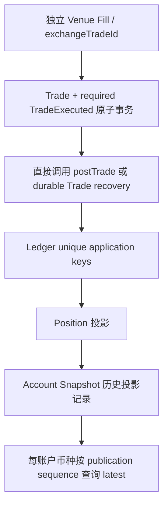

# L5 Position 与 Account Snapshot 并发整改

任务：`NQ-GATEAUDIT-PHASE6-L5-CONCURRENT-POSITION-AND-ACCOUNT-PROJECTION-REMEDIATION`。

结论：`IMPLEMENTED / PENDING_INDEPENDENT_CORRECTNESS_REVIEW / L5_CONCURRENT_PROJECTION_REMEDIATED / POSITION_LOST_UPDATE_P1_REMEDIATED / ACCOUNT_SNAPSHOT_CONCURRENCY_PROVEN / PROJECTION_REPLAY_IDEMPOTENCY_PROVEN / P0_0 / LOCAL_P1_0`。这是本次实现的自查结论，独立审查尚未完成。

L5=`NOT_ACCEPTED`，C2/C3=`NOT_RUN`。本轮 stage=0、commit=NONE、push=NONE，不重开 L4，不运行 LIVE/真实 provider，不修改生产数据库。

## 原始发现与两个根因

保留 [C1 原始失败摘要](runs/C1-failure.json)、[原始报告](CONCURRENT_WORKLOAD_AND_BACKLOG.md)、原 summary 和原始 raw/log，不更新其历史结论。旧候选起点 HEAD=`991187fe772ad8b03746a4a9ddfc3ea9010e5896`。

- Position：120 个唯一 Trade、TradeExecuted=120、Ledger=480、BUY qty 合计 12.0 BTC，但 qty/available=11.7。`TradeLedgerPostingService.updatePositionProjection` 无锁读旧 quantity，JVM 计算绝对结果，`JdbcLedgerPostingRepository.upsertPosition` 用 `EXCLUDED.qty` 覆盖。不同 Trade 的事务可读取同一旧值，Trade/Ledger 的唯一性不会使不同 Trade 的投影自动串行。
- Account Snapshot：原 raw 的 BTC snapshot 237 为 11.6，ts=`2026-09-11T12:34:47.751+08:00`；snapshot 239 为 11.7，ts=`2026-09-11T12:34:47.700+08:00`，且对应最终 Position。旧查询 `ORDER BY ts DESC,snapshot_id DESC` 选中了 237。实际最后保存的投影观察来自较早 51ms 的成交，因而被错误排在后面。11.6 的额外差异已由原数据证明为成交时间排序问题，不将其笼统称为第二次 quantity lost update。
- 原 raw SHA-256=`d8e06730b1ca62f09f905333396908219649eb54654ddcf82d55f8486718ceea`，本轮读取时重新核对。原 raw 未包含逐笔指令交错，不能声称重建了全部三次覆盖。

这属于一个 `projection-concurrency correctness cluster`，分别修复 Position 的并发读写边界和 Snapshot 的生成/发布顺序。

## Authoritative accounting chain

以下是当前 ordinary OKX 成交路径的真实所有权及提交边界；箭头表示因果关系，不表示 Ledger 从 event bus 消费 TradeExecuted：



| 层 | Canonical owner / 身份 | 事务、重放及并发机制 |
| --- | --- | --- |
| Fill | Venue 的真实成交；adapter report 带 exchangeTradeId、quantity、price、fee | Venue 独立事务，不与 NQ 共享提交。OKX reconciliation 校验 report 与 Order/已存 Trade 的身份和数值，恢复先查询；requested quantity 不能覆盖 executed quantity。 |
| Trade | `OkxRestReconcileService` 校验/构造，`JdbcTradeRepository` 持久化；trade_id PK、既有 `(exchange,exchange_trade_id)` UNIQUE | 插入锁父 Order，累计已存成交并拒绝 overfill。当前 OKX `insertWithRequiredEvent` 让 Trade 与 required event 同事务；重复恢复读取原 Trade，不改 uniqueness。 |
| TradeExecuted | `RequiredTradeEventStore`；稳定 `te-` event_id，旧随机身份按 source trade_id 校验 | 同 Trade 提交；source 行锁 + event PK。历史缺口可由 durable Trade 恢复；不在本轮重做 B4 qualification。 |
| Ledger | `TradeLedgerPostingService.postTrade` / `JdbcLedgerPostingRepository`；`tradeId:LEDGER:1/2/FEE_1/FEE_2` | 独立于 Trade 提交的可恢复事务。Ledger entries/events、Position、Snapshot、对应事件/审计原子提交。现有 partial UNIQUE idempotency_key 保持不变。 |
| Position | 同一 postTrade 事务；`(account_id,symbol)` UNIQUE | 是可由有序 Trade 应用重建的投影，不是独立成交事实。每 Trade 按 signed executed qty 减 base fee 更新数量，同时沿用既有均价算法。新增行初始化与行锁，且读取前已取得币种锁。 |
| Account Snapshot | 同一 postTrade 事务；snapshot_id PK | append-only 的历史投影观察，不是独立资金事实。base 取该账户相关 Position 合计，其他币种沿用 Ledger SUM(delta)。`ts` 仍是源成交观察时间；latest 以串行发布的 snapshot_id 为序。 |

关键源码：[记账服务](../../../../backend/nq-ledger/src/main/java/com/guidinglight/nexusquant/ledger/service/TradeLedgerPostingService.java)、[投影仓储](../../../../backend/nq-infra/src/main/java/com/guidinglight/nexusquant/ledger/infra/jdbc/JdbcLedgerPostingRepository.java)、[Trade writer](../../../../backend/nq-infra/src/main/java/com/guidinglight/nexusquant/scheduler/infra/jdbc/JdbcTradeRepository.java)、[required event](../../../../backend/nq-infra/src/main/java/com/guidinglight/nexusquant/scheduler/infra/jdbc/RequiredTradeEventStore.java)、[账户查询](../../../../backend/nq-infra/src/main/java/com/guidinglight/nexusquant/trading/infra/query/JdbcTradingQueryFacade.java)。

Ledger 不能被称为本实现所有余额/持仓的最终数值 authority：现有 principal 的正负金额及 fee 的正负分录都属于同一 account/currency，其净额为零；服务的 currentBalance 确实执行 SUM(delta)。因此 BTC 数量 oracle 必须使用 Trade.qty + Order.side + base fee。保持此既有会计模型，不重写 B2，也不将本轮解释成真实资产经济账本的重新设计。

## 选择的并发与幂等契约

采用 PostgreSQL serialization，组合两种必要粒度，没有新增 migration：

1. `postTrade` 要求真实 `READ COMMITTED` 事务，timeout=30s。最多锁本次 base/quote/fee 三个币种，使用 `pg_advisory_xact_lock(hashtextextended(namespace:account:currency,0))`，按实际锁键排序去重。锁在读取任何投影/幂等状态前取得，持有至整个事务 commit/rollback。币种暂无常驻 head 行，用事务 advisory lock 覆盖第一条 Snapshot 的初始化；数据库端互斥跨 JVM 有效，进程死亡自动释放。哈希碰撞只增加串行等待，不会漏锁。
2. Position 执行 `INSERT ... ON CONFLICT DO NOTHING` 创建零行，再 `SELECT ... FOR UPDATE`。随后沿用原数量/均价计算和绝对 upsert，读到的就是此前已提交串行结果。初始化与应用在同一事务中，不会因未提交失败留下零 Position。
3. 在锁内查询本 Trade 的既有 Ledger application keys：全部存在则 `IDEMPOTENT_HIT`，不再写投影/快照；全部不存在才记账和应用；部分存在则 `INCOMPLETE_ACCOUNTING_APPLICATION` 拒绝并回滚，不能猜测历史投影是否已经应用。
4. 现有稳定 Trade identity 派生全套 Ledger key，且其插入与两种 projection 在同事务内。因此在 canonical writer 形成的完整历史中，全套 key 存在表示该 application 已经提交；它不是单靠进程内标志或无锁预检查。没有新增随机 projection invocation identity。
5. Snapshot 读取/汇总发生在币种锁内，既包含当前事务刚更新的 Position，也包含此前相关事务已提交的投影；按账号币种汇总多个同 base 的 symbol，避免最后一个 symbol 覆盖整个资产。仍沿用 base 优先、无该 base Position 时读取 Ledger 余额的现有双来源口径。
6. schema V1 的 BIGSERIAL 是正向、非循环、默认 CACHE 1 序列，V2–V51 没有重设它。同币种 writer 在锁内分配 snapshot_id，锁直到 commit 才交给后继；后继重新读取已提交状态并分配更大 ID。序号可有空洞，不要求连续，不能把无锁分配的 ID 一般化为 commit order。账户 API 与 Ledger reconcile 的 latest 查询统一按 snapshot_id DESC。

不同账户以及不相交币种组可以并行。BTC-USDT 与 ETH-USDC 不共享锁；BTC-USDT 与 ETH-USDT 共享 USDT 发布维度，串行具有明确状态理由；没有全局账户 projection lock。较晚 writer 不能先读 revision 10、等待 revision 11 发布后再把 10 当 current：它在读取前就必须取得相同币种锁。

Commit result unknown 时不根据异常类型推断提交成败，不额外执行 delta。successor 进入相同事务锁，再读取 durable Ledger keys：已提交早退，未提交完整应用。快照与 Position/keys 一起提交，故不存在只补一个快照造成重复 publication 的正常分支。更高隔离级别的外层事务会 fail closed，避免等待锁后仍使用旧 MVCC snapshot。

## 验证与候选

本轮环境：Windows / Java 21.0.9 / PostgreSQL 16.15 / repository schema V51 / Spring Boot 3.5.10。PG 镜像复用 canonical supply-chain lock 与本地缓存；每次新建 isolated container/database，child 环境使用 B0 allowlist，真实交易所出口被拒绝。direct tests 通过真实 NQ repository 形成 source，调用真实 Spring 事务代理；端到端测试通过独立 Venue、RiskGate、Order、Trade 和 reconciliation 完成。direct source 建立不冒充真实 venue 成交证明。

冻结技术输入：[candidate-manifest.json](projection-remediation/candidate-manifest.json)，1,828 个 backend 源码、测试、配置、POM 与 supply-chain lock 输入，SHA-256=`8ac8b3557acf269f04be34106a3e7bf20b148b4a3ca53968e0fdb1a802e52279`。冻结在最终目标测试之前；Full Maven 前后及收集阶段再次核对，原工作区与干净测试副本均 hash mismatch=0。Full Maven 后 production/test delta=0；本报告及证据元数据的收尾不修改技术候选。

完整变更清单、日志摘要、旧证据 hash、两个 Full Maven 结果见 [validation.json](projection-remediation/validation.json)。实现及必要文档修改涉及 11 个既有文件，新增 3 个直接测试文件，另新增本报告与附属证据；此前未提交的 L5 harness 保留，只有 B0Processes 增加新 proof JVM 的内存上限，以及 l5_measurement 的 latest comparator 随正式查询更新。既有 7 个 L5 evidence 文件全部 byte-for-byte 不变。没有 stage/commit/push。

最终目标命令（log=`backend/nq-app/target/l5-projection-remediation/focused-final05.log`）：

```powershell
$env:MAVEN_OPTS='-Xmx512m'
mvn -o -f backend/pom.xml -pl nq-app -am test '-Dtest=L5ProjectionConcurrencyTest,L5ProjectionRecoveryTest,L5BoundedWorkloadTest,L5DriverContractTest,TradeLedgerPostingServiceTest,JdbcLedgerPostingRepositoryTest,JdbcLedgerReconcileRepositoryTest' '-Dsurefire.failIfNoSpecifiedTests=false' '-Dnq.l5.projection=true' '-Dnq.l5=true' '-Dnq.l5.level=C1' '-DargLine=-Xmx768m'
```

实际结果：**15 tests / failures=0 / errors=0 / skipped=0 / exit=0**。未运行 C2/C3 或整个 L5 scale matrix。

| 证明 | 实际结果 |
| --- | --- |
| Sequential / 逆序成交时间 / BUY、SELL、base fee | BTC-USDT=1.49、同账户 BTC-USDC=0.30，账户 BTC=1.79，与独立 Trade/Order oracle 一致；重复应用不变。 |
| 1 / 2 / 4 JVM hot-row | 分别 10 / 20 / 40 个唯一 Trade，exact BTC=1 / 2 / 4；首波无 Position 行，独立 PG 观察分别确认 1 / 2 / 4 个实际锁等待者。 |
| 同一未应用 fact 四路竞争 | 四个不同 JVM 争同一 Trade，POSTED=1、IDEMPOTENT_HIT=3，Position=0.1。 |
| 同一已应用 fact 并发 replay | 1/2/4 路均为幂等命中；Ledger、LedgerEvent、Position、Snapshot、event_store 的原 ID 与值不变。 |
| Snapshot stale-writer | A 在真实 findAssetPosition 返回后、未提交前暂停，B 同 base/不同 symbol 必须在读取前等待；放行后 latest 按 sequence=0.3 BTC，即使其源成交时间早 60s。 |
| 账户/币种隔离 | A 暂停时，同账户 ETH-USD 和不同账户 BTC-USDT 均完成 POSTED；不依赖全账户锁。 |
| Position read 后 kill | A 在真实读后暂停，B 同资产排队；强杀 A 后 B 完成，A 的未提交 Ledger/Position/Snapshot 不可见；新 PID 重放 A，最终 0.3，后续 replay 不变。 |
| 完整 NQ 对账 / COMMIT 前中断 | 双 Spring JVM、独立 Venue、2 个真实 filled Order；代理未转发 COMMIT，B 在 PG 等待，杀 A 并断开其连接，successor 对账后 Trade=2、Ledger=8、Position/Snapshot=20。 |
| 完整 NQ 对账 / COMMIT 响应丢失 | PG 已确认 COMMIT，响应帧未交付 A；A 存活等待时 B 可收敛，随后杀 A、启动 successor。保留原已提交 Trade/Ledger/Snapshot ID 和内容，最终 20，重复对账不变。 |
| Effective quantity | 真实 strategy requested=10.0005，durable effective/Order/venue wire/Trade=10；Position=10、Snapshot=10、TradeExecuted=1、Ledger=4，重复对账不产生 phantom residual。 |
| 不完整历史应用 / 错误事务 | 注入的残缺分录只能用于拒绝测试，调用回滚且数据不变；无真实事务及 REPEATABLE READ 外层事务均拒绝。 |

所有数量比较是 BigDecimal/Decimal 的精确比较，没有 epsilon。direct oracle 从独立只读 PostgreSQL 连接对 Trade.qty、Order.side、base fee 求和，不以 Position 自身反推 expected；Position 与账户币种的 reconstruction 分别断言。direct 原始状态在目标日志 `L5_PROJECTION_ROOT` 对应目录的 `raw-state-*.json`；recovery/effective 的 `raw-proof.json` 由相应 ROOT 日志定位，保留在 target，不将随机运行身份导入受版本控制的证据。

### Original C1 永久回归

[新 C1 摘要](projection-remediation/C1-regression.json)与旧 FAIL 文件分开，原始 raw SHA-256 记录在 validation.json，定位入口为最终目标日志 `L5_ROOT`。该文件的 PASS 仅表示本次 C1 regression，不能作为 L5 acceptance。

| 原 C1 hard invariant | 修复候选实测 |
| --- | --- |
| concurrent reconciliation actors / 同时 NQ JVM | 2 / 2；含正常替换时共有 3 个进程生命周期 |
| unique filled Orders / Trades / TradeExecuted | 120 / 120 / 120 |
| Ledger entries / Ledger events | 480 / 480 |
| 独立 authoritative qty sum | 12.0 BTC |
| Position.qty / available_qty | 12.0 / 12.0 BTC |
| latest BTC account snapshot | 12.0 BTC |
| duplicate PLACE / Trade / Ledger | 0 / 0 / 0 |
| actionable / unresolved backlog | 0 / 0 |
| replay / 资源清理 | durable facts 不变；owned NQ/Venue/container=0，PG/Venue 端口已释放 |

C1 同时执行了原 17 类业务/测量反例拒绝和 concurrent oracle negatives。原红色 raw 的离线检查仍为 4 tests PASS，即成功识别并拒绝原 Position 丢失；不把这个离线 PASS 当作原 C1 通过。

### Full Maven

最终技术候选在准备好的干净副本中执行完整 `mvn -f backend/pom.xml test`：**1909 tests / failures=0 / errors=0 / conditional skips=130 / exit=0**。130 是条件未启用场景，不表示执行通过；本任务要求的新增 PG、多 JVM、C1 与故障场景已经在上述目标 run 中实际执行，skipped=0。未借此重开 L4 qualification。

该副本复制当前工作区的 3,888 个受版本管理/本轮相关输入文件；1,828 个冻结技术输入复制前后及运行后逐文件字节匹配。没有复制旧 target 中的源码副本，也没有修改架构扫描测试。数据库是本轮新建的 loopback PG 16.15/V51，使用当前 CI 的 `BackendCiLegacyAccountFixture` 准备 PAPER account=1、exchange account=0、credential=0，再向 Maven 进程同时传入 NQ_DB 与 SPRING_DATASOURCE aliases；CI/no-outbound/禁真实 provider 环境沿用当前 workflow，不继承机器 profiles/datasource。fixture source 和 workflow hashes 都有记录。

原始结果位于 `backend/nq-app/target/l5-projection-remediation/full02/`：`full-maven.log`、`collected-result.json`、`surefire-and-log.zip` 与镜像输入 manifest。Maven module totals 与逐 engine 日志均为 1909；XML 单文件合计 1904，是两组同时使用 Jupiter/ArchUnit 的同名 suite 覆写 XML：ModuleBoundary=1+9、PackageBoundary=4+10。5 个 Jupiter case 的 PASS 保留在完整日志中，归档同时包含日志，未删减测试或用 XML 少计后的数值替代总数。

首次 Full Maven 保留为 **FAIL：1909 tests / 1 failure / 5 errors / 131 skips**。原工作区既存 `target/.../staged-tree/.../src/main/java` 被旧架构扫描纳入模块；其余错误来自未准备显式隔离 datasource。清洁副本和 canonical fixture 解决执行环境问题，production/test 内容未变。成功后 CopyFile2 报 Windows 长路径收集错误，已改用 ZIP 收集原 XML 和日志；原 runner/result 失败元数据仍保留。该收集错误发生于 Maven exit=0 之后，不能改写成 Maven 测试失败，也没有为此再次跑 Full Maven。

失败历史保留在 `backend/nq-app/target/l5-projection-remediation/`：

- `direct-attempt01.log/.xml`：5 tests / 2 failures；仅两个暂停屏障未触发。测试误用 AtomicReference.compareAndSet 的字符串引用相等；修复为值比较后对读到的对象 CAS。其余 1/2/4 JVM、重放及序列/fee 场景已通过，但该 run 不代表最终完整候选。
- `direct-and-recovery-attempt02.log`、`direct-attempt02.xml`、`recovery-attempt02.xml`：direct 5 tests PASS；新增完整链路未观察到锁等待而失败。只读 reader 无 pg_read_all_stats 权限，不能看其他会话的 wait_event_type；后续只给新建隔离实例 reader 增加该元数据读取权限，不增加业务写权限、不改变业务调度。
- `recovery-attempt03.log`：提交前未转发、提交已确认但响应扣留均通过；后来增加 effective quantity 与原 C1 组合，不能把这一 run 单独作为最终全部覆盖。
- `focused-attempt04.log`：原 C1、direct、两个提交场景通过；effective quantity 的 wire 字符串是 `10.00000000`，测试误用文本等于 `10`，因此保留为失败。最终改为精确 BigDecimal 比较，数值约束没有放宽。

## 边界与交接

收尾检查：stage-assets=`1893 scanned / 173 reviewed exceptions / errors=0`；文档链接=`26 checked / warnings=0 / errors=0`；diff whitespace 检查通过。固定 Gitleaks 8.18.4 按当前 CI 配置检查 3,875 个 safe files，findings=0，6 个 secret negative 全部拒绝；本批 11 个 evidence 文件另行递归扫描 findings=0。未扩大 scanner allowlist。1,828 个技术输入及 67 个受保护的既存输入复核无漂移，Git index 为空、HEAD 不变。Full Maven 报告归档已校验完整；新建 PG 已移除，字节一致的临时干净副本在归档后已清理，原工作区 target 中的历史证据保留。

这是实现与自查证据，不能替代真正独立的候选审查。完成后下一动作仍是 `NQ-GATEAUDIT-PHASE6-L5-CONCURRENT-POSITION-PROJECTION-INDEPENDENT-CORRECTNESS-REVIEW`；独立审查只针对本候选的 no-lost-update、no-duplicate-replay、snapshot-current/monotonic 和 C1 exact reconstruction，不重新审 L4。

没有修复旧 C1 测试库中的历史坏数据（该隔离库此前已经销毁），也没有授权生产数据重建。旧代码曾形成的错误投影不会因为完整 Ledger key 已存在而被正常 replay 自动重算；旧 snapshot_id 也不追认串行发布保证。实际发布前须停止旧 writer 并独立核对现有投影与 source；若发现历史差异，须另行授权恢复/数据修复，不能混跑旧新 writer 或默认为历史已正确。

Position 均价属于有序应用语义，数量 oracle 是 Trade signed qty/base fee 的独立求和；本轮不改变均价算法、Ledger accounting semantics、Trade uniqueness、V49/V50/V51、策略 lifecycle、.github、AGENTS 或 Skill 定义。仅按本任务要求补充现有 engineering-lessons reference。
