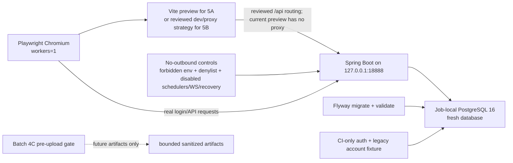

# NQ CI Batch 5 Frontend E2E Hardening Plan

任务：`NQ-CI-BATCH-5-FRONTEND-E2E-PLAN`

状态：**PASS / READY FOR REVIEW**

> Batch 5 = **PLAN ONLY / NOT IMPLEMENTED**。本文只冻结后续实施边界，不修改 workflow，不新增 CI job，不修改 frontend/backend/test/migration/dependency/deploy 文件，不运行或上传 Playwright artifact。

## 1. Current state and boundaries

- Branch: `dev`；编辑前工作区 clean。
- GateJ: completed；GateK planning baseline: FROZEN / ACCEPTED；GateK CI mainline: IN PROGRESS。
- Batch 1: FROZEN / ACCEPTED；Batch 2 PostgreSQL/Flyway: FROZEN / ACCEPTED；Batch 3 no-outbound guard: FROZEN / ACCEPTED。
- Batch 4C artifact/log redaction: **FROZEN / ACCEPTED**。
- Batch 4F-A dependency audit preflight: **FROZEN / ACCEPTED**；Batch 4F-B 至 4F-F: **OPTIONAL BACKLOG / NOT STARTED**。
- Static workflow assertion: OPTIONAL FUTURE HARDENING / NOT IMPLEMENTED。
- LIVE: DISABLED；AI: NOT STARTED；DH runtime: NOT INTEGRATED；RealClient / real provider / real exchange adapter: NOT IMPLEMENTED。
- 本轮不进入 Batch 5 implementation，不启动 Batch 4F-B 至 4F-F，不用 mock 代替真实后端验证。

## 2. Playwright actual state

| Item | Current repository fact | Batch 5 implication |
| --- | --- | --- |
| Config | `frontend/playwright.config.ts`；`testDir=./tests/e2e`；Chromium only | 浏览器矩阵暂不扩张 |
| `baseURL` | `E2E_BASE_URL`，默认 `http://127.0.0.1:5179` | CI 必须绑定 loopback，不允许公网 URL |
| `webServer` | 默认由 Playwright 启动 Vite **dev server**；`E2E_EXTERNAL_DEV_SERVER=true` 时禁用 | 当前不是 `vite preview`；preview 必须作为后续独立实现决策 |
| npm runner | `run-e2e.mjs` 自行启动 Vite dev server，等待 120s，再以 external server 模式运行 Playwright并在 `finally` kill Vite | 当前只管理前端，不启动 backend/DB；没有 Windows process-tree 强清理保证 |
| Parallelism | `fullyParallel=false`，`workers=1`，`retries=0` | 保持串行；不得用 retry 隐藏确定性失败 |
| Timeouts | action/navigation 30s；webServer 120s；未设置 suite/test/job timeout | CI 必须补 job/step/server readiness 上界 |
| Trace | `retain-on-failure` | 当前失败会生成 trace；在 artifact policy 冻结前 CI 应覆盖为 `off` |
| Screenshot/video | 未显式配置，Playwright 默认均为 `off` | 首轮保持 `off` |
| Reporter | 未显式配置，使用 Playwright 默认 reporter | 首轮显式 `line`/等价 console summary；禁止 raw HTML upload |
| Output | 未显式配置 output/report path | 默认可能生成 `test-results/`；CI 首轮必须清理且不上传 |
| Login helper | `loginToConsole()` 先真实登录 API、创建/启用 `OKX/SIM` 两个 exchange account、重置默认账户，再通过真实登录表单进入 dashboard | 不是只读 helper；必须使用 job-local fresh DB，不能复用共享/持久 DB |
| Credentials | helper 内置本地测试账号默认值，可由 `E2E_USERNAME/E2E_PASSWORD` 覆盖；本文不复述密码值 | 只能使用一次性 CI fixture；禁止 repository/production secret |
| Specs | 27 files；现有全量历史记录不等于 CI evidence | 每个批次必须显式 allowlist，禁止首轮无差别全量 |

## 3. Test matrix

### 3.1 可进入最小 CI 基线（Batch 5A，no-backend report-only）

以下 4 个 spec 只访问公开 `/login` 或 `/dev/design-system`，不调用真实后端，可在前端 build 后用 loopback preview 执行：

- `login-page-smoke.spec.ts`
- `design-system-table-smoke.spec.ts`
- `design-system-live-query-smoke.spec.ts`
- `design-system-backtest-chart-smoke.spec.ts`

它们可作为首个 bounded allowlist。历史上曾单独通过不代表本轮已执行；Batch 5 first run 前仍是 **NOT EXECUTED IN CI**。

### 3.2 需要真实 backend environment（Batch 5B 候选）

下列 spec 通过 `loginToConsole()` 依赖真实 Spring Boot、PostgreSQL、Flyway、auth seed 与 exchange-account fixture；首批建议只纳入低副作用 smoke：

- 首批候选：`smoke.spec.ts`、`account-context-smoke.spec.ts`、`strategies-query.spec.ts`、`research-query.spec.ts`。
- 第二层候选：`marketdata-bars-query-smoke.spec.ts`、`publish-version-smoke.spec.ts`、`strategy-version-smoke.spec.ts`、`backtest-config-enhanced-smoke.spec.ts`、`evaluation-report-enhanced-smoke.spec.ts`。
- `backtest-detail-smoke.spec.ts` 的两个页面级 case 当前明确为 **PENDING BACKEND ENV / NOT VERIFIED IN CI**；不得引用 design-system component smoke 代替页面级验证，也不得写成已通过。

### 3.3 仅已列出未执行 / conditional skip

- `research-detail.spec.ts`：无预置 research config 时 `test.skip`。
- `strategies-detail.spec.ts`：无预置 strategy 时 `test.skip`。
- `backtest-dataset-binding-smoke.spec.ts`：依赖既有 backtest config；无数据时 skip，且含硬编码 `http://127.0.0.1:18888`。
- `trading-workbench-query.spec.ts` 的订单详情 case：缺少 `E2E_TRADE_ORDER_ID` 时 skip。

这些条件不满足不得记为 passed。进入 required baseline 前必须消除环境型 skip 或把 case 从 required allowlist 中排除并明确原因。

### 3.4 暂不纳入 required baseline

- `account-credential-write-smoke.spec.ts`：credential/account 写路径，需单独安全与清理审查。
- `marketdata-dataset-smoke.spec.ts`：创建/刷新 dataset，写入较多。
- `marketdata-ingestion-smoke.spec.ts`：`run-once` 语义允许外网失败，和 CI no-outbound fail-closed 冲突，禁止纳入。
- `paper-trading-*.spec.ts` 全部 7 个文件及 `paper-trading-run-smoke.spec.ts` 内两个 case：创建并运行大量 strategy/research/backtest/publish/paper-run/alert/schedule/recovery/stability 数据，需专用数据隔离与有界清理。
- `backtest-dataset-binding-smoke.spec.ts`、detail conditional specs、order-detail conditional case：先修复确定性 fixture/URL/skip contract 后再评审，不在 5A/5B 修改 spec。

## 4. Environment dependency topology

Local full E2E requires the same logical chain, but current `npm run test:e2e` starts only Vite dev server. Backend/PostgreSQL must already be running. `vite.config.ts` configures `/api` proxy only under `server`, not `preview`; therefore preview can serve 5A but cannot be assumed to serve authenticated 5B without a separately reviewed routing change. The helper depends on seeded auth user, a legacy account link (default fallback `3001`), and writable SIM exchange accounts.

## 5. PostgreSQL, Flyway, seed and backend profile

### Database decision

Do **not** reuse the running database instance or schema of the existing `backend` or `postgres-flyway` job: GitHub Actions services are job-scoped, and E2E writes mutable state. The future E2E job should define its own isolated `postgres:16` service with CI-only values and a fresh database. It may reuse the frozen Batch 2 service pattern/version/health check, not its data or container.

### Migration and fixture order

1. Start job-local PostgreSQL and wait for health.
2. Run the frozen Flyway migrate + validate mechanism against an empty E2E DB; no `clean`, `baselineOnMigrate`, migration edits or skip.
3. Run a synchronous, explicit, fail-closed CI fixture step after Flyway. Do not restore the removed seed watcher/polling loop.
4. Seed only the auth user and legacy `accounts` row required by E2E, using fixed CI-only identities. Do not create credential material or write `exchange_account_credentials`.
5. Start backend with a reviewed CI-E2E property set: local/test auth seed behavior may be reused only after explicit review; do not use `ci-app-smoke` as-is because it has no real web port and disables seed.
6. Explicitly disable scheduling, catalog sync, OKX recovery, OKX/Binance WS, bootstrap admin side effects, LIVE/real provider/RealClient and external ingestion.
7. Health-check backend, then start preview and health-check it; only then run the allowlisted specs.

`application-local.yml` currently enables Flyway and local/test auth seed and defaults to port 18888, but it also carries local adapter behavior. Therefore “run `local` unchanged” is not accepted as the final CI profile strategy. Implementation must either provide explicit command-line/environment overrides reviewed against Batch 3 or introduce a separately reviewed CI-E2E profile in its own scoped batch; this plan does not modify backend configuration.

## 6. No-outbound preservation

- Keep all forbidden exchange credential/LIVE env checks from Batch 3; inject no exchange credentials or repository secrets.
- Reuse the Batch 3 denylist as a workflow-level invariant and keep all exchange startup paths disabled.
- The existing `ExchangeNoOutboundGuard` is test-scope JVM code; it is installed by JUnit smoke, not by a separately launched Spring Boot process. It does **not** automatically protect E2E runtime. This is a P1 implementation gap.
- Before backend-required E2E becomes blocking, implementation must prove runtime enforcement: preferably job-level egress deny for exchange hosts/networks plus an explicit controlled negative probe, or a separately reviewed runtime guard. “No outbound log observed” is not proof.
- `marketdata-ingestion-smoke.spec.ts` must remain excluded because it intentionally exercises a path whose current description tolerates external failure.

## 7. Minimal CI job sequence

Recommended single job, serial and fail closed:

1. Checkout; setup Java 21 and Node 22; `npm ci`.
2. Install pinned Playwright Chromium; verify executable/version. Browser download failure = environment/toolchain failure and job failure, never skip-as-pass.
3. Start and health-check isolated PostgreSQL 16 (2 min bound).
4. Flyway migrate + validate (5 min bound).
5. Apply synchronous CI-only fixture and assert forbidden tables/rows remain absent (1 min bound).
6. Start backend in background with stdout/stderr redirected to a bounded temp file; health-check loopback only (3 min bound).
7. `npm run build`; for 5A start `vite preview --host 127.0.0.1 --port 5179`; for 5B use the existing dev proxy or a separately reviewed preview API routing strategy; health-check (2 min bound). Do not claim current preview proxies `/api`.
8. Run explicit spec allowlist with `workers=1`, `retries=0`; 10 min for 5A, 20 min for 5B; overall job `timeout-minutes: 30` initially.
9. On failure, emit only sanitized step category/status/exit code and bounded tail after redaction. Never `cat` raw backend/Playwright logs.
10. Always cleanup preview/backend process groups and delete temp DB/artifact directories. Job-local service disposal remains GitHub-managed.

Process startup must capture PID/process group, verify readiness, and fail if the process exits early. Cleanup must run under `if: always()` but must not turn a test failure green.

## 8. Failure classification

| Failure | Classification | CI result |
| --- | --- | --- |
| Assertion, route/API contract, auth/account behavior regression | Product/test regression | Fail required job |
| Flyway migrate/validate or forbidden fixture assertion | Environment/data contract regression | Fail required job |
| Backend starts then exits, health never reaches UP, seed missing | `ENVIRONMENT_CONFIGURATION_FAILURE` | Fail job; label category, not test failure |
| Browser install/checksum/executable failure | `TOOLCHAIN_ENVIRONMENT_FAILURE` | Fail job; manual rerun allowed after evidence |
| Preview startup/port collision | `ENVIRONMENT_CONFIGURATION_FAILURE` | Fail job |
| Test timeout | Unclassified until evidence; deterministic repeat is regression | Fail job; no automatic retry |
| Known GitHub runner outage/service incident | External infra | Fail current run; manual rerun allowed, never mark passed |
| Conditional fixture absent/skip in non-required case | Not executed | Must not count as passed; required baseline forbids it |
| Test data pollution from previous case | Isolation defect | Fail job and rollback Batch 5 required status |

## 9. Artifact, log and redaction policy

### Initial policy

- Batch 5A/5B should start **report-only to console summary**, with `trace=off`, `screenshot=off`, `video=off`, HTML report disabled, and `test-results` deleted in cleanup.
- Do not upload trace, screenshot, video, HTML report, Playwright `test-results`, raw backend logs, raw network logs, HAR, storageState or browser profile.
- Failure output is limited to spec/test title, sanitized error category, exit code and bounded redacted excerpt. Do not print response bodies from helper failures until their safety is reviewed; current helpers may include raw response text in assertion errors.

### Future upload gate (separate Batch 5C review)

Upload is allowed only after all conditions are met:

1. Generate into one bounded staging directory, never upload Playwright's directory directly.
2. Reject symlinks, absolute paths, archives with unknown contents, browser profiles, HAR, storageState, source maps and raw logs.
3. Normalize workspace paths to repository-relative placeholders.
4. Parse text/JSON/HTML structurally and remove headers/cookies/query strings/request-response payloads/environment dumps before scanning.
5. Run the Batch 4C pre-upload gate; it currently rejects binary/zip rather than safely redacting them, so binary trace/video/screenshot remain forbidden until a separately reviewed sanitizer/proof exists.
6. Fail closed on token, cookie, `Authorization`, JDBC/connection strings, env assignments, raw payloads, real account identifiers or absolute paths. Report rule + relative file only, never matched text.
7. Use `if-no-files-found: error`, immutable artifact name without user data, access limited to repository readers, and bounded retention: PR 3 days, `dev` push at most 7 days. No public link or long-term retention.

Recommendation: keep trace/video disabled by default. If text-only sanitized failure metadata proves insufficient, review `trace=retain-on-failure` separately; do not enable video first. HTML report should not be the first upload format because it may embed attachments, paths and failure context.

## 10. Findings

### P0

- 无当前已执行写入或外联；本轮未实现 Batch 5。

### P1

- Existing no-outbound guard is JUnit/test-scope and does not automatically cover the separately launched E2E backend process. Backend-required E2E cannot become required until runtime enforcement is proven.
- Authenticated helper mutates account state and exposes access token in process memory/localStorage; sharing a database or uploading traces/storage is unacceptable.
- Current `marketdata-ingestion-smoke` is incompatible with fail-closed no-outbound semantics and must stay excluded.

### P2

- Current runner starts Vite dev server, not preview; production build/preview behavior is not exercised by `npm run test:e2e`, and current preview config has no `/api` proxy for authenticated specs.
- Full suite has environment-dependent skips and legacy hard-coded backend URL; it is not a deterministic CI allowlist.
- Helpers may include raw API response bodies in assertion/error text; raw failure logs cannot be uploaded or printed without sanitization.
- Heavy backtest/paper-trading fixtures write persistent rows and have no suite-level teardown contract.
- Browser installation is not pinned/cached as a first-class CI step; suite/job timeouts are incomplete.

### P3

- Reporter/output/screenshot/video are implicit defaults rather than explicit CI policy.
- `run-e2e.mjs` kills the direct Vite child but does not document descendant process cleanup semantics.

## 11. Implementation batches

| Batch | Scope | Acceptance | Rollback |
| --- | --- | --- | --- |
| 5A | Frontend-only 4-spec allowlist; build + loopback preview; no backend/artifact | First and second CI runs green; 0 skip; no artifact; Batch 4C log proof rechecked | Remove E2E job/step only; retain frontend build |
| 5B-ENV | Isolated PostgreSQL, Flyway validate, synchronous auth/legacy fixture, reviewed backend startup/no-outbound enforcement | Readiness deterministic; forbidden env/credential rows absent; negative outbound probe fails closed | Remove backend E2E path; Batch 2/3 frozen jobs unchanged |
| 5B-SMOKE | Add four authenticated low-side-effect specs | 0 skip; repeat run on fresh DB green; data assertions bounded | Revert allowlist to 5A; no spec edits mixed in |
| 5C | Optional text-only sanitized failure metadata/report review | Batch 4C gate proof, path normalization, PR 3d/dev 7d retention, no raw/binary content | Disable upload; test job remains authoritative |
| 5D | Incremental page-level candidates, one domain at a time | Each spec has deterministic fixture, cleanup and fresh-DB repeat evidence | Remove only failing domain allowlist |
| 5E | Freeze review and documentation governance | Two consecutive immutable green runs, P0/P1=0, statuses synchronized | Mark Batch 5 non-required and return to last accepted allowlist |

No batch may include frontend feature/page development, backend business changes, migration changes, dependency upgrades, Batch 4F-B to 4F-F, LIVE/AI/DH/real-provider work, or broad full-suite enablement.

## 12. Mainline completion and governance

Batch 5 may join required CI mainline only when:

- 5A and backend-required baseline have separate, reviewed allowlists with 0 unexpected skip and two consecutive immutable green runs on `dev`.
- PostgreSQL/Flyway/fixture/backend/preview startup is bounded and fresh per job; repeat execution proves no test pollution.
- Batch 3 runtime no-outbound enforcement is effective for the E2E backend process; no exchange/LIVE/credential env is present.
- Batch 4C log proof passes; no artifact is uploaded unless 5C is separately accepted.
- Backend/toolchain/environment failures are categorized but still fail the job; no `continue-on-error`, `skipTests`, retry masking, Flyway clean or baseline escape hatch exists.
- Workflow change receives first-run review, second-run review and freeze review before becoming branch-required.

Documentation governance starts after each implementation batch's real GitHub run evidence, not at plan acceptance. Update `STATUS.md`, `TESTING.md`, `WORKLOG.md`, this plan and baseline plan with exact run/job/status; only the final freeze review may change Batch 5 from implemented/pending evidence to FROZEN / ACCEPTED.

## 13. Review decision

**NQ-CI-BATCH-5-FRONTEND-E2E-PLAN：PASS / READY FOR REVIEW**

> 更新（2026-06-18）：plan review **PASS / ACCEPTED**（`NQ_CI_FRONTEND_E2E_PLAN_REVIEW.md`）；**Batch 5A 已实施 = IMPLEMENTED / READY FOR FIRST-RUN**（新增 `frontend-no-backend-e2e` job + `frontend/playwright.ci.config.ts`，四个 no-backend spec，本地 4 passed，尚未经 GitHub Actions first-run review，见 `NQ_CI_FRONTEND_E2E_5A_IMPLEMENTATION.md`）。5B-ENV = P1 PREREQUISITE / NOT STARTED；5B-SMOKE = BLOCKED BY 5B-ENV。注意 5A allowlist 仓库真实路径为 `frontend/tests/e2e/`（非 `frontend/e2e/`）。

**Batch 5：PLAN ONLY / NOT IMPLEMENTED**

**Batch 4F-A：FROZEN / ACCEPTED**

**Batch 4F-B 至 4F-F：OPTIONAL BACKLOG / NOT STARTED**

**Batch 4C：FROZEN / ACCEPTED**

**NQ GateK CI mainline：IN PROGRESS**

Next concrete action: `NQ-CI-BATCH-5-FRONTEND-E2E-PLAN-REVIEW`、plan fix，或暂停 CI 线；不得直接实施 Batch 5。
