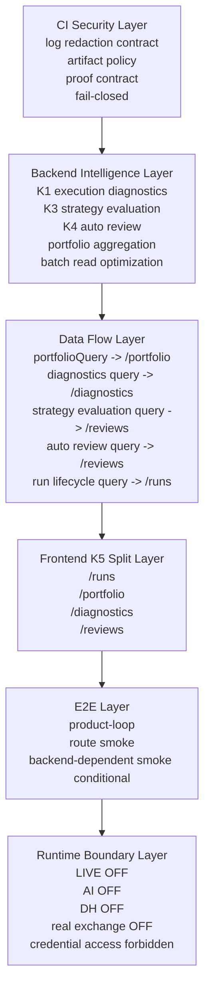

# NexusQuant GateK System Whitepaper

## 1. Title / Status

NexusQuant GateK System Whitepaper

Status:

- GateK: `FINALIZED / FROZEN / ARCHIVED`
- Runtime: `LOCKED`
- LIVE: `DISABLED`
- AI: `NOT STARTED`
- DH runtime: `NOT INTEGRATED`
- Real exchange trading: `NOT ENABLED`

This whitepaper is a GateK archive document. It records the final system shape, accepted boundaries, and handover rules for GateK. It does not add executable behavior, does not change backend, frontend, CI, tests, API, migration, deployment, AI, DH, LIVE, credential, or real exchange paths.

Source documents used for this archive synthesis:

- `docs/current/NQ_GATEK_ARCHITECTURE_FREEZE.md`
- `docs/current/NQ_GATEK_CI_SECURITY_CONTRACT.md`
- `docs/current/NQ_GATEK_ARCHIVE_AND_HANDOVER.md`
- `docs/current/NQ_GATEK_PAPER_EXECUTION_INTELLIGENCE_PLAN.md`
- `docs/current/NQ_GATEK_PAPER_TRADING_PAGE_SPLIT_PLAN.md`
- `docs/current/NQ_CI_SECURITY_GUARD_PLAN.md`
- `docs/current/NQ_CI_BASELINE_PLAN.md`
- `docs/current/README.md`

## 2. Executive Summary

GateK completed the Paper Execution Intelligence and security-contract consolidation layer for NexusQuant. Its final value is not real-money execution. Its value is diagnostic clarity, post-run evaluation, reviewability, route ownership, and CI evidence safety around Paper Trading.

GateK is not a LIVE Gate. It does not authorize live trading, real exchange execution, credential reads, AI order generation, DH runtime control, or real provider access. GateK remains a frozen architecture state for Paper Trading intelligence and repository-level safety contracts.

Before GateK, the Paper Trading surface had accumulated execution, portfolio, risk, diagnostic, review, ranking, and run-detail responsibilities in an increasingly coupled model. GateK compressed that stack into a layered analysis system:

- CI Security Layer: deterministic evidence, redaction, artifact policy, and fail-closed proof.
- Backend Intelligence Layer: read-only execution diagnostics, strategy evaluation, auto review, portfolio aggregation, and batch-read discipline.
- Data Flow Layer: explicit route-local query ownership and no hidden cross-page analytics queries.
- Frontend K5 Split Layer: `/paper-trading/*` child routes for runs, portfolio, diagnostics, and reviews.
- E2E Layer: stable product-loop and route smoke, with backend-dependent smoke treated as conditional environment proof.
- Runtime Boundary Layer: LIVE, AI, DH, real exchange, and credential access remain locked off.

The final GateK state is a frozen architecture, not a live trading runtime.

## 3. Final Architecture Graph



ASCII fallback:

```text
CI Security Layer
  -> Backend Intelligence Layer
  -> Data Flow Layer
  -> Frontend K5 Split Layer
  -> E2E Layer
  -> Runtime Boundary Layer

CI Security:
  log redaction contract / artifact policy / proof contract / fail-closed

Backend Intelligence:
  K1 execution diagnostics / K3 strategy evaluation / K4 auto review
  portfolio aggregation / batch read optimization

Data Flow:
  portfolioQuery -> /paper-trading/portfolio
  diagnostics query -> /paper-trading/diagnostics
  strategy evaluation query -> /paper-trading/reviews
  auto review query -> /paper-trading/reviews
  run lifecycle query -> /paper-trading/runs

Frontend K5:
  /paper-trading/runs
  /paper-trading/portfolio
  /paper-trading/diagnostics
  /paper-trading/reviews

E2E:
  product-loop / route smoke / backend-dependent smoke conditional

Runtime Boundary:
  LIVE OFF / AI OFF / DH OFF / real exchange OFF / credential access forbidden
```

## 4. Layer-by-Layer Architecture

### CI Security Layer

The CI Security Layer is the proof and evidence boundary for GateK.

Secret leakage is defined as any CI-visible output that exposes protected runtime material or enough unredacted shape to reconstruct protected material. This includes direct credential disclosure, raw private provider payloads, authorization headers, signing material, environment dumps, or retained artifacts that preserve unsafe content.

The frozen log shape contract separates allowed evidence from forbidden output:

- Allowed: bounded status labels, counts, booleans, route names, test names, file names, redacted placeholders, public status categories, adapter capability categories, and fail-closed reason labels.
- Forbidden: raw environment dumps, raw private request or response payloads, unmasked auth/signing/session/account material, sensitive stack context, private headers, private query parameters, or unsafe retained artifact bodies.

The CI proof contract has two acceptable evidence shapes:

- `PROOF_OK`: deterministic evidence was checked and no forbidden log or artifact shape was observed.
- `REDACTION_HIT`: protected shape detection happened, but raw protected material stayed undisclosed and the hit was represented as bounded evidence.

Artifact policy is gated. Text artifacts must pass the same redaction contract as logs. Binary/rich debug artifacts are not part of the GateK security freeze unless separately reviewed. Artifact existence never implies safety; artifact content must satisfy the policy before retention.

The fail-closed rule is active: missing evidence, ambiguous evidence, redaction detector failure, artifact scan failure, or unexpected backend stdout must fail or block review. It must not be reinterpreted as partial success.

Batch 4C, Batch 4C-C, and the Batch 5 CI security scope are frozen in the accepted CI security line. This whitepaper records that frozen contract; it does not mutate workflow files or trigger CI.

### Backend Intelligence Layer

The Backend Intelligence Layer is read-only Paper Trading analytics.

K1 execution diagnostics established the causal foundation for Paper run analysis. It classifies execution outcomes such as no order, order without fill, filled loss, risk blocked, and data insufficient, and attaches severity/confidence where the available facts support it.

K3 strategy evaluation adds bounded strategy and publish evaluation. It compares Paper behavior with backtest context where comparable data exists, applies sample-sufficiency discipline, and treats scores as Paper-internal simulation ranking, not investment advice.

K4 auto review adds rules-based post-run and portfolio review. The review model is deterministic and template/rule driven. It is not AI generation and does not issue trading instructions.

Portfolio aggregation consolidates portfolio, risk, drawdown, ranking, and data-quality signals. It must remain analytical and read-only.

Batch read discipline is part of the architecture. Aggregation must avoid per-run query explosion and avoid hidden N+1 fan-out across run collections.

Backend analytics may explain, evaluate, summarize, rank, and review Paper Trading results. It must not mutate trading state, start a run, place or cancel orders, access credentials, call real exchanges, enable LIVE, or become a trading execution authority.

### Data Flow Layer

The Data Flow Layer is frozen around explicit query ownership.

The ownership model is:

- `/paper-trading/runs`: run lifecycle and execution state.
- `/paper-trading/portfolio`: `portfolioQuery`, portfolio aggregation, risk, ranking, and portfolio curve.
- `/paper-trading/diagnostics`: execution diagnostics query.
- `/paper-trading/reviews`: strategy evaluation query and auto review query.

Route-local ownership is required. A page owns only the queries required for its route responsibility. Shared shells and sibling routes must not mount hidden analytics queries.

No cross-page leakage is allowed:

- `portfolioQuery` must remain single-instance under `/paper-trading/portfolio`.
- Diagnostics queries must not be mounted by `/runs`, `/portfolio`, or shared layout shells.
- Strategy evaluation and auto review queries must remain under `/reviews`.
- Run lifecycle queries must remain execution-owned under `/runs`.

The frozen model does not introduce a global store for Paper analytics. Zustand remains reserved for lightweight global state such as auth/account context; Paper route state and filters remain local or URL-owned when explicitly designed.

GateK rejects the previous all-in-one page as a query owner. The system no longer relies on one large page to aggregate every analytics and execution responsibility.

### Frontend K5 Split Layer

The Frontend K5 Split Layer is the route-level decomposition of Paper Trading.

- `/paper-trading/runs` is the execution layer. It owns run filtering, run creation, run lifecycle actions, run list, selected run details, lifecycle timeline, fact tabs, and execution-specific queries.
- `/paper-trading/portfolio` is the portfolio, risk, drawdown, ranking, and portfolio analytics layer. It owns the single `portfolioQuery` instance for the modules that share that data source.
- `/paper-trading/diagnostics` is the execution cause diagnostics layer. It owns diagnostics filters and diagnostic aggregation displays.
- `/paper-trading/reviews` is the strategy evaluation and auto review layer. It owns strategy scoring/evaluation and rules-based review displays.

The all-in-one PaperTradingPage is removed from the frozen architecture as an owner of business queries. The route shell remains as navigation/layout only. The child route shell is completed, and the stable entry remains `/paper-trading` with a child-route model.

The split preserves Paper-only risk wording. It must not hide LIVE disabled, real exchange disabled, AI not started, DH not integrated, or non-investment-advice boundaries for visual simplicity.

### E2E Layer

The E2E Layer is a mixed stability model.

- Product-loop baseline covers the core Paper Trading user flow and key product surfaces.
- Route smoke baseline covers direct access to child routes and route-specific render/query ownership.
- Backend-dependent smoke is conditional because it depends on local or CI backend availability, backend profile shape, PostgreSQL readiness, and redaction-safe backend logs.

Environment dependency is not an architecture risk by itself. If the backend-dependent smoke cannot run because the target backend is unavailable, the correct interpretation is environment missing backend, not frontend architecture failure and not permission to weaken security boundaries.

E2E must not be fixed by enabling LIVE, reading credentials, connecting real exchanges, bypassing no-outbound guards, weakening CI redaction, or broadening mocks until failures disappear.

### Runtime Boundary Layer

Runtime boundary is locked.

- No LIVE.
- No real exchange trading.
- No credential access in analytics.
- No AI runtime.
- No DH runtime.
- No RealClient.
- No real provider.
- No real permission probe.

GateK cannot be used as authorization for real-money trading. Paper results, Paper score, strategy evaluation, auto review, or diagnostics never imply LIVE authorization, real exchange readiness, AI trading readiness, or DH runtime integration.

## 5. GateK Evolution Timeline

### K1

- Execution diagnostics backend.
- Paper run cause, severity, and confidence.
- Read-only attribution foundation for no order, no fill, risk blocked, filled loss, and data insufficient outcomes.

### K2

- Execution diagnostics UI.
- Dedicated diagnostics responsibility surfaced without widening runtime permissions.
- Cause and severity filters remain UI-local and diagnostics-owned.

### K3

- Strategy evaluation backend.
- Strategy and publish evaluation.
- Paper-vs-Backtest comparison where comparable facts exist.
- Sample-sufficiency and non-investment-advice discipline.

### K3B

- Strategy evaluation UI.
- Evaluation display and filters under the review/evaluation responsibility.
- No LIVE, no AI scoring, no real investment recommendation.

### K4

- Rule-based auto review backend.
- Deterministic post-run review and anomaly grouping.
- Read-only review output, not automated action.

### K4B

- Auto review UI.
- Review messages and filters exposed as Paper analytics.
- No AI-generated trading advice and no runtime mutation.

### K5

- Paper Trading split architecture.
- Dashboard extraction.
- Child routes.
- Portfolio route.
- Diagnostics route.
- Reviews route.
- Runs page slimmed.
- Final freeze.

## 6. Final System Properties

- Deterministic CI contract.
- Read-only backend intelligence.
- Route-isolated frontend.
- Query ownership isolation.
- Conditional E2E model.
- Locked runtime boundary.
- No all-in-one page as query owner.
- No per-run query explosion.
- No LIVE.
- No AI runtime.
- No DH runtime.
- No real exchange trading.
- No credential access from analytics.

## 7. Risk Closure Statement

GateK closes the following architecture risks within its accepted scope:

- Secret leakage risk closed by deterministic CI log redaction, artifact policy, and fail-closed proof.
- CI ambiguity closed by explicit `PROOF_OK` / `REDACTION_HIT` semantics and missing-evidence failure posture.
- Artifact bypass closed by pre-retention redaction expectations and artifact content policy.
- Frontend query leakage closed by route-local query ownership and the `portfolioQuery` single-instance rule.
- All-in-one coupling closed by the K5 split route model and removal of the all-in-one page as the query owner.
- Runtime execution risk closed by locked LIVE, real exchange, credential, AI, DH, RealClient, and real provider boundaries.
- Backend analytics mutation risk closed by read-only semantics for diagnostics, evaluation, portfolio aggregation, and auto review.

The remaining E2E condition is environment availability only. Backend-dependent smoke requires a local or CI backend that is actually available and configured for the test profile. That condition is a validation dependency, not an architecture risk.

## 8. Handover Rules

Maintainers must preserve these rules:

- Do not reintroduce an all-in-one PaperTradingPage as a query owner.
- Keep `portfolioQuery` single-page, single-instance under `/paper-trading/portfolio`.
- Keep diagnostics query ownership route-local under `/paper-trading/diagnostics`.
- Keep strategy evaluation and auto review query ownership route-local under `/paper-trading/reviews`.
- Keep run lifecycle query ownership under `/paper-trading/runs`.
- Do not introduce a global Paper analytics store to bypass route ownership.
- Keep CI log redaction fail-closed.
- Keep artifacts behind redaction policy before retention.
- Keep backend analytics read-only.
- Do not turn diagnostics, strategy evaluation, auto review, or portfolio aggregation into trading execution.
- Do not interpret Paper results, Paper score, or Paper review as LIVE authorization.
- Do not let AI or DH runtime bypass NQ risk controls, account context, current facts, or frozen runtime boundaries.
- Do not use backend-dependent E2E failures as a reason to lower security boundaries.
- Record backend-dependent E2E conditionality as environment availability when the backend is missing or unavailable.
- Do not read, print, retain, or infer credential material through this archive surface.

## 9. Release Note

Release title:

NexusQuant GateK: Paper Execution Intelligence and Security Contract Freeze

Release summary:

NexusQuant GateK finalizes the Paper Execution Intelligence architecture and freezes the associated CI security contract. Paper Trading Intelligence is completed as a read-only diagnostics, evaluation, review, and portfolio analysis layer. The UI split is completed through the `/paper-trading/runs`, `/paper-trading/portfolio`, `/paper-trading/diagnostics`, and `/paper-trading/reviews` route model. CI security contract boundaries are frozen around log redaction, artifact policy, proof semantics, and fail-closed behavior. Runtime boundaries are locked: LIVE is disabled, AI is not started, DH runtime is not integrated, real exchange trading is not enabled, and credential access remains forbidden for this surface. GateK is archived as a frozen architecture and handover baseline.

This release note does not state or imply that NexusQuant can trade live, that a real exchange is connected, that AI trading is enabled, or that DH runtime is integrated.

## 10. Final Attestation

GateK System Architecture is FINALIZED, ARCHIVED, AND SAFE WITH CONDITIONS.

Conditions:

- Backend-dependent E2E requires local or CI backend availability.
- Backend-dependent E2E also requires the intended test profile, PostgreSQL readiness, no-outbound posture, and redaction-safe backend logs.
- This condition is an environment dependency, not an architecture risk.
- The attestation does not authorize LIVE trading, real exchange trading, credential reads, AI runtime, DH runtime, RealClient, real provider, or real permission probe behavior.

Final state:

```text
GateK: FINALIZED / FROZEN / ARCHIVED
CI: FROZEN
Backend: FROZEN
Frontend: FROZEN
Data Flow: ISOLATED
E2E: CONDITIONAL
Runtime: LOCKED
LIVE: DISABLED
AI: NOT STARTED
DH runtime: NOT INTEGRATED
Real exchange trading: NOT ENABLED
Credential access: FORBIDDEN
```
